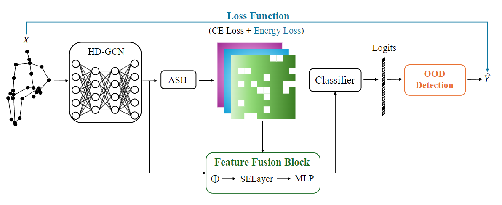
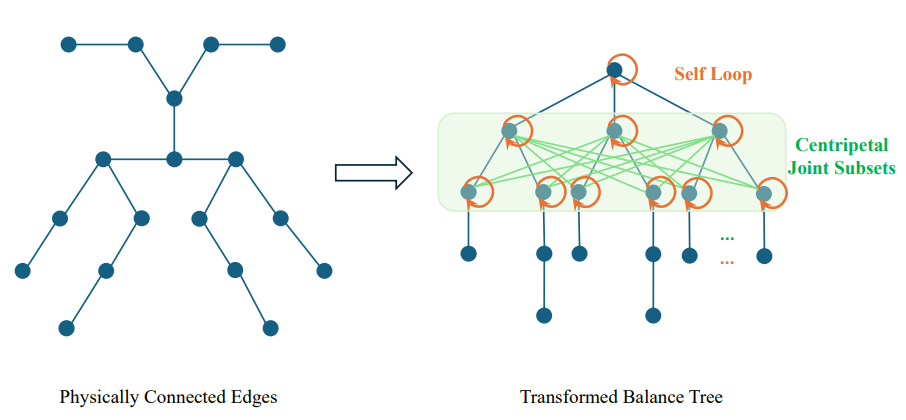
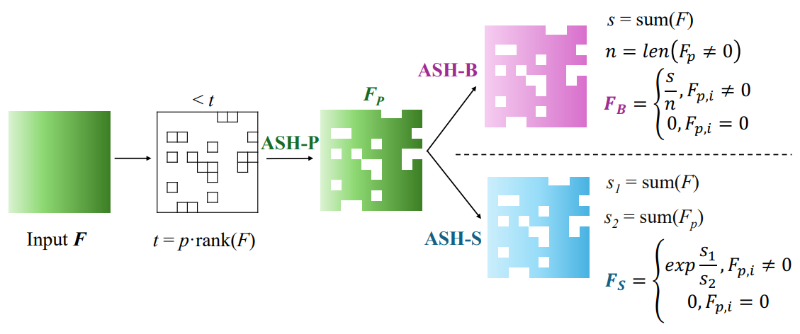
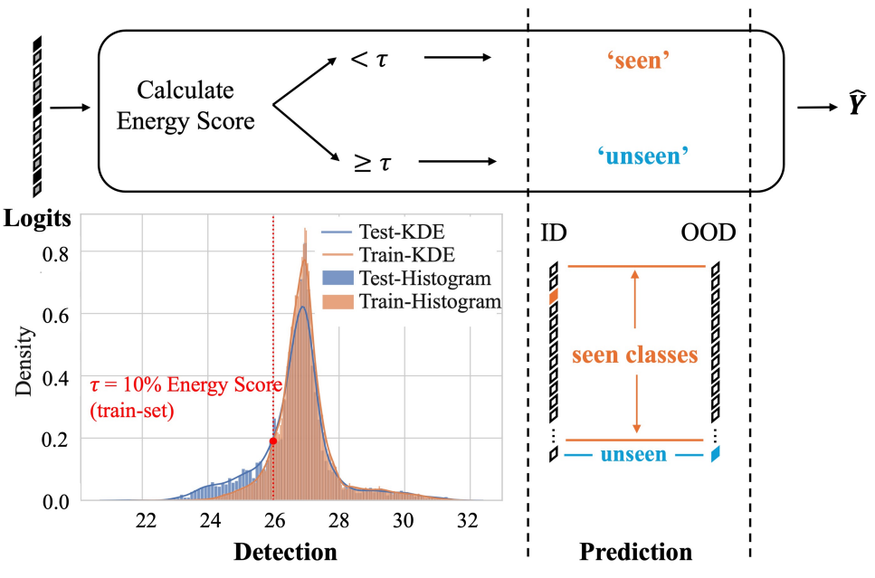
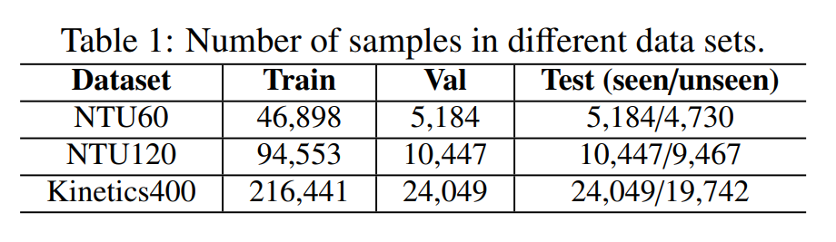
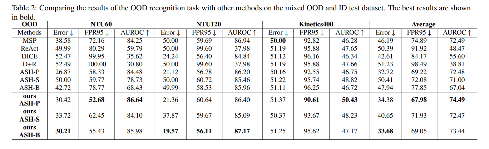
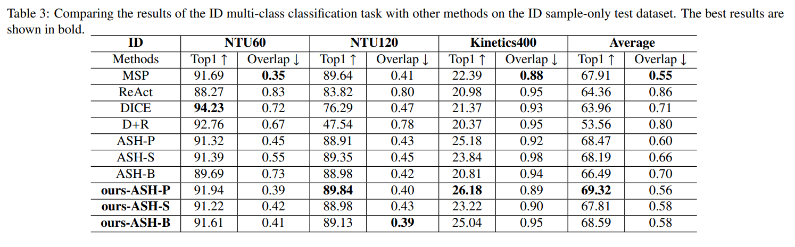
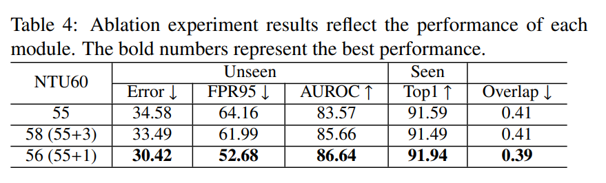
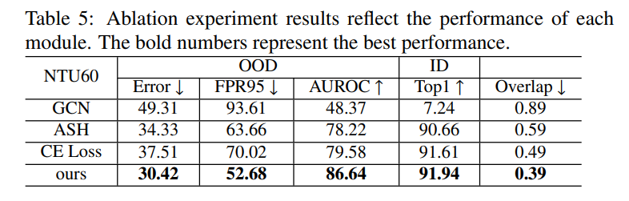
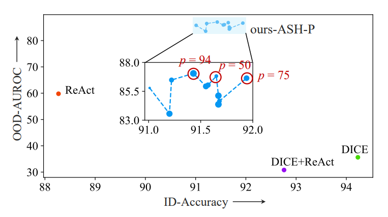

#資料集/ntu60 #資料集/ntu120 #骨架偵測/工具/Kinectv2  #資料集/Kinetics400 #骨架偵測/使用現成框架預處理資料/STGCN   #動作識別演算法/HD-GCN #消融實驗/是否加入ActivationShapingASH  #消融實驗/是否進行特徵融合 #消融實驗/是否加入能量損失 

## 摘要 
人體動作辨識是電腦視覺系統中的關鍵任務。在現實世界的應用中，人體動作常常超出訓練資料的分佈範圍，因此==模型不僅需要辨識分佈內（ID）的動作，還要能夠辨識並拒絕分佈外（OOD）的動作。==儘管這項任務具有重要意義，但對人體動作的OOD檢測研究仍然有限，現有的研究大多集中在基於RGB影像資料和事後檢測方法。這些方法雖然方便且計算效率高，但通常缺乏足夠的準確性，且未能充分考慮到OOD樣本的存在。 為了解決這些問題，我們==提出了一個新穎的端到端骨架模型Action-OOD，專門用於人體動作的OOD偵測。與某些需要預先了解OOD資料分佈的現有方法不同，我們的模型僅在訓練階段使用ID數據，從而有效解決了OOD檢測中普遍存在的過度自信問題。我們引入了**基於注意力的特徵融合模組**，增強了模型識別未知類別的能力，同時保持了已知類別的分類準確性。此外，我們提出了一種創新的**基於能量的損失函數**，並將其與傳統的交叉熵損失結合，最大化ID和OOD數據分佈之間的區分。== 在NTU-RGB+D 60、NTU-RGB+D 120和Kinetics-400數據集上的廣泛實驗表明，我們提出的方法在性能上優於最先進的檢測方法。我們的研究結果強調了經典OOD偵測技術在骨架動作辨識任務中的有效性，為該領域的未來研究提供了一個有希望的方向。程式碼可在以下網址取得：https://github.com/YilliaJing/Action-OOD.git。

## 1. 引言
以人為本的視覺理解促進了智能機器的發展，使人類能夠完成更大的任務並提升生活質量。基於深度學習的模型在監督式的人類行為分類任務中表現出了顯著的性能。在基於骨架的人類行為數據集中，這項任務可以被視為典型的 spatio-temporal modeling 問題來解決 (Yan et al., 2018; Chen et al., 2021; Cheng et al., 2020)。儘管這些方法在監督式分類問題中已經達到較高的準確性，但它們仍然缺乏對分佈外 (out-of-distribution, OOD) 問題的考量。這些方法的一個重要假設是訓練集的分佈與測試集的分佈相似，然而，在實際情況中，這一假設並不總是能夠實現。

==當這些模型應用於識別訓練集分佈之外的樣本時，它們可能會因為選擇已知分佈中的類別而表現出過度自信的問題 (Yu et al., 2024)。因此，為了安全性考量，這類模型必須對其學習邊界有清晰的認識 (Nalisnick et al., 2019)，以確保計算機視覺系統的穩健性。如何處理這種分佈外檢測 (OOD detection) 問題，已在自動駕駛 (Geiger et al., 2012) 和醫學影像分析 (Schlegl et al., 2017) 等領域引起廣泛關注。==

==在OOD檢測的研究中，焦點集中在由語義轉變引起的分佈外樣本，目的是判斷一個樣本是否屬於訓練數據集中包含的類別。==這項任務面臨兩個挑戰：一是量化內部分佈樣本 (ID) 與分佈外樣本 (OOD) 之間的差異，二是根據它們的表現區分這兩類樣本。針對第一個挑戰，一種典型的方法是分數測量方法 (Hendrycks and Gimpel, 2017)，例如softmax信心分數 (Hendrycks and Gimpel, 2017)。對於具有低softmax信心分數的輸入樣本，將其歸類為OOD樣本。然而，神經網絡可能會對遠離訓練數據的輸入樣本產生任意高的softmax信心分數 (Nguyen et al., 2015)。為了解決這一問題，提出了能量分數 (energy score) 用於OOD檢測。這可以從一個純粹的判別分類模型中推導出來，而無需顯式依賴密度估計器。實驗顯示，能量分數的表現優於基於softmax的分數測量方法。

基於這些分數測量方法，一個關鍵問題是如何最大化OOD樣本與ID樣本之間的分數分佈差異。為此，設計了差異放大方法 (Sun et al., 2021; Zhu et al., 2022)。然而，這些方法大多以事後方式實施，這意味著模型本身無法內在地區分OOD樣本，並不能從根本上解決“讓模型知道它知道什麼”的問題。此外，這些方法最初是為處理RGB結構數據集中的OOD檢測而設計的，對於處理具有骨架結構數據的行為識別問題，其有效性尚未被研究。

此外，Wu 等人 (2023) 的方法嘗試通過在訓練階段引入OOD分佈信息來達成此目標。然而，在實際操作中，我們無法測量具體的OOD類別。同樣地，當OOD類別本身擴展時，過度自信的問題仍然存在。總而言之，儘管這些方法顯著提高了OOD識別的準確性，但要在無先驗OOD信息的情況下，使用端到端框架來實現這一目標仍具有挑戰性。

為了解決上述的局限和挑戰，我們提出了一個端到端模型，稱為Action-OOD，用於處理基於骨架的人類行為識別中的分佈外檢測問題。考慮到目前監督式骨架識別的最先進特徵提取器已經發展完善，我們的==重點在於利用提取的特徵來擴展它們在OOD檢測中的適應性，同時保持對監督類別的穩健預測性能。==我們使用了HD-GCN (Lee et al., 2023) 作為我們的主要特徵提取器，這是一種目前流行的骨幹網絡。基於其基本輸出，我們首次創新地應用了特徵激活模塊，該模塊利用ASH (Djurisic et al., 2023) 在訓練階段投影原始特徵，以適應OOD檢測。具體來說，它能過濾無用信息並放大關鍵特徵維度，以生成對異常檢測更敏感且準確的表示。接著，將此作為對原始特徵的正交聚合，我們創新設計了一個特徵融合模塊，該模塊將原始骨幹網絡輸出與針對OOD的激活特徵進行整合，使模型能夠在保持ID數據強大識別能力的同時，有效區分潛在的OOD存在。

為了支持端到端的訓練，我們設計了一個精細的學習損失函數，結合了能量函數和交叉熵信息。這一方法旨在提高模型對ID數據中能量分數分佈的理解，從而進一步促進對OOD樣本的準確檢測。

我們的主要貢獻總結如下：
- 我們提出了Action-OOD，這是一個端到端的基於骨架的OOD檢測模型，通過僅在ID數據上訓練來解決過度自信問題。
- ==我們設計了基於注意力的特徵融合模塊，以在保留ID類別分類能力的同時提高OOD檢測的準確性。==
- ==我們設計了一個基於能量的損失函數，可以提高ID與OOD樣本之間的分數區分，從而有效地最大化它們的分佈區別。==
- 所提出的Action-OOD模型在NTU-RGB+D 60、NTU-RGB+D 120和Kinetics-400數據集的人類行為OOD檢測任務中表現優於基準模型。

本文的其餘部分組織如下：第2節解釋了基於骨架的行為識別任務中與GCNs相關的基本知識，以及為何能量分數在OOD檢測中被廣泛應用的理論。第3節詳細介紹了我們提出的方法，包括框架設計、特徵融合模塊和損失函數設計。第4節主要討論實驗結果。第5節我們提供了結論並討論未來的工作。

## 2. 相關研究  
### 2.1. 基於骨架的行為識別中的圖卷積網絡 (GCNs)  

人類行為識別任務是計算機視覺中的典型問題，具有廣泛的現實應用，例如人機互動 (Nikam and Ambekar, 2016) 和視頻監控 (Jiang et al., 2015)。基於骨架的方法具有其獨特的優勢。骨架結構可以提供更準確的節點級信息，並忽略背景噪聲信息的影響，從而提高識別的預測準確性。

在使用深度學習方法進行基於骨架的行為識別的早期階段，卷積神經網絡 (CNNs) (Chéron et al., 2015; Liu et al., 2017b; Simonyan and Zisserman, 2014) 和遞歸神經網絡 (RNNs) (Wang and Wang, 2017; Liu et al., 2017a) 被廣泛使用。然而，這些方法的局限在於它們未能充分利用關節的結構排列。

之後，研究人員構建了時空架構來處理這個問題。許多研究使用人工設計的物理連接 (PC) 邊來提取人類骨架的空間特徵 (Chen et al., 2021; Cheng et al., 2020)，而GCNs能夠很好地處理這種類型的圖結構數據。定義在人類骨架上的圖表示為G(V, E)，其中V代表關節組，E代表邊組。三維時間序列骨架數據的表示形式為 $$X\in\mathbb{R}^{C\times T\times|V|}$$，其中 $|V|$ 表示關節節點的數量，$C$ 表示通道數量，$T$ 表示時間窗口大小。GCN的操作可以描述為對輸入特徵圖 $X$ 的處理：
$$
\mathbf{F}_{\mathrm{out}}=\mathbf{AX}\mathbf{\Theta}. \tag{1}
$$
在這裡，${\Theta}$ 表示逐點卷積操作。$A$ 代表鄰接矩陣，初始化為 $\mathbf{\Lambda}^{-\frac{1}{2}}\mathbf{A}\mathbf{\Lambda}^{-\frac{1}{2}}\in\mathbb{R}^{N_{g}\times|V|\times|V|}$ ，其中 ${\Lambda}$ 是用於歸一化的對角矩陣，在實驗中 $N_{g}=3$ 。
然而，==僅依賴物理連接 (PC) 邊來建立空間關係是不足的，因為這會因其啟發式且固定的特性而限制感受野。此外，還必須考慮每條邊的不同貢獻，因為在執行特定動作時，不同身體部位的關節重要性會有所不同。為了解決這些問題，提出了分層分解圖卷積網絡 (HD-GCN) (Lee et al., 2023)。==HD-GCN 的圖卷積操作定義如下：
$$
\mathbf{F_{out}} = \sum_{g\in G}\mathbf{A_{g}}\mathbf{X}\mathbf{\Theta_{g}}, \tag{2}
$$
其中 $G = \left\{g_{pc},g_{sl},g_{fc}\right\}$  表示三個圖子集，$g_{pc}$ 、$g_{sl}$ 和 $g_{fc}$  分別表示物理連接、自循環和全連接聯合子集。它代表了三種典型的有用圖形關係，有助於探索關節之間的空間關係。這三種結構將在3.1節中詳細介紹。透過此操作，HD-GCN 在三個實驗資料集上實現了 93.9% 的平均 Top-1 準確率。

### 2.2. 分布外檢測方法

分布外檢測的研究主要可以分為兩種方式。首先，我們可以定義一個評分函數，將每個輸入點映射為一個標量，這樣內部分布數據 (in-distribution) 和分布外數據 (out-of-distribution) 將具有不同的分布。因此，我們可以通過計算這個分數來識別分布外樣本。有許多研究專注於如何為預訓練神經網絡定義這種分數。Hendrycks 和 Gimpel (2017) 提出了最大預測 softmax 概率 (MSP)。隨後，Wu 等人 (2023) 證明了MSP的對數等價於自由能量分數 (free energy score) 的特殊情況。這表明，在某些情況下，內部分布 (ID) 和分布外 (OOD) 數據可能具有相似的MSP值，但其能量分數不同。因此，能量分數已成為最廣泛使用的分數測量方法之一。

其次，我們可以通過修改預訓練神經網絡捕獲的特徵，以事後處理的方式來區分內部分布（ID）和分布外（OOD）數據，這通常應用於特徵激活。大量實驗表明，不同的特徵激活方法有助於區分ID和OOD數據。Sun 等人 (2021) 在觀察到OOD數據會在模型的倒數第二層觸發與ID數據顯著不同的單元激活模式後，提出了修正激活 (ReAct) 方法。通過執行截斷操作，能顯著改善ID和OOD數據的區分。Zhu 等人 (2022) 發現類似於批量歸一化（Batch Normalization）的一些操作可能會增加ID和OOD數據之間的分數差異（如MSP和能量分數）。DICE (Sun 和 Li, 2022) 被提出用來解決神經網絡高維空間中冗餘信息的問題，它試圖通過定義權重（即權重 × 激活）來對倒數第二層的節點進行排序和過濾，以去噪。這進一步減少了ID和OOD數據分數分佈的方差值，使兩個分佈的峰值更容易區分。類似於之前的工作，Djurisic 等人 (2023) 移除了前K個元素（通常超過50%）並調整剩餘的激活值（如10%），將其放大或直接賦予一個常數值。這在多個影像分類基準上達到了最先進的性能。

然而，以上兩類方法大多被視為事後處理方法。雖然它們比重新訓練一個特定的OOD檢測模型能減少計算成本，但Liu 等人 (2023) 的研究顯示，這些方法仍然不如在訓練階段使用OOD信息的一些工作具有競爭力，如Hendrycks 等人 (2022) 和Song 等人 (2022) 的研究。此外，這些方法最初是為RGB結構數據集中的OOD檢測而設計的，對於處理具有骨架結構數據的行為識別問題，其有效性尚未被探索。==在本研究中，我們證明了這些方法在基於骨架數據集上的有效性，並進一步採取步驟來解決這些問題。==

### 2.3. 基於能量的分布外檢測

在深層神經網絡中，分布外檢測的目的是識別偏離訓練分布的樣本。在本研究中，我們只關注標準的分布外檢測，這與語義轉變有關，即將OOD數據定義為來自訓練期間未見過的語義類別的測試樣本。理想情況下，神經網絡應該能夠將這些樣本識別為OOD，同時對於屬於訓練期間已見類別的ID測試樣本保持強大的分類性能 (Zhang 等人, 2023)。為了實現這一目標，一種常見的方法是利用數據的密度函數，記為 $p^{in}(x)$，並將低似然度的實例識別為OOD。然而，先前的研究已表明，深度生成模型估計的密度函數在OOD檢測中並不總是可靠的 (Nalisnick 等人, 2019)。

==基於能量的分布外檢測使用能量分數來進行檢測，通過ID和OOD樣本之間的能量差異來實現區分。==能量分數解決了與softmax信心相關的一個關鍵問題，即對於OOD樣本，softmax可能會導致過高的值 (Hein 等人, 2019)。

讓我們定義一個判別神經網絡 $f(x):\mathbb{R}^D\to\mathbb{R}^K$，它將輸入 $x$ 映射到 $K$ 個實數，這些實數被稱為對數值 (logits)。其能量分數函數 $E(x,f)$ 在 $\mathbb{R}^D$ 上使用softmax激活，可以定義如下：
$$
E(\mathbf{x};f)=-T\cdot\log\sum_i^Ke^{f_i(\mathbf{x})/T}, \tag{3}
$$
其中，$T$ 是溫度參數。還可以證明，使用負對數似然 (Negative Log-Likelihood, NLL) 損失訓練的模型會壓低內部分布數據點的能量分數，並提升其他標籤的能量分數 (LeCun 等人, 2006)。由於交叉熵損失在 logSoftmax 函數之後可以實現為 NLL 損失，它也會壓低內部分布數據的能量分數。換句話說，內部分布樣本將會具有比分布外樣本更大的負能量分數 −$E(x;f)$ 。

## 3. 方法

我們的主要目標是通過一個端到端的框架來實現準確的人類行為分布外檢測，無需任何其他後續的微調或事後操作。所提出的基於骨架的人類行為分布外檢測模型的整體框架如圖1所示。

圖 1：所提出的 Action-OOD 模型的架構。符號⊕表示向量連接運算。

這個端到端的==Action-OOD框架可以分為三個主要步驟：首先，我們使用HD-GCN (Lee et al., 2023)，這是一個在ID分類中達到最先進準確度的GCN框架，用於對骨架數據進行特徵提取。其次，提取的特徵會被激活並與原始特徵融合。特徵融合塊的功能是提高OOD樣本的識別能力，同時保持ID數據的原始分類性能。最後，這些特徵被輸入分類器，並根據分類器的輸出logits進行OOD檢測，如圖4所示。此外，整個模型通過基於能量的損失函數進行訓練。我們的工作主要集中在特徵處理和OOD檢測上。==接下來，我們將深入探討這些組件的每一部分。

### 3.1 基於GCN的特徵提取器

由於許多基於GCN的模型在行為識別任務中取得了巨大成功，在本研究中，我們使用在ID數據分類中表現最好的現有模型，從人類骨架數據中提取嵌入特徵。對於基於GCN的模型來說，提前構建圖拓撲是一個重要步驟。拓撲結構能夠為模型的空間學習帶來極大的便利，並且能夠融入先驗信息，從而提高模型的物理一致性。遵循(Lee et al., 2023)的先前研究，我們定義了三種類型的關節連接方式，同時保持節點數量不變（見圖2）。

圖 2：圖結構構建方法的描述。以Kinetics數據集為例，左側部分顯示了可視化的人體關節及其物理連接。右側部分顯示了基於物理連接 (PC edges) 的轉換後的平衡樹結構。橙色邊代表關節的自循環邊 (self-loop)，綠色邊代表每個向心關節子集中完全連接的邊。

我們將圖 $G = \begin{Bmatrix}g_{pc},g_{sl},g_{fc}\end{Bmatrix}$ 定義為三種類型的圖子集。第一種類型的子集  $g_{pc}$  是物理連接（physical connections），由圖2中的藍線表示，這代表骨架數據中的自然物理關係。第二種類型  $g_{sl}$  是自循環邊（self-loop），即節點與自身相連。通過加入自循環邊，節點除了依賴於鄰近節點的信息外，還能在消息傳遞過程中考慮自身的特徵，這有助於穩定訓練過程。此外，自循環邊可以被視為一種正則化機制，防止過擬合，使其成為圖神經網絡構建中的常用方法 (Kipf 和 Welling, 2017)。

第三種類型的子集是分層完全連接關節  $g_{fc}$。我們採用平衡樹的方法來重新表示圖結構（如圖2右側所示）。根據節點的層次結構，在平衡樹的兩個層級之間構建完全連接的邊。這種方法考慮到動作的特徵可能與人體各層次結構的特徵相關，並且在特徵空間中擴展了模型的空間感受野，從而增強模型的泛化能力。這種方法在先前的實驗中被廣泛證明是有效的。之後，對於輸入的骨架數據  $X$，輸出特徵圖  $F$ 定義如下：
$$
F=f^{HD-GCN}(X,G). \tag{4}
$$

### 3.2. 特徵激活整形與融合

基於之前的研究 (Djurisic 等人, 2023)，我們==利用激活整形 (Activation Shaping, ASH) 操作來過濾高維HD-GCN特徵圖 $F$ 中的無用信息，這樣可以對其他下游任務（如分布外檢測）帶來幫助。==然而，不同之處在於，我們將其應用於訓練階段，以幫助模型本身區分OOD樣本。

圖3：激活整形策略的過程。這些策略通過修剪百分比來修剪元素，然後採用不同的策略為剩餘的元素賦值。

ASH操作有三種類型：ASH-P、ASH-B和ASH-S。正如圖3所示，對於輸入的特徵圖  $F$ ，ASH-P 將小於閾值  $t$  的值設為零；ASH-B 將非零值進行二值化重置；ASH-S 則對這些值進行縮放處理。這三種策略的具體細節可以參見補充材料。它們之間的區別在於修剪後的正規化策略。在實驗部分，我們展示了這三種策略在訓練中的結果。之後，我們保留了輸出的特徵圖以及修剪後的特徵：
$$
\hat{F}=\left[F,\mathrm{ASH}(F)\right], \tag{5}
$$

其中，$ASH(F)$ 代表任何激活策略作用於特徵圖 $F$ 的結果，$[·, ·]$ 表示將兩個向量拼接成一個單一的向量。拼接後的特徵在特徵融合過程中經過兩個主要操作：一個是SE層（Hu 等人，2018），其主要目的是增強模型對通道特徵的敏感性：
$$
F^{SE}=\hat{F}\cdot\mathrm{ReLU}\Bigg(W_{fc}\cdot\underbrace{\frac{\sum_i^{k_h}\sum_j^{k_w}\hat{F}}{k_h\times k_w}}_{\text{average pool}}+b\Bigg), \tag{6}
$$
和另一個 MLP 層（Yu 等人，2022）：
$$
F^{fuse}=\mathrm{MLP}\Big(F^{SE}\Big) \tag{7}
$$
此處，$W_{fc}$ 代表可學習的權重。在這個階段，我們已經獲得了融合後的特徵 $F^{fuse}$​。實驗顯示，該特徵可以在保證已見類別分類準確性的同時，提升對未見類別的識別能力。

### 3.3. 使用Logits進行OOD檢測

在特徵修剪和融合過程之後，提取的特徵將被輸入到分類器中：

$$
logits=W_{fc}^{\prime}\cdot\mathrm{drop}_\mathrm{out}\left(F^{fuse}\right)+b^{\prime}. \tag{8}
$$

如下公式8所示，數據融合後的分類操作，其中 $W_{fc}^{\prime}​$ 是可學習的權重。接著，我們獲得了準備用於下游OOD檢測任務的logits。logits的維度相當於已見類別的總數加上一個未見類別。詳細的OOD檢測過程如圖4所示。

圖4：OOD檢測過程的說明。在檢測階段，輸入的是來自之前特徵提取器的logits。根據基於能量的理論，得分越低，樣本屬於內部分布 (in-distribution) 的可能性就越高。

對於經過分類器的輸入logits，我們使用公式3來測量每個樣本的能量分數：如果該分數小於閾值 $\text{τ}$，我們將其識別為分布外 (OOD) 的“未見”樣本，並將表示該樣本屬於未知類別的元素值設為1。否則，未見樣本的概率保持為0，而其他類別的概率則在0到1之間。參數 τ\tauτ 的值是基於訓練集中能量分數排名前10%的數據給出的。這背後的假設是，訓練後OOD樣本的能量分數小於90%內部分布數據的能量分數。接下來，我們可以得到一個向量 $\hat{Y}$，該向量代表樣本屬於每個類別的概率。

### 3.4 基於能量的損失函數

如第2.2節所述，儘管使用交叉熵損失進行訓練的模型會降低OOD數據的能量分數，但兩個分布之間的差距對於檢測來說可能並不總是最佳的。因此，我們提出了一個能量約束的學習目標，並將其與傳統的交叉熵損失相結合：

$$
\begin{aligned}L&=-\sum_{logits_m}P(logits_{in})\log f(logits_{in})\\&+\alpha\cdot\mathbb{E}_{(logits_{in},y)\sim\mathcal{D}_{\mathrm{in}}^{\mathrm{lrain}}}\left(\max\left(0,E\left(logits_{in}\right)-m_{\mathrm{in}}\right)\right)^2.\end{aligned} \tag{9}
$$

第一部分是交叉熵部分，其中 $P(logits_{in})$ 代表預期的概率輸出，$f(·)$  代表模型對內部分布訓練數據的輸出。第二部分是基於能量的部分，$\mathcal{D}_{\mathrm{in}}^{\mathrm{train}}$ 代表內部分布訓練數據，$E(\text{logits}_{in})$ 表示內部分布數據的能量分數，$m_{\text{in}}$ 是設置的邊際參數，該參數有助於減少ID能量分數分佈的方差並接近此點，$\alpha$  是調整能量部分比例的調節參數。藉助這一學習目標，ID數據的方差將減少。我們還可以確保模型理解ID數據的能量分數分佈，因此能夠間接區分ID和OOD樣本。整個過程可以在算法1中找到。

## 4. 實驗

為了展示我們提出的模型 Action-OOD 在人類行為檢測方面的準確性，我們進行了一系列實驗。在本節中，我們將詳細說明實驗設計的細節，並對實驗結果進行深入分析。首先，我們介紹了三個數據集，並描述了它們的數據預處理方法。隨後，我們將我們的工作與其他現有的OOD檢測方法進行比較，並確定所提出模型的優勢和劣勢。最後，我們設計了三個消融研究來檢驗各個模塊的有效性。

### 4.1. 數據集描述

- **NTU-RGB+D 60 (Shahroudy et al., 2016) & NTU-RGB+D 120 (Liu et al., 2019)**:  
  NTU-RGB+D 60 數據集 (NTU60) 包含60個動作類別和56,880個視頻樣本，廣泛應用於各種動作識別任務中。NTU-RGB+D 120 數據集 (NTU120) 是NTU-RGB+D 60的擴展版本，將人類行為類別的總數擴展至120。兩個數據集包含五種類型的數據：3D骨架數據（人體關節）、遮罩深度圖、完整深度圖、RGB視頻和紅外數據。在本研究中，我們僅使用3D骨架序列數據。3D骨架數據包括每幀25個身體關節的3D坐標（X, Y, Z），最多包含2個主體。這些數據集中的動作被分為三個主要類別：日常動作、交互動作和醫療相關動作。我們從NTU60數據集中隨機選擇五個類別作為未見類別，從NTU120數據集中隨機選擇十個類別。這些未見類別涵蓋了所有三個類別的樣本。

- **Kinetics人類行為數據集 (Kinetics 400) (Kay et al., 2017)**:  
  Kinetics 400 是目前由DeepMind構建的最大規模的非限制性動作識別數據集，涵蓋400個動作類別，包括人類與物體交互、人與人交互，以及其他從YouTube視頻中提取的複雜交互動作。由於Kinetics數據集僅提供原始視頻片段，沒有骨架數據，我們採用了之前研究STGCN (Yan et al., 2018) 處理過的骨架數據。處理後的數據序列包含18個關節和2個主體。我們隨機選擇了33個動作類別作為OOD樣本的「未見」類別，並確保使用與NTU60和NTU120相同的比例。

- **數據集劃分協議**:  
  我們的訓練集和驗證集均由已知標籤的數據組成。僅測試集中包含未知類別的數據。驗證集和測試集中的已見類別數據是一致的。在已知類別數據中，訓練集與測試集/驗證集的數據量比例為9:1。訓練集、驗證集和測試集的樣本數如表1所示。

### 4.2. 實驗詳情

#### 4.2.1. 實驗設置

- **實現細節**: 我們採用了HD-GCN (Lee et al., 2023) 作為骨幹網絡，來提取圖結構的骨架數據，如圖1所示。數據的批量大小設置為64。使用SGD優化器，並採用0.9的Nesterov動量和0.0004的權重衰減。學習率對於NTU60和NTU120數據集設置為0.001，而對於Kinetics400數據集設置為0.01。學習的總訓練輪數為NTU60和NTU120數據集設置為100輪，Kinetics400數據集設置為150輪，並對前5輪應用warm-up策略 (He et al., 2016)，以促進更穩定的學習。所有實驗都在NVIDIA GeForce RTX 3090上進行，使用CUDA 11.6和PyTorch 1.12.1。

- **評估指標**: 如圖4所示，我們評估了對「未見」樣本的檢測準確性以及對「已見」樣本的分類準確性。所有樣本在評估前會經過基於閾值的判定，以辨別其標籤是否為「未見」。如果被分類為「未見」，將相應標記；否則，預測其屬於已知類別。關於「未見」檢測任務，可以將其視為二元分類問題。我們使用檢測錯誤率 (Detection Error) (Liang et al., 2019)、AUROC (Davis 和 Goadrich, 2006) 以及在95%真陽性率下的假陽性率 (FPR at 95% TPR) (Liang et al., 2019) 來評估未見樣本的檢測準確性，這些方法基於 (Zhao et al., 2023) 的方法學進行。此外，對於涉及已見數據的動作識別任務，我們使用Top-1 Accuracy (Lee et al., 2023) 進行定量評估。這些評估指標的具體細節如下：

1) **檢測錯誤率 (Detection Error, Error)** (Liang et al., 2019):  
   它衡量當真陽性率 (TPR) 為95%時的錯誤分類概率。Error的定義為：
$$
Error=0.5\times(1-TPR)+0.5\times FPR, \tag{10}
$$
其中 FPR 代表誤報率。

2) **AUROC** (Davis 和 Goadrich, 2006): AUROC 代表接收者操作特徵曲線（ROC曲線）下的面積，它展示了真陽性率 (TPR) 與假陽性率 (FPR) 之間的關係，範圍從0到1（值越大，準確度越高）。AUROC 提供了一個總結二元分類器在所有可能閾值下表現的單一標量值。  
   
3) **FPR at 95% TPR (FPR95)** (Liang et al., 2019): 指當真陽性率達到95%時，分類任務中的假陽性預測率。  

4) **Top-1 準確率 (ACC)** (Lee et al., 2023): 測量所有樣本中正確預測的比例，即預測類別標籤與每個樣本的真實標籤完全匹配的情況。定義為：  
	$$
	ACC=\frac{hit}N\times100\%, \tag{11}
	$$
   其中，$hit$ 表示正確預測的樣本數，$N$ 代表測試樣本的總數。  

5) **Overlap**: 在大多數基於能量的 OOD 檢測中，ID 和 OOD 分數分佈的重疊部分表明 OOD 數據被錯過或 ID 數據被錯誤判斷為 OOD。兩個分佈的重疊面積越小，兩者的區別越大。因此，我們提出使用分佈重疊面積來進行評估，這可以更直觀地反映 OOD 識別的錯誤。  

- **損失函數**: 如第3.3節所述，我們設計了一種新穎的能量損失，幫助模型在訓練階段僅使用ID數據來區分OOD數據。我們將公式9中的參數設置為 $\alpha{=}0.1$ 和 $m_{in}{=}-25$ 。

### 4.2.2. 基線方法

由於大多數 OOD 檢測模型是事後處理方法，我們保留了基本的特徵提取部分並更改不同的事後處理方法來實現 OOD 檢測。我們將 Action-OOD 與四種主要方法進行比較：一種基於分數測量的方法（最大 Softmax 概率，MSP (Hendrycks 和 Gimpel, 2017)）和三種不同的特徵激活方法——ReAct (Rectified Activation) (Sun 等人, 2021)、DICE (Directed Sparsification) (Sun 和 Li, 2022)、DICE+ReAct、ASH (Activation Shaping) (Djurisic 等人, 2023)。詳細如下：

- **MSP (Maximum Softmax Probability)**: Hendrycks 和 Gimpel (2017) 認為分布外樣本往往具有比已知樣本更低的最大softmax概率。這種基於分數的測量方法在計算機視覺領域取得了廣泛的成功。
  
- **ReAct (Rectified Activation)** (Sun 等人, 2021): 一種事後處理方法，通過截斷網絡倒數第二層的激活來減少模型對 OOD 數據的過度自信問題，以限制噪聲的影響。

- **DICE (Directed Sparsification)** (Sun 和 Li, 2022): 另一種事後處理方法，基於去噪的思想，對其貢獻（即權重 × 激活）進行排序。它認為只有部分單元對內部分布預測結果有貢獻。然而，在測量分布外數據時，該方法可能會導致不可忽視的噪聲信號。

- **DICE + ReAct**: 遵循先前的研究 (Djurisic 等人, 2023)，我們構建了一個基線方法，使用 DICE 和 ReAct 方法共同過濾噪聲信號。

- **ASH (Activation Shaping) (Djurisic 等人, 2023)**: ASH 包含三種基於修剪的特徵激活整形機制，包括 ASH-P、ASH-S 和 ASH-B。

### 4.2.3. 消融研究

為了驗證各組件的有效性，我們設計了以下消融研究來分析 Action-OOD 中的關鍵組件：

- **GCN**: 旨在衡量 Action-OOD 中特徵融合模塊的效果。如前所述，Action-OOD 包含兩部分特徵：GCN 基於的特徵，擅長分類內部分布 (ID) 樣本；ASH 基於的特徵，旨在降低對 OOD 樣本的過度自信。此實驗可以驗證 ASH 操作在 OOD 識別任務中的改善效果。
- **ASH**: 根據之前的分析，僅依賴閾值進行修剪的策略在某些情況下可能不足，從而影響模型的 OOD 識別效果。為了驗證此問題是否也存在於未見行為檢測中，並說明特徵融合模塊的作用，我們設計了此消融實驗。
- **CE Loss**: 為了展示所提出的能量損失函數的效果，我們通過僅使用傳統的 CE 損失進行訓練來進行實驗。

### 4.3. 結果與討論

#### 4.3.1. 與基線方法的性能比較

我們在三個數據集上評估了提出的 Action-OOD 方法，針對兩個任務進行比較：(a) 從 ID 和 OOD 混合數據集中區分 OOD 樣本，(b) 僅基於 ID 數據評估是否會將 ID 樣本誤分類為 OOD。我們還提供了所有模型在三個數據集上的平均結果。

從表2可以看出，我們的方法在大多數評估指標上都取得了最佳表現。在 NTU60 數據集中，我們的方法在 OOD 檢測中獲得了平均 85.57% 的 AUROC，而在已見分類準確率方面，表3顯示超過了 91%。與幾個事後處理方法相比，平均 AUROC 提高了 43.48%。基於三個數據集上的平均三個評估指標，我們的方法也取得了最佳結果。在某種程度上，我們的方法僅通過端到端模型減輕了訓練模型面對 OOD 樣本時的過度自信問題。

在表3的僅ID樣本評估中，ID 多類別分類的最佳準確率有時可能由其他方法實現，特別是在 NTU60 數據集中。然而，這些方法在 OOD 檢測任務中的表現較差（見表2），這意味著模型仍將大多數數據識別為 ID，因此過度自信的問題依然存在。儘管如此，基於三個數據集的平均表現，我們的方法在僅 ID 樣本測試中仍然獲得了最高的分類準確率。總結來說，我們的方法在保持ID數據分類準確性的同時，也保證了 OOD 任務的有效檢測能力。

可以觀察到，與前兩個數據集相比，Kinetics 數據集上的整體預測準確率不太理想。此外，對 ID 數據集的直接分類結果也相對較差。通過比較 Kinetics 數據集中錯誤預測的樣本，我們發現某些 ID 樣本被誤分類為 OOD 樣本，這意味著模型對 ID 樣本缺乏信心。這在某種程度上也表明數據本身可能缺乏表達力，從而阻止了模型學習到更多區分特徵。一個可能的原因是圖結構的構建（如圖2所示）。首先，Kinetics 數據集本身包含大量涉及人物和物體交互的動作，僅使用骨架數據難以區分。其次，通過可視化分析，我們發現 STGCN (Yan et al., 2018) 在提取 Kinetics 節點時存在某些問題。例如，數據中的節點15和16分別代表左眼和右眼，但這些節點可能對動作信息提供的幫助不大。此外，數據集中將左右髖關節分開建模，但缺少關鍵的腰部節點信息，而這對理解四肢動作的類型至關重要。

#### 4.3.2. OOD 表徵維度的數量

使用機器學習方法處理分類數據通常需要對數據中的類別標籤進行獨熱編碼。處理後的向量將被輸入模型參與訓練。編碼向量的維度通常等於數據類別的總數。在我們的工作中，為了使模型意識到除 ID 類別外還存在其他未知類別，我們額外拼接了一個 k 維向量來標記數據是否屬於 OOD。在 NTU60 數據集上的實驗結果如表4所示。

表格的最後兩行顯示了我們在嵌入中使用額外維度（k = 1 和 k = 3）來表示 OOD 樣本的結果。由於訓練集僅包含 ID 樣本，因此沒有樣本的這些額外維度被設置為1。我們希望這一操作能在訓練期間有效地告知模型，所有樣本都屬於前55個類別，而不屬於第56個類別或第56-58個類別，從而提供額外的信息。通過比較表中「55」、「58（55+3）」和「56（55+1）」的結果，可以觀察到使用額外的維度確實提高了模型的 OOD 檢測準確率。這進一步證實了我們設計的有效性。

同時，對比使用56（55+1）和58（55+3）維度的結果可以發現，使用額外的1維度比使用3維度更有效。這可能是因為高維度表示容易導致信息冗餘，從而增加訓練的難度。因此，本論文中的實驗結果均使用了額外的1維向量來表示OOD類別。需要注意的是，對於NTU120和Kinetics400數據集，可能使用更多維度的表示會更好，但這裡為了便於比較，選擇了1維的OOD表示方法。

### 4.3.3. 消融研究

**Activation Shaping 的效果**: 通過比較 GCN 的結果與我們的方法，可以看出在 ASH 策略的幫助下，Error 指標降低了 58.59%，AUROC 準確率也提高了 79.12%。ASH 能夠顯著提升模型的 OOD 識別能力。同時，從表中可以看出，GCN 實驗中的已見類別準確率非常低，這是因為未見和已見樣本的能量分數分佈有很大程度的重疊。因此，許多 ID 樣本會被誤認為 OOD。基於使用排名前10%的 ID 樣本能量分數作為閾值的 OOD 檢測方法存在過度校正模型性能的嫌疑。

**特徵融合模塊的效果**: 與 ASH 列相比，利用典型的 GCN 嵌入會使 Error 指標增加 11.39%，而 AUROC 準確率提高了 8.42 個百分點。從 GCN 實驗的結果來看，特徵融合模塊使模型能夠在不影響識別內部分布 (ID) 樣本能力的前提下，提升分布外檢測 (OOD) 的準確性。

**能量損失的效果**: 與僅使用傳統交叉熵損失的結果相比（最後兩行），可以觀察到本文採用能量損失的方法在各種設置下顯著增強了模型的能力。此外，我們發現與直接使用 ASH 方法相比，使用特徵融合模塊但只用交叉熵損失的模型在 OOD 任務上表現不佳，儘管在 ID 分類中略有優勢。這進一步表明，結合特徵融合模塊和能量損失的使用可以提升模型的整體能力，從而更好地區分內部分布和分布外數據。

### 4.3.4. 不同修剪百分比的效果

為了探索修剪百分比  $p$  的效果，我們在實驗中測試了不同的值。正如圖5所示，我們選擇了在 NTU60 數據集上表現最佳的 ASH-P 策略進行評估。藍點的大小反映了修剪比例 $p$ 的大小，紅色、綠色和紫色點分別代表在其最佳比例下的 ReAct、DICE 和 DICE+ReAct 方法的性能。

圖 5：NTU-RGB+D 60 資料集上的 ID-OOD 權衡。放大折線圖中點的大小對應不同的p值。 折線圖表示我們的方法的結果，p 值範圍為 40%-90%。

### 5. 結論與未來工作

本文介紹了 Action-OOD，一個旨在解決識別分布外人類行為樣本挑戰的端到端框架。該框架採用了分層圖結構組成方法，並利用 GCN 提取人類骨架的特徵圖。隨後，應用了特徵激活策略，並通過提出的特徵融合模塊將激活的特徵與原始特徵融合。實驗表明，這一步驟使模型能夠在保持內部分布樣本分類能力的同時，自然識別分布外數據。接著，根據分類器輸出的 logits，計算每個測試樣本的能量分數，幫助確定其是否屬於 OOD 類別。模型使用設計的基於能量的損失函數進行訓練，該損失函數有助於模型減少 ID 數據的方差，並區分 ID 和 OOD 樣本。實驗結果證明，這種方法有效地緩解了在人類行為分類模型面對超出訓練範疇的樣本時所遇到的過度自信問題。值得注意的是，模型訓練過程僅依賴於內部分布樣本信息，沒有先驗的 OOD 分布特徵，因此該方法具有廣泛的實際應用性。

當然，模型仍需解決一些潛在的限制。首先，由於模型基於 GCN 進行訓練，其泛化能力受限於不同數據集的骨架節點數量。在現實場景中，如果部署的模型用於識別具有不同節點數的測試樣本是否屬於 OOD，其準確性可能會受到影響。其次，端到端模型的泛化能力仍然受限於模型參數和數據集大小。一個潛在的解決方案是探索半監督學習技術來緩解這個問題。此外，還可以通過整合大規模語言模型並在有限的 ID 樣本數據集上進行訓練來解決這個問題。通過利用現有類別文本和特徵信息，模型可以推斷未知類別名稱以處理陌生樣本特徵。總結來說，人類行為識別任務具有多樣的應用場景，基於具體實際情境的許多新挑戰有待進一步探索。