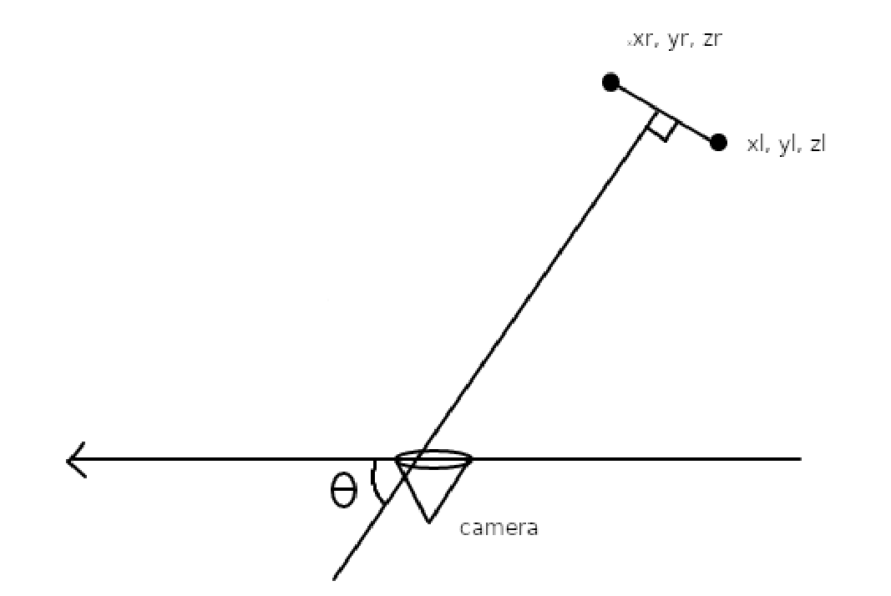
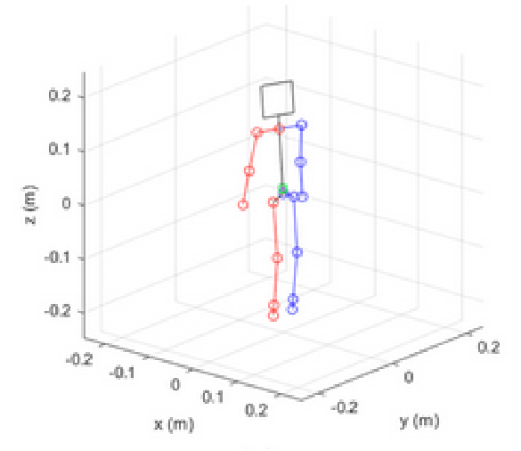
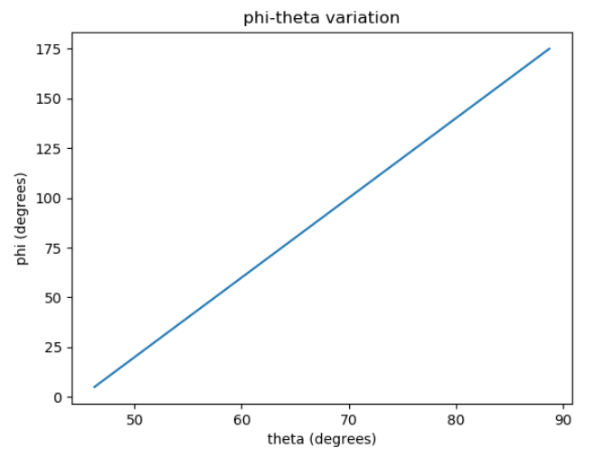
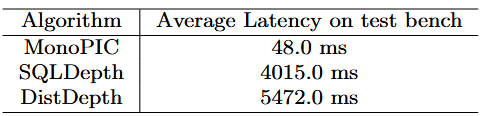

#骨架偵測model/BlazePose  #動作識別/演算法/ID3決策樹 

## 摘要
涉及自動駕駛車輛的交通事故通常發生在這樣的情況下：當（行人）障礙物在非常短的時間內突然出現在移動車輛的路徑上，使得自動駕駛系統沒有足夠的反應時間來應對場景變化。因此，在行人避免系統中，考慮某些影響反應時間的因素以改善延遲性至關重要。為了解決這一問題，我們提出了一種新的算法實現，該算法將二維框架內單一隨機選定的行人的意圖分類為基於四元數格式表示的方向變化的邏輯狀態。這樣可以避免使用延遲較高的深度學習算法，主要是因為不需要深度感知，而且大多數物聯網邊緣設備的計算資源有限。該模型在測試中實現了平均83.56%的準確率，方差為0.0042，同時其平均延遲為48毫秒。這展示了相較於當前標準的時空卷積網絡應用於此類感知任務的多項顯著優勢。

## 1. 簡介
行人安全是智能交通系統（ITS）開發和實施中的一個關鍵問題。即使在自動駕駛技術出現之前，行人死亡數字在2019年上半年至2022年間已激增18% [1]。為了提高行人安全，開發準確且反應時間迅速的行人意圖判斷方法至關重要。在這篇研究論文中，我們提出了一種基於決策樹的行人意圖判斷方法。該決策樹利用了行人的運動模式和行為線索等特徵來判斷行人意圖。這種新方法具有魯棒性、高準確度和計算效率，適合於智能交通系統中對延遲性有影響的實時應用。

為了驗證該方法，我們使用了實際行人數據集進行實驗，並將結果與現有方法[2][3][4]進行比較。研究結果顯示，該方法在準確判斷行人意圖方面具有顯著的效果。這種基於決策樹的方法是在先前行人意圖預測研究[5]的基礎上進行改進，並相較於現有方法具備多項優勢。首先，該方法採用了較小但更具影響力的行人特徵範圍，以提高行人意圖預測的準確性。其次，該方法計算效率高，能夠實時應用於智能交通系統，這在行人流量難以預測且需要快速決策的高密度城市環境中特別有用。

圖 1 深度學習模型的表示，通常用於評估行人意圖。子圖 a 涉及手動特徵工程和分類的傳統方法 [6]，而子圖 b 說明瞭一個通用的深度學習模型，該模型同時具有特徵提取和分類的任務。

實驗結果顯示，該方法在各種場景中能夠高準確率地預測行人意圖。與現有方法（包括圖1.a中提到的時序卷積網絡[8]和身體姿態分析）相比，該方法在準確性和計算效率方面均表現出色。這些結果表明，該方法具有顯著潛力來提升行人安全，並減少智能交通系統中涉及行人的事故風險。

總體而言，所提出的基於決策樹的方法為判斷行人意圖提供了一種有效且快速的解決方案。實驗結果證明了該方法的有效性及其在提高智能交通系統中行人安全方面的潛力。這些發現為不斷增長的行人意圖預測研究提供了貢獻，並為開發能有效解決行人安全問題的智能交通系統提供了新見解。

為了解決延遲問題，合理的方法是減少算法所需的計算工作量和運算次數。為實現這一目標，關鍵在於確定這些模型在評估行人對自動駕駛車輛構成的危險時所處理的具體輸入[9]。這些輸入包括行人的檢測、相對於自動駕駛車輛的方向角、相對位移，以及結合其他傳感器數據的表觀速度[9]。這些輸入本質上代表了可通過卷積從圖像數據流中提取的時空關係。通過去除機器學習模型中的中間組件，可以減少計算負擔。

圖 2 被捕獲的水準線方向角的簡化表示，參考自 [10]。

此方法所面臨的困難與應用算法解決方案來識別前面討論的隱含輸入有關。最初的挑戰在於如何在保持可接受的延遲水平下，確定行人障礙物的方向，同時定位其身體關鍵點。為了解決這一問題，我們開發了一個數學函數，從這些關鍵點的姿態數據中提取出方向角。其次，行人障礙物的速度則通過外推圖像流中 x 和 y 分量的位移（以像素為單位）來確定。這種方法將參考框架限制在圖像範圍內，消除了對深度數據的需求，這與Cao等人[11]最近的研究目標相似。

為了證明MonoPIC在相關指標上的有效性，我們進行了以下測試的定量評估：

1. 每次預測的計算量 - 這項測試對評估算法的效率至關重要，有助於了解MonoPIC在對行人移動意圖進行單次預測時所進行的計算量。

2. 能耗 - 這項測試旨在測量MonoPIC在積極處理數據時設備的能耗。保證算法的節能性對於資源受限的物聯網邊緣設備的部署至關重要。

3. 與其他單核算法的延遲比較 - 這項測試將MonoPIC的響應時間（延遲）與設計用於相同任務的其他算法進行比較，從而提供有關算法速度和響應能力的洞察。

對MonoPIC的全面測試得出了關於其在物聯網邊緣設備上部署可行性的有價值結論。每次預測的計算量分析強調了該算法的計算效率，表明它能夠迅速處理信息，而不會帶來過多的計算負擔。單線程環境下的能耗測試顯示，MonoPIC能夠保持節能性，這對於資源有限的邊緣設備至關重要。此外，與同類算法的延遲比較表明，MonoPIC在判別行人移動意圖方面具有競爭性的速度和響應性。

這些發現共同表明，MonoPIC不僅擅長於準確預測，還在資源利用方面進行了優化，使其成為物聯網邊緣設備應用的潛在候選者。這些測試具有通用性，無需依賴特定數據集，從而增強了這些結論在不同場景下的普適性，證明了MonoPIC在各種運行條件下的穩健性能。

本文將涵蓋MonoPIC實施的理論方面及其設計決策背後的理由，並隨後分析其所帶來的優勢。

## 2 相關工作

為了提高評估過程的透明度，有必要概述文獻回顧和測試所使用的方法。文獻回顧涵蓋了過去五年的研究和出版物，這一時間範圍確保了涵蓋算法在行人移動意圖估計方面的最新進展，與該領域的動態特性保持一致。搜索策略包括對關鍵詞的全面選擇，以捕捉相關文獻的廣度。關鍵詞包括“行人移動意圖”、“邊緣計算”、“物聯網設備”、“算法效率”和“能耗優化”。這些多樣的關鍵詞集旨在檢索涵蓋算法特性、邊緣設備部署以及能效考慮的研究。

文獻回顧重點回答具體的研究問題，以確定測試參數：

1. 效率：有哪些最新的算法進展能夠用來估算行人移動意圖？它們的計算效率如何？
2. 邊緣部署：這些算法在部署於物聯網邊緣設備時，在能耗方面表現如何？
3. 性能比較：MonoPIC的延遲與其他針對相同任務設計的等效算法相比如何？

通過系統性地在文獻回顧中解答這些研究問題，測試框架被設計成評估MonoPIC的能力，並與該領域的最新進展保持一致。這種方法論確保了評估基於當前行人移動意圖估算算法的技術現狀，並考慮其在邊緣計算場景中的應用。

行人意圖檢測是道路安全的重要組成部分，許多研究探索了不同的方法來應對這一挑戰。一項研究提出了基於多尺度的行人意圖預測方法，使用3D關節信息作為時空表示，該方法不需要檢測器，並改善了之前方法的運行時間[12]。另一項研究展示了一種基於骨架的行人意圖檢測方法，該方法使用相機數據流和Mediapipe框架來分離檢測到的人的骨架結構[13]。

關於行人意圖預測的未來發展，一份報告討論了行人意圖對於自動駕駛車輛（AVs）安全導航的重要性，避免事故和人身傷害[14]。該報告討論了基於AI視覺系統和深度神經網絡來推斷行人意圖，並著重於標註學習以執行高效的操作。

此外，一篇關於行人意圖預測的研究論文提出，由於行人在運動中的靈活性，行人意圖預測的複雜性較高，但深度機器學習模型在應對這一挑戰上具有潛力[15]。這些研究展示了各種應用於行人意圖檢測的技術和方法，包括多尺度預測、基於骨架的預測、AI視覺系統和深度機器學習模型。進一步的研究仍然需要開發更加穩健和精確的模型，並注重實時應用以及提升行人安全。

決策樹是智能交通系統中行人意圖預測的一種流行技術。本研究提出了一種新穎的算法實現，該算法利用ID3模型化的決策樹，在二維空間中對單個隨機選擇的行人的意圖進行分類，適用於物聯網邊緣設備。另一項研究提出了基於多特徵融合的隨機森林模型來預測行人過馬路的意圖[16]。一份針對自動駕駛車輛行人意圖預測的綜合調查也強調了決策樹在該領域的重要性[17]。此外，有一項研究探討了基於軌跡數據的梯度提升決策樹來預測行人等待或行走的決策[5]。

這些研究展示了基於決策樹的算法在利用各種特徵和模型進行行人意圖預測中的有效性。行人意圖的預測對於智能交通系統的安全和高效運行至關重要。決策樹是一種常用的技術，能夠通過基於一組規則對輸入空間進行遞歸分割，從而建模複雜的決策過程。多項研究在不同的機器人決策環境中，利用決策樹進行行人意圖預測。

另一項研究提出了一種基於多特徵融合的隨機森林模型來預測行人過馬路的意圖[12]。這些研究展示了基於決策樹的算法在利用各種特徵和模型進行行人意圖預測中的有效性。使用決策樹進行行人意圖預測展現了其在解決智能交通系統挑戰方面的潛力。進一步研究對於開發更穩健和精確的基於決策樹的模型至關重要，特別是在提升延遲性和實時預測能力方面。此外，一篇關於行人意圖預測的研究論文強調了由於行人行動的敏捷性，行人意圖預測的高度複雜性，以及深度機器學習模型在應對此挑戰中的潛力[15]。

MediaPipe是一個由Google維護的開源框架，提供了一整套工具、API和預訓練模型，讓用戶能夠更輕鬆地開發諸如姿態估計、物體檢測和面部識別等任務的應用程序。MediaPipe中的一個重要任務是姿態標誌點檢測器，它能夠在圖像或視頻中檢測人體關鍵點，識別主要身體部位、分析姿態並對動作進行分類。該工具利用機器學習模型來處理單張圖片或視頻，並以圖像坐標和三維世界坐標輸出身體姿態的標誌點[18][19][20]。這一任務可應用於多種平台，包括Android、Python和基於網頁的應用，並提供了代碼示例和實施指南。它還提供了一些配置選項，例如設置姿態檢測的最低置信度分數、可檢測的最大姿態數量，以及是否輸出檢測到的姿態的分割掩碼[18][20]。

MediaPipe姿態標誌點檢測器被廣泛應用於許多研究中，包括一篇使用MediaPipe來估算2D人體關節坐標的論文，該論文還基於一種人形模型的優化方法來改進預測[21]。另一項研究提出了基於3D關節信息作為時空表示的多尺度行人意圖預測方法，這種方法不需要檢測器，並提高了之前方法的運行時間[12]。總體來說，MediaPipe姿態標誌點檢測器提供了一個強大且多功能的框架，被廣泛應用於人類姿態估計、行為分析、監控系統和手勢識別等領域。

Camara等人[22]提出了一種使用決策樹算法來預測行人在斑馬線場景中的意圖的方法。該方法利用了多種特徵，如行人速度、距離和過馬路時間，來預測行人的意圖。一項由Radhakrishna等人提出的相關姿態檢測方法建議使用基於決策樹的算法來預測行人意圖，該算法在實時行人檢測系統中利用了行人位置、速度和方向角等特徵，如圖2所示，儘管該研究未深入探索這些特徵[10]。另一項由Ge等人提出的研究則在混合交通場景中使用基於決策樹的算法進行行人意圖預測，該系統利用了行人速度、位置和方向等特徵，儘管是在夜間環境中進行的預測[23]。Jung等人通過政策優化對這些系統進行了改進[24]。

MonoPIC解決了當前行人意圖檢測系統中的若干不足，提升了其有效性和應用性。MonoPIC所克服的現有系統中的一些顯著缺點包括：

- **計算效率**：許多現有系統在計算效率方面表現不佳，尤其在實時場景中，行人移動意圖的預測會出現延遲。MonoPIC在計算效率方面表現出色，能夠在最小的計算負擔下快速做出準確的預測。這對於需要快速響應的應用（如自動駕駛車輛和監控系統）至關重要。
- **邊緣部署挑戰**：傳統系統在資源受限的物聯網邊緣設備上部署時可能面臨挑戰，影響其在邊緣計算應用中的可行性。MonoPIC專門為物聯網邊緣設備設計，優化了資源利用，能夠在處理能力和內存有限的設備上無縫運行，解決了部署複雜算法時的局限性。
- **能耗優化**：高能耗是運行於電池供電設備或旨在可持續運行的系統中的重大關注點。MonoPIC在能耗優化方面表現出色，確保了能源資源的高效利用，這對於延長電池供電設備的使用壽命和減少連續算法處理的環境影響至關重要。
- **速度與響應性**：在需要實時決策的應用中，現有系統可能會出現延遲問題，影響其響應能力。MonoPIC通過展示出競爭性的速度和響應能力來應對這一挑戰，能夠及時預測行人移動意圖。這對於自動導航等應用至關重要，因為快速決策對於安全和效率是必不可少的。

通過解決這些缺點，MonoPIC成為克服當前行人意圖檢測系統關鍵挑戰的有力解決方案，使其適合在各種現實場景中部署。

總結來說，決策樹在智能交通系統中的行人意圖預測中顯示出了巨大的潛力。上述研究展示了基於決策樹的算法在利用各種特徵進行行人意圖預測中的有效性。然而，未來的研究仍需致力於開發更穩健和精確的基於決策樹的行人意圖預測模型，並著重於提升延遲性和實時預測能力。

## 3. 概念理論與實施方法

這項新穎的算法旨在彌合為行人障礙物避讓設計的定制物聯網測試平台與低成本消費市場之間的差距。通過實施能夠在計算吞吐量較低的設備上運行的處理方法，並使用單目2D相機達成同樣的目標，該算法將能夠改善延遲。同時，引入物聯網測試平台來限制能耗，從而更加現實地測試該算法。

### 3.1 四元數變換

所提出的演算法旨在分析相機饋送並檢測圖像中的人類。它利用 Mediapipe [25] 框架來隔離在源中檢測到的人類骨骼結構。然後，該演算法收集三個關鍵資訊來預測圖像幀內人體的運動方向。

首先，它使用 Radhakrishna 等人概述的方法收集人體的定向角度，通過提取表示每個已識別物理地標位置的單位向量，這使我們能夠使用相機觀察方法 [27] 推導出旋轉矩陣 [26]，即

$$
R_{3,3}=\begin{bmatrix}r_{00} r_{01} r_{02}\\r_{10} r_{11} r_{12}\\r_{20} r_{21} r_{22}\end{bmatrix}=\begin{bmatrix}\widehat{x} \widehat{y} \widehat{z}\end{bmatrix} \tag{1}
$$

其中，每列都是與右側單位向量的分量關聯的常量值的直接替換。這些向量空間中的原點被任意定義為包含骨骼物件的最小長方體的左前下角，如圖 3 所示。可以進行這種任意定義，因為我們只尋找旋轉值而不是絕對深度。

隨後，我們從這個旋轉矩陣[26]中得到標準形式的四元數 $Q$，具體表示為：

$$
\mathbf{Q}=a+bi+cj+dk \tag{2}
$$

其中，係數值可以根據方程3至6進行映射[28]：

$$
a=\frac12\sqrt{|1+r_{00}+r_{11}+r_{22}|} \tag{3}
$$

$$
b=\frac{r_{21}-r_{12}}{4a} \tag{4}
$$

圖 3 骨骼姿勢標誌的可視化方式表示。注意向量空間的原點[21]。

$$
c=\frac{r_{02}-r_{20}}{4a} \tag{5}
$$

$$
d=\frac{r_{10}-r_{01}}{4a} \tag{6}
$$

將四元數表示為軸角，

$$
\mathbf{Q}=cos\theta+sin\theta(xi+yj+zk) \tag{7}
$$

因此，為了我們的利益重新排列這個方程，我們可以發現  $\theta$  為

$$
\theta=\arccos(\frac a{\sqrt{a^2+b^2+c^2+d^2}}) \tag{8}
$$

接著，角度 $\theta$ 可以通過轉換來獲得在我們參考框架中的方向角度，使得參考軸是相機畫面窗口中的水平線。我們將這個角度稱為 $\phi$。

$$
\phi=\theta\cdot\frac{180}\pi\cdot4-180 \tag{9}
$$

**表 1** 表示 phi 隨 theta 變化的 10 個讀數樣本

**圖 4** 顯示讀數變化的曲線，精確到選擇性向上或向下近似的程度。

該角度提供了人面朝方向的參考。首先，將常數 $\frac{180}{\pi}$ 乘以四元數角度，將其從弧度轉換為角度。其次，應用常數4和減去180的線性誤差修正，這是在對比 $\theta$ 和 $\phi$ 之間的差異後繪圖得到的，近似到最接近的度數，並對20個樣本進行了斜率和常數的計算，如表1和圖3所示。顯然，該線性修正的值域是 [45, 90]，而範圍是 [0, 180]。由於四元數軸角度僅相當於其實際世界對應角的一半，因此可以考慮變化中的斜率。

其次，算法測量了圖像框架中人類在X軸上的接近速度，這提供了人類在圖像中水平移動的速度指標。最後，測量了圖像框架中人類在Y軸上的接近速度，這表明了人類在圖像中的垂直速度分量。此計算通過將像素位置的變化量除以幀速率來完成，如公式10所示。

$$
\widehat{v}=\frac{\Delta[\widehat{x} \widehat{y}]}{fps} \tag{10}
$$

其中“fps”代表每秒幀數。需要注意的是，這些位置向量的參考點假設圖像框架左上角的像素為原點。使用這些信息，算法可以預測人類在框架中的移動方向。該預測方向基於人體的方向角以及在X軸和Y軸上的接近速度。總體而言，所提出的算法是一種強大的工具，用於分析相機畫面並預測圖像框架中人的移動。通過使用先進的Mediapipe框架並收集關鍵數據，該算法代表了計算機視覺和圖像分析領域的一個重要進步，儘管與Prakash等人[29]的方法不同，該算法在多目標檢測能力方面存在局限性。

從俯視角度來看，該新算法的運行過程如下：首先在圖像框架中尋找人體目標，然後通過相機的"look-at"方法計算旋轉矩陣來確定人體的肩部方向，從旋轉矩陣中計算出四元數，並確定人體相對於相機水平線的面向角度。這提供了一種計算量較小的過程來獲取模型分類的主要輸入，從而減少了深度學習算法在同類任務中表現出的抽象性和泛化性。這正是該解決方案的主要優勢所在。

此外，通過分析屏幕上被跟踪的人體物體在2D框架中的速度，算法獲取了該速度的垂直分量。這一過程通過多個時間點分析特定點的X和Y坐標並計算其對時間的導數來實現。此過程為我們提供了足夠的信息，以建模決策樹，幫助我們在未來幾秒內預測目標行人的未來位置。直觀來看，該解決方案應該能夠通過最小化延遲，對場景中的最後時刻姿勢變化做出快速的控制反應。

本研究中假設被檢測到的人體物體是具有最高驗證置信度的目標。我們設計的測試案例每次僅涉及一個行人，儘管很容易理解該算法可以通過實施多線程並將計算分配給多個處理器核心來檢測多個行人。立體深度估計[30]是主要方法，它通過分析由兩個已知距離分開的相機捕獲的圖像之間的差異來提取圖像中的關鍵點。深度信息可以用來計算圖像中物體的3D位置和方向。在本案例中，由於系統在擴展至步態分析以進行人機協作時的靈活性，這種方法優於從向量中確定姿態的方法[31]。

為了從深度估計器提供的數據中計算四元數並隨後計算方向角度，我們可以使用Radhakrishna等人[10]所展示的相機"look-ahead"方法，該方法已從方程1到方程10進行擴展。

### 3.2 ID3 分類

ID3算法[32]是一種常用於從標記數據生成決策樹的算法。該算法由Ross Quinlan於1986年提出，並已在機器學習、數據挖掘和人工智能等多個領域得到廣泛應用[33]。ID3算法通過根據提供最多信息增益的特徵遞歸地劃分數據集，生成樹狀結構來表示決策過程。生成的決策樹可用於分類或預測任務。ID3算法有幾個限制，包括容易在訓練數據上過擬合，以及難以處理連續和缺失數據。然而，它是一個簡單且有效的算法，為更先進的決策樹算法鋪平了道路。因此，決定以此作為構建決策樹的起點。

直觀來看，在視頻框架中，任何物體的運動可以分為九種類型，這些類型由Radhakrishna等人提出，並在圖5中可視化展示：

1. 案例1：斜向右，朝著相機運動的方向。
2. 案例2：斜向左，朝著相機運動的方向。
3. 案例3：斜向右，逆著相機運動的方向。
4. 案例4：斜向左，逆著相機運動的方向。
5. 案例5：垂直向右，穿過相機的路徑。
6. 案例6：垂直向左，穿過相機的路徑。
7. 案例7：直接朝向相機。
8. 案例8：背對相機，但仍然阻礙相機的路徑。

這些提供的運動方向涵蓋了物體在屏幕上可能移動的所有方向。這些方向基於物體和圖像框架邊緣的相對位置。因此，如果物體不移動，或其移動方向不在上述任何方向中，則無法使用這些方向來描述其運動。

圖 5 評估 2D 幀時可以在螢幕上觀察到的運動方向表示，從情況 1 到 8 反覆運算。

需要注意的是，這些運動方向是相對於相機視角和圖像框架的方向而言的。例如，如果相機旋轉了90度，則物體的運動方向也會相應地旋轉。此外，所列的方向假設物體是直線運動，並未考慮複雜的運動形式，如曲線運動或速度變化。在許多情況下，路上的行人往往沿著相對直線的路徑行走，特別是當沿著人行道行走或過馬路時。直線運動的假設簡化了建模和預測過程，使其更容易在實際應用中實施和部署。

行人在道路上通常遵循已確立的路徑，例如人行道或斑馬線，這些路徑主要涉及直線運動。突然的複雜運動在道路上的典型行為中較少見。最重要的是，檢測的範圍針對的是最後一刻的障礙物避讓，這使我們能夠估計在小於一米的範圍內行人所遵循的路徑。這些路徑最適合被近似為直線。

總結來說，根據物體和圖像框架邊緣的相對位置，所提供的運動方向列表是全面的，涵蓋了物體在屏幕上可能移動的所有方向。根據構建決策樹的算法，需要計算所選特徵的信息增益，即：行人在框架中水平方向的速度、垂直方向的速度以及方向角度。這可以通過以下公式來實現：

$$
\mathrm{Entropy}(S)=-\sum_{i=1}^cp_i\log_2p_i \tag{11}
$$

其中，$S$ 代表樣本集，$c$ 是類別數， $p_i$  是第 $i$ 類中樣本的比例。

$$
\mathrm{Entropy}(S_A)=\sum_{v\in\mathrm{Values}(A)}\frac{|S_{A=v}|}{|S|}\mathrm{Entropy}(S_{A=v}) \tag{12}
$$

其中，$A$ 是正在考慮的屬性，$Values(A)$ 是屬性 $A$ 的可能值集合，$S_{A=v}$​ 是樣本集 $S$ 中屬性 $A$ 取值為 $v$ 的子集，且 $|S_{A=v}|$ 是該子集中樣本的數量。

$$
InformationGain(A)=Entropy(S)−Entropy(S_A) \tag{13}
$$

其中，$InformationGain(A)$ 是屬性 $A$ 的信息增益，而 $Entropy(S_A)$ 是在考慮屬性 $A$ 的情況下樣本集 $S$ 的熵。這些方程可以處理多類別問題，方法與之前的熵公式相同。

請注意，這些公式可以通過使用熵的一般形式來處理多類問題，其方式與方程 1 中描述的方式相同。

依據該算法，使用上述特徵並將其分類為九個基本的運動方向狀態，可以生成決策樹，如圖3所示。其中，水平方向的幀速度具有最高的信息增益為0.022，垂直方向的信息增益為0.014，而接近角度的信息增益為0.004。這些值是通過使用先前提到的四元數變換來解析視頻，從而獲得人類物體的幀速度和方向角度得出的。

### 3.3 算法

該新概念的所有變體算法的聚合流程遵循相同的基本結構，如下所示：

在此版本的算法中，新增了兩個變量——`prev pose` 和 `prev time`，用於跟踪上一次檢測到的姿勢以及前一幀的時間戳。此外，還新增了一個輸入變量 `t`，它表示當前幀與未來幀之間的時間（以秒為單位），用於計算速度。另外，還增加了兩個輸出變量——`vl` 和 `vr`，它們分別表示指定時間間隔內左肩和右肩的平均速度。

最後，新增了一個名為 `calculateVelocity()` 的函數，該函數將當前和上一幀的肩部標誌點、當前和上一幀的時間戳以及時間間隔 $t$  作為輸入，並返回在該時間間隔內肩部的平均速度。需要注意的是，函數 `getRotationMatrix()`、`calculateQuaternion()` 和 `poseDetector()` 假設已在代碼的其他地方定義。

### 3.4 可視化

為了應對與智能交通系統相關的三個使用案例，開發了該算法的三個變體，每個變體基於前一個版本進行改進。在所有上述演示的左上角部分顯示了三個參數。第一個數字表示幀率，第二個數字表示延遲（以毫秒為單位），第三個數字表示算法檢測到的人體相對於水平線的角度。

圖 6 使用 ID3 演算法和離散化數據集獲得的決策樹的表示

- **第一個變體**：該變體預測行人障礙物在一秒後的移動路徑，通過將行人的未來坐標分類到2D坐標系中。在分類後，該變體還檢查未來的坐標是否落入相機所假設安裝的機器人未來某個任意時間內將投影到的區域。由於該算法旨在對行人障礙物的短期行為進行分類，以便快速反應，預測時間設定為一秒。當滿足上述條件時，該變體還明確指出何時即將發生碰撞。

圖 7 第一個變體的演示，能夠突出顯示即將發生的碰撞。

- **第二個變體**：該變體基於最後定義的幀數據，假設每幀狀態無突變，對預測路徑進行完整外推。此外推是在一個預定義的路徑框架內進行的，該框架是為相機假設安裝的機器人設置的。該變體從目標路徑預測源代碼生成完整路徑，但不強調碰撞可能性。

圖 8 第二種變體的演示，能夠為觀察到的行人投影路徑疊加。這種表示形式突出顯示了未來可能的路徑衝突。

- **第三個變體**：該變體對行人障礙物的預測移動方向進行分類，並將其投影可視化在幀中。此變體收集了代碼中提到的各個點數據，以可視化模型的準確範圍。本項目旨在消除使用附加機器學習管道來進行相同預測的需求，以減少檢測和分類延遲，因為本項目針對的應用場景是避免由於未能及時應對行人障礙物移動意圖的突變而導致的自動機器人交通事故。根據初步文獻調查，現代標準的檢測速度接近200毫秒，而該模型能夠在50毫秒內完成相同任務。考慮到這些數據初看可能會被認為是異常值，因此將提供詳細的測試參數說明文件。

圖 9 具有靜態覆蓋層的第三種變體的演示，非常適合安裝在自動駕駛地面車輛上，以便在最後一刻避開行人。

## 4. 結果與支持統計

以下是關於測試條件、使用的數據集以及獲得結果的概述。

### 4.1 數據集與測試條件

數據集由人類受試者（如作者本人）在平坦地面上進行九種不同方式的行走（如第3節第2小節所述）以及符合這些條件的庫存視頻構成。這些數據集包括7段長度不同的視頻，共計2328幀，錄製時平均每秒15幀。

### 4.2 模型延遲

根據Mersch等人[2][3]的近期研究，作者提出了一個時間卷積神經網絡（TCN），該網絡在基準數據集上達到了高準確率，且其延遲估計在幾十毫秒範圍內。該延遲在處理管道中僅涉及單個階段。應用相同的原理到本文提出的新算法中，需要注意的是，這裡使用的BlazePose卷積神經網絡（CNN）與決策樹結合後，佔據了40毫秒的延遲（這是經過20次測試迭代後得出的平均值）。同一測試階段中新算法的平均延遲為48毫秒，如圖6所示。將兩者的延遲相減，可以得出決策樹部分的延遲為8毫秒，而相比之下，時間卷積神經網絡的方法延遲超過10毫秒，並且結果可在硬件實現中達成。

圖 10 請注意此演示部分左上角的三個參數。第一個數位代表幀速率，第二個數位代表以毫秒為單位的延遲，第三個數位代表演算法檢測到的相對於人類地平線的角度。

### 4.3 模型準確性

隨著誤差範圍的減少，決策樹的準確性呈對數下降。因此，為了評估模型的準確性，設置了一個任意的誤差範圍50像素。考慮到視頻幀的長度為432像素，且最大捕獲範圍寬度為10米，可以推算出實際觀測行人在幀內的位置與其準確預測的未來位置之間的距離為1.15米。

圖 11 模型的準確性與在任意測試用例上規定的可容忍誤差邊際的比較圖作為代表性樣本。

假設這些條件下，平均預測準確率為83.56%，相較於Wang等人[3]達到的58.9%有顯著提高。儘管兩個模型在不同數據集上訓練，但為驗證新算法而定制的數據集，其攝像角度與Wang等人引用的由Pellegrini等人[4]製作的ETHZ數據集非常相似，唯一的主要區別在於捕捉每次只包含一個人的情況，以符合Mediapipe BlazePose模型單線程處理單一對象的能力。作為實驗一部分的公開庫存視頻也經過驗證，確保其符合相似的視覺標準，從而保證比較的公平性。無論如何，這一準確度數值是在實際部署後獲得的，因此比較的是模型在真實環境中的部署準確性。新算法在數據集中七個文件的平均準確性方差為0.0042（參見圖9），表明其在實際部署中的可靠性。

### 4.4 系統規格

本系統在以下規格的平台上進行測試：
- **Intel Core i5 7200U** 處理器
- **8GB** RAM
- **512 GiB** 固態硬碟
- 外接USB 2.0 30 FPS 2MP「Passport」攝像頭，解析度為1920x1080，視角為110度。

圖 12 模型在樣本空間內所有數據集上的平均準確度圖。請注意，低方差意味著模型的可靠性。

### 4.5 部署的定量分析

在本節中，我們對基於四元數的決策樹框架與最新的單目深度估計算法進行了全面的定量比較，包括SQLDepth和DistDepth。評估主要集中於兩個關鍵性能指標：每次預測所需的計算次數以及運行這些算法的設備上的功耗。我們選擇單目深度圖作為基準進行比較，因為它們在實際應用場景中的適用性較強。

#### 4.5.1 單目深度圖的選擇

單目深度估計技術因其從單張圖像中提取深度信息的能力而受到重視，特別適合實時應用和資源受限的設備。與立體視覺或多視圖方法不同，單目深度估計僅需要一個攝像頭，從而降低了硬件複雜性。此外，單目深度圖與我們提出的框架的輕量化設計理念一致，確保其在資源受限平台上的兼容性。

#### 4.5.2 實驗設置

我們的實驗使用了涵蓋各種行人場景的多樣化數據集，包括不同的光照條件、多樣背景和遮擋情況。該數據集經過精心策劃，以模擬現實場景並確保我們提出的框架具有通用性。我們實現了基於四元數的決策樹框架，使用Python內置的工具進行決策樹構建和預測。為了進行比較，我們利用了兩種最新的單目深度估計算法SQLDepth和DistDepth，這些算法基於流行的深度學習框架實現。計算比較考慮了視頻幀中一次正向傳播過程中進行的加法、減法和乘法操作。所有相關模組均部署在以下規格的邊緣設備上：
- **AMD Ryzen 9** 處理器
- **76,000 mWh** 電池
- **16GB** RAM
- **1TB** 固態硬碟

表 2 沒有 MLP 和 softmax 隱含計算的等效深度感應單目演算法執行的計算次數與沒有位姿檢測的 MonoPIC 的整個計算負載的比較

#### 4.5.3 每次預測的計算量

表2總結了每個算法每次預測所需的計算量。我們基於四元數的決策樹方法相比於基於深度學習的替代方案，顯示出顯著的計算複雜度減少。這種減少歸因於決策樹在處理與行人意圖分類相關的特徵空間時的效率。SQLDepth和DistDepth的幀大小為768 x 432，用於計算估算。

值得注意的是，該解決方案主要適用於反應時間大幅減少的情況下，例如自動機器人或自動駕駛車輛。在這種情況下，可以合理地假設行人障礙物的路徑曲率不存在。因此，該方法僅依賴於路徑的線性外推。

### 4.6 功耗

功耗是實時應用中一個至關重要的考量，特別是在能源資源有限的設備上。圖13展示了每個算法在運行1小時後的功耗比較，結果顯示我們所提出的框架在減少能耗方面的效率。表1和表2的結果清楚地表明，基於四元數決策樹的輕量級、單目、與深度無關的行人意圖分類框架在計算量和功耗方面具有顯著的優勢。每次預測所需計算量的減少以及功耗的降低尤其值得關注，展示了該方法在邊緣設備上部署的實際可行性。

圖 13 MonoPIC 與 SQLDepth 和 DistDepth 在 1 小時刷新率、6 分鐘刷新率下的功耗讀數比較。

#### 4.6.1 計算效率與功耗

四元數決策樹展現出驚人的計算效率，能夠以最小的計算開銷實現實時行人意圖分類。這與基於深度學習的方法（如SQLDepth和DistDepth）的高計算需求形成了鮮明對比。功耗分析進一步強調了我們提出的框架在資源受限環境中的優勢。通過利用四元數決策樹，我們在準確性與計算效率之間取得了平衡，從而提供了一種適合低延遲應用的節能解決方案。

儘管該框架展示了有希望的結果，但必須承認其存在一定的局限性。目前的評估集中於特定數據集，將其推廣至多樣化場景還需要進一步研究。此外，我們正在進行的研究也旨在探索如何改進決策樹模型並整合自適應學習機制，以提升性能。

總結來說，我們的實驗評估證實了所提出的輕量級、單目、與深度無關的行人意圖分類框架的有效性。通過使用基於四元數的決策樹，並與最新的深度學習方法進行比較，我們展示了出色的計算效率和降低的功耗，這使該框架成為資源受限設備上進行實時行人意圖分類的有力解決方案，有助於在各種應用中提升安全性和反應能力。

表 3 MonoPIC 中幀返回的平均延遲遠高於本地測試臺上的等效深度估計模型

#### 4.6.2 延遲比較

在延遲方面，我們提出的輕量級、單目、與深度無關的行人意圖分類框架在提供快速響應預測方面表現出色，超過了基於深度學習的對手。四元數決策樹展示了卓越的效率，保證了低延遲的行人意圖分類。與此形成對比的是，SQLDepth和DistDepth的深度架構導致了較長的處理時間，削弱了實時響應能力。

延遲分析強調了我們框架在需要及時決策的應用中的優勢。四元數決策樹的高效利用在預測準確性和低延遲之間取得了平衡，這使得我們的解決方案非常適合需要快速且實時洞察行人運動意圖的場景。然而，必須承認，我們的延遲比較是基於特定數據集進行的，將其推廣至更廣泛的場景還需要進一步研究。正在進行的研究將繼續改進決策樹模型，並探索自適應學習機制，以不斷提高延遲性能。

總結來說，我們的實驗評估證明了該框架在低延遲行人意圖分類方面的優越性。通過利用四元數決策樹並與基於深度學習的方法進行比較，我們的解決方案顯著縮短了處理時間，使其成為對於資源受限設備需求實時響應的應用的理想選擇。

## 5. 結論

總結來說，基於動態人體姿態數據構建的決策樹的創新算法實現，在行人意圖檢測任務中展現了優異的結果，無論是在延遲還是準確性方面都超過了最接近的可比較替代方案。這歸因於決策樹相對於卷積神經網絡所需的計算複雜度較低，同時通過ID3算法的資訊增益評估來限制訓練參數，確保了模型的準確性。雖然基於深度學習的方法在視覺導向任務中表現良好，但它們往往在實現過程中計算代價高昂。在此情況下，像這種僅使用少量但高影響力參數的算法，特別是在需要部署到邊緣設備時，具有極高的實用性。