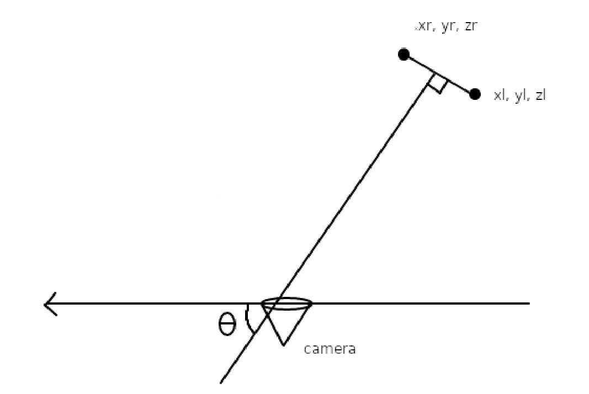
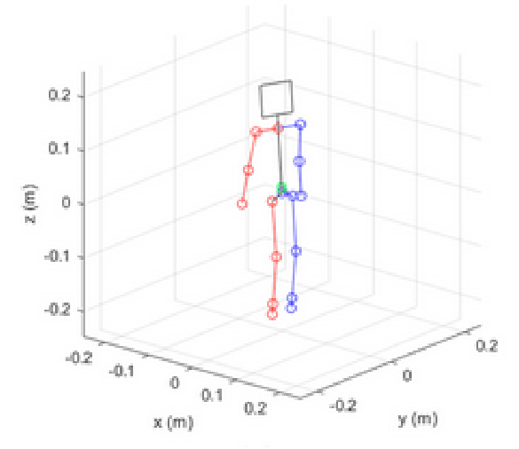
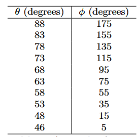
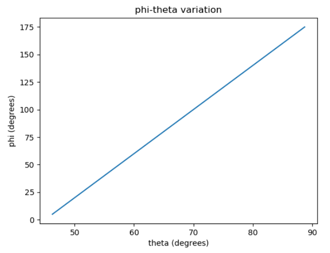

## 摘要
涉及自動駕駛車輛的交通事故通常發生在這樣的情況下：當（行人）障礙物在非常短的時間內突然出現在移動車輛的路徑上，使得自動駕駛系統沒有足夠的反應時間來應對場景變化。因此，在行人避免系統中，考慮某些影響反應時間的因素以改善延遲性至關重要。為了解決這一問題，我們提出了一種新的算法實現，該算法將二維框架內單一隨機選定的行人的意圖分類為基於四元數格式表示的方向變化的邏輯狀態。這樣可以避免使用延遲較高的深度學習算法，主要是因為不需要深度感知，而且大多數物聯網邊緣設備的計算資源有限。該模型在測試中實現了平均83.56%的準確率，方差為0.0042，同時其平均延遲為48毫秒。這展示了相較於當前標準的時空卷積網絡應用於此類感知任務的多項顯著優勢。

## 1. 簡介
行人安全是智能交通系統（ITS）開發和實施中的一個關鍵問題。即使在自動駕駛技術出現之前，行人死亡數字在2019年上半年至2022年間已激增18% [1]。為了提高行人安全，開發準確且反應時間迅速的行人意圖判斷方法至關重要。在這篇研究論文中，我們提出了一種基於決策樹的行人意圖判斷方法。該決策樹利用了行人的運動模式和行為線索等特徵來判斷行人意圖。這種新方法具有魯棒性、高準確度和計算效率，適合於智能交通系統中對延遲性有影響的實時應用。

為了驗證該方法，我們使用了實際行人數據集進行實驗，並將結果與現有方法[2][3][4]進行比較。研究結果顯示，該方法在準確判斷行人意圖方面具有顯著的效果。這種基於決策樹的方法是在先前行人意圖預測研究[5]的基礎上進行改進，並相較於現有方法具備多項優勢。首先，該方法採用了較小但更具影響力的行人特徵範圍，以提高行人意圖預測的準確性。其次，該方法計算效率高，能夠實時應用於智能交通系統，這在行人流量難以預測且需要快速決策的高密度城市環境中特別有用。

圖 1 深度學習模型的表示，通常用於評估行人意圖。子圖 a 涉及手動特徵工程和分類的傳統方法 [6]，而子圖 b 說明瞭一個通用的深度學習模型，該模型同時具有特徵提取和分類的任務。

實驗結果顯示，該方法在各種場景中能夠高準確率地預測行人意圖。與現有方法（包括圖1.a中提到的時序卷積網絡[8]和身體姿態分析）相比，該方法在準確性和計算效率方面均表現出色。這些結果表明，該方法具有顯著潛力來提升行人安全，並減少智能交通系統中涉及行人的事故風險。

總體而言，所提出的基於決策樹的方法為判斷行人意圖提供了一種有效且快速的解決方案。實驗結果證明了該方法的有效性及其在提高智能交通系統中行人安全方面的潛力。這些發現為不斷增長的行人意圖預測研究提供了貢獻，並為開發能有效解決行人安全問題的智能交通系統提供了新見解。

為了解決延遲問題，合理的方法是減少算法所需的計算工作量和運算次數。為實現這一目標，關鍵在於確定這些模型在評估行人對自動駕駛車輛構成的危險時所處理的具體輸入[9]。這些輸入包括行人的檢測、相對於自動駕駛車輛的方向角、相對位移，以及結合其他傳感器數據的表觀速度[9]。這些輸入本質上代表了可通過卷積從圖像數據流中提取的時空關係。通過去除機器學習模型中的中間組件，可以減少計算負擔。

圖 2 被捕獲的水準線方向角的簡化表示，參考自 [10]。

此方法所面臨的困難與應用算法解決方案來識別前面討論的隱含輸入有關。最初的挑戰在於如何在保持可接受的延遲水平下，確定行人障礙物的方向，同時定位其身體關鍵點。為了解決這一問題，我們開發了一個數學函數，從這些關鍵點的姿態數據中提取出方向角。其次，行人障礙物的速度則通過外推圖像流中 x 和 y 分量的位移（以像素為單位）來確定。這種方法將參考框架限制在圖像範圍內，消除了對深度數據的需求，這與Cao等人[11]最近的研究目標相似。

為了證明MonoPIC在相關指標上的有效性，我們進行了以下測試的定量評估：

1. 每次預測的計算量 - 這項測試對評估算法的效率至關重要，有助於了解MonoPIC在對行人移動意圖進行單次預測時所進行的計算量。

2. 能耗 - 這項測試旨在測量MonoPIC在積極處理數據時設備的能耗。保證算法的節能性對於資源受限的物聯網邊緣設備的部署至關重要。

3. 與其他單核算法的延遲比較 - 這項測試將MonoPIC的響應時間（延遲）與設計用於相同任務的其他算法進行比較，從而提供有關算法速度和響應能力的洞察。

對MonoPIC的全面測試得出了關於其在物聯網邊緣設備上部署可行性的有價值結論。每次預測的計算量分析強調了該算法的計算效率，表明它能夠迅速處理信息，而不會帶來過多的計算負擔。單線程環境下的能耗測試顯示，MonoPIC能夠保持節能性，這對於資源有限的邊緣設備至關重要。此外，與同類算法的延遲比較表明，MonoPIC在判別行人移動意圖方面具有競爭性的速度和響應性。

這些發現共同表明，MonoPIC不僅擅長於準確預測，還在資源利用方面進行了優化，使其成為物聯網邊緣設備應用的潛在候選者。這些測試具有通用性，無需依賴特定數據集，從而增強了這些結論在不同場景下的普適性，證明了MonoPIC在各種運行條件下的穩健性能。

本文將涵蓋MonoPIC實施的理論方面及其設計決策背後的理由，並隨後分析其所帶來的優勢。

## 2 相關工作

為了提高評估過程的透明度，有必要概述文獻回顧和測試所使用的方法。文獻回顧涵蓋了過去五年的研究和出版物，這一時間範圍確保了涵蓋算法在行人移動意圖估計方面的最新進展，與該領域的動態特性保持一致。搜索策略包括對關鍵詞的全面選擇，以捕捉相關文獻的廣度。關鍵詞包括“行人移動意圖”、“邊緣計算”、“物聯網設備”、“算法效率”和“能耗優化”。這些多樣的關鍵詞集旨在檢索涵蓋算法特性、邊緣設備部署以及能效考慮的研究。

文獻回顧重點回答具體的研究問題，以確定測試參數：

1. 效率：有哪些最新的算法進展能夠用來估算行人移動意圖？它們的計算效率如何？
2. 邊緣部署：這些算法在部署於物聯網邊緣設備時，在能耗方面表現如何？
3. 性能比較：MonoPIC的延遲與其他針對相同任務設計的等效算法相比如何？

通過系統性地在文獻回顧中解答這些研究問題，測試框架被設計成評估MonoPIC的能力，並與該領域的最新進展保持一致。這種方法論確保了評估基於當前行人移動意圖估算算法的技術現狀，並考慮其在邊緣計算場景中的應用。

行人意圖檢測是道路安全的重要組成部分，許多研究探索了不同的方法來應對這一挑戰。一項研究提出了基於多尺度的行人意圖預測方法，使用3D關節信息作為時空表示，該方法不需要檢測器，並改善了之前方法的運行時間[12]。另一項研究展示了一種基於骨架的行人意圖檢測方法，該方法使用相機數據流和Mediapipe框架來分離檢測到的人的骨架結構[13]。

關於行人意圖預測的未來發展，一份報告討論了行人意圖對於自動駕駛車輛（AVs）安全導航的重要性，避免事故和人身傷害[14]。該報告討論了基於AI視覺系統和深度神經網絡來推斷行人意圖，並著重於標註學習以執行高效的操作。

此外，一篇關於行人意圖預測的研究論文提出，由於行人在運動中的靈活性，行人意圖預測的複雜性較高，但深度機器學習模型在應對這一挑戰上具有潛力[15]。這些研究展示了各種應用於行人意圖檢測的技術和方法，包括多尺度預測、基於骨架的預測、AI視覺系統和深度機器學習模型。進一步的研究仍然需要開發更加穩健和精確的模型，並注重實時應用以及提升行人安全。

決策樹是智能交通系統中行人意圖預測的一種流行技術。本研究提出了一種新穎的算法實現，該算法利用ID3模型化的決策樹，在二維空間中對單個隨機選擇的行人的意圖進行分類，適用於物聯網邊緣設備。另一項研究提出了基於多特徵融合的隨機森林模型來預測行人過馬路的意圖[16]。一份針對自動駕駛車輛行人意圖預測的綜合調查也強調了決策樹在該領域的重要性[17]。此外，有一項研究探討了基於軌跡數據的梯度提升決策樹來預測行人等待或行走的決策[5]。

這些研究展示了基於決策樹的算法在利用各種特徵和模型進行行人意圖預測中的有效性。行人意圖的預測對於智能交通系統的安全和高效運行至關重要。決策樹是一種常用的技術，能夠通過基於一組規則對輸入空間進行遞歸分割，從而建模複雜的決策過程。多項研究在不同的機器人決策環境中，利用決策樹進行行人意圖預測。

另一項研究提出了一種基於多特徵融合的隨機森林模型來預測行人過馬路的意圖[12]。這些研究展示了基於決策樹的算法在利用各種特徵和模型進行行人意圖預測中的有效性。使用決策樹進行行人意圖預測展現了其在解決智能交通系統挑戰方面的潛力。進一步研究對於開發更穩健和精確的基於決策樹的模型至關重要，特別是在提升延遲性和實時預測能力方面。此外，一篇關於行人意圖預測的研究論文強調了由於行人行動的敏捷性，行人意圖預測的高度複雜性，以及深度機器學習模型在應對此挑戰中的潛力[15]。

MediaPipe是一個由Google維護的開源框架，提供了一整套工具、API和預訓練模型，讓用戶能夠更輕鬆地開發諸如姿態估計、物體檢測和面部識別等任務的應用程序。MediaPipe中的一個重要任務是姿態標誌點檢測器，它能夠在圖像或視頻中檢測人體關鍵點，識別主要身體部位、分析姿態並對動作進行分類。該工具利用機器學習模型來處理單張圖片或視頻，並以圖像坐標和三維世界坐標輸出身體姿態的標誌點[18][19][20]。這一任務可應用於多種平台，包括Android、Python和基於網頁的應用，並提供了代碼示例和實施指南。它還提供了一些配置選項，例如設置姿態檢測的最低置信度分數、可檢測的最大姿態數量，以及是否輸出檢測到的姿態的分割掩碼[18][20]。

MediaPipe姿態標誌點檢測器被廣泛應用於許多研究中，包括一篇使用MediaPipe來估算2D人體關節坐標的論文，該論文還基於一種人形模型的優化方法來改進預測[21]。另一項研究提出了基於3D關節信息作為時空表示的多尺度行人意圖預測方法，這種方法不需要檢測器，並提高了之前方法的運行時間[12]。總體來說，MediaPipe姿態標誌點檢測器提供了一個強大且多功能的框架，被廣泛應用於人類姿態估計、行為分析、監控系統和手勢識別等領域。

Camara等人[22]提出了一種使用決策樹算法來預測行人在斑馬線場景中的意圖的方法。該方法利用了多種特徵，如行人速度、距離和過馬路時間，來預測行人的意圖。一項由Radhakrishna等人提出的相關姿態檢測方法建議使用基於決策樹的算法來預測行人意圖，該算法在實時行人檢測系統中利用了行人位置、速度和方向角等特徵，如圖2所示，儘管該研究未深入探索這些特徵[10]。另一項由Ge等人提出的研究則在混合交通場景中使用基於決策樹的算法進行行人意圖預測，該系統利用了行人速度、位置和方向等特徵，儘管是在夜間環境中進行的預測[23]。Jung等人通過政策優化對這些系統進行了改進[24]。

MonoPIC解決了當前行人意圖檢測系統中的若干不足，提升了其有效性和應用性。MonoPIC所克服的現有系統中的一些顯著缺點包括：

- **計算效率**：許多現有系統在計算效率方面表現不佳，尤其在實時場景中，行人移動意圖的預測會出現延遲。MonoPIC在計算效率方面表現出色，能夠在最小的計算負擔下快速做出準確的預測。這對於需要快速響應的應用（如自動駕駛車輛和監控系統）至關重要。
- **邊緣部署挑戰**：傳統系統在資源受限的物聯網邊緣設備上部署時可能面臨挑戰，影響其在邊緣計算應用中的可行性。MonoPIC專門為物聯網邊緣設備設計，優化了資源利用，能夠在處理能力和內存有限的設備上無縫運行，解決了部署複雜算法時的局限性。
- **能耗優化**：高能耗是運行於電池供電設備或旨在可持續運行的系統中的重大關注點。MonoPIC在能耗優化方面表現出色，確保了能源資源的高效利用，這對於延長電池供電設備的使用壽命和減少連續算法處理的環境影響至關重要。
- **速度與響應性**：在需要實時決策的應用中，現有系統可能會出現延遲問題，影響其響應能力。MonoPIC通過展示出競爭性的速度和響應能力來應對這一挑戰，能夠及時預測行人移動意圖。這對於自動導航等應用至關重要，因為快速決策對於安全和效率是必不可少的。

通過解決這些缺點，MonoPIC成為克服當前行人意圖檢測系統關鍵挑戰的有力解決方案，使其適合在各種現實場景中部署。

總結來說，決策樹在智能交通系統中的行人意圖預測中顯示出了巨大的潛力。上述研究展示了基於決策樹的算法在利用各種特徵進行行人意圖預測中的有效性。然而，未來的研究仍需致力於開發更穩健和精確的基於決策樹的行人意圖預測模型，並著重於提升延遲性和實時預測能力。

## 3. 概念理論與實施方法

這項新穎的算法旨在彌合為行人障礙物避讓設計的定制物聯網測試平台與低成本消費市場之間的差距。通過實施能夠在計算吞吐量較低的設備上運行的處理方法，並使用單目2D相機達成同樣的目標，該算法將能夠改善延遲。同時，引入物聯網測試平台來限制能耗，從而更加現實地測試該算法。

### 3.1 四元數變換

所提出的演算法旨在分析相機饋送並檢測圖像中的人類。它利用 Mediapipe [25] 框架來隔離在源中檢測到的人類骨骼結構。然後，該演算法收集三個關鍵資訊來預測圖像幀內人體的運動方向。

首先，它使用 Radhakrishna 等人概述的方法收集人體的定向角度，通過提取表示每個已識別物理地標位置的單位向量，這使我們能夠使用相機觀察方法 [27] 推導出旋轉矩陣 [26]，即

$$R_{3,3}=\begin{bmatrix}r_{00} r_{01} r_{02}\\r_{10} r_{11} r_{12}\\r_{20} r_{21} r_{22}\end{bmatrix}=\begin{bmatrix}\widehat{x} \widehat{y} \widehat{z}\end{bmatrix}$$

其中，每列都是與右側單位向量的分量關聯的常量值的直接替換。這些向量空間中的原點被任意定義為包含骨骼物件的最小長方體的左前下角，如圖 3 所示。可以進行這種任意定義，因為我們只尋找旋轉值而不是絕對深度。

隨後，我們從這個旋轉矩陣[26]中得到標準形式的四元數 $Q$，具體表示為：

$$\mathbf{Q}=a+bi+cj+dk$$

其中，係數值可以根據方程3至6進行映射[28]：

$$a=\frac12\sqrt{|1+r_{00}+r_{11}+r_{22}|}$$

$$b=\frac{r_{21}-r_{12}}{4a}$$

圖 3 骨骼姿勢標誌的可視化方式表示。注意向量空間的原點[21]。

$$c=\frac{r_{02}-r_{20}}{4a}$$

$$d=\frac{r_{10}-r_{01}}{4a}$$

將四元數表示為軸角，

$$\mathbf{Q}=cos\theta+sin\theta(xi+yj+zk)$$

因此，為了我們的利益重新排列這個方程，我們可以發現  $\theta$  為

$$\theta=\arccos(\frac a{\sqrt{a^2+b^2+c^2+d^2}})$$

接著，角度 $\theta$ 可以通過轉換來獲得在我們參考框架中的方向角度，使得參考軸是相機畫面窗口中的水平線。我們將這個角度稱為 $\phi$。

$$\phi=\theta\cdot\frac{180}\pi\cdot4-180$$

**表 1** 表示 phi 隨 theta 變化的 10 個讀數樣本

**圖 4** 顯示讀數變化的曲線，精確到選擇性向上或向下近似的程度。

該角度提供了人面朝方向的參考。首先，將常數 $\frac{180}{\pi}$ 乘以四元數角度，將其從弧度轉換為角度。其次，應用常數4和減去180的線性誤差修正，這是在對比 $\theta$ 和 $\phi$ 之間的差異後繪圖得到的，近似到最接近的度數，並對20個樣本進行了斜率和常數的計算，如表1和圖3所示。顯然，該線性修正的值域是 [45, 90]，而範圍是 [0, 180]。由於四元數軸角度僅相當於其實際世界對應角的一半，因此可以考慮變化中的斜率。

其次，算法測量了圖像框架中人類在X軸上的接近速度，這提供了人類在圖像中水平移動的速度指標。最後，測量了圖像框架中人類在Y軸上的接近速度，這表明了人類在圖像中的垂直速度分量。此計算通過將像素位置的變化量除以幀速率來完成，如公式10所示。

第十頁結束!!!!!!!!!!!!