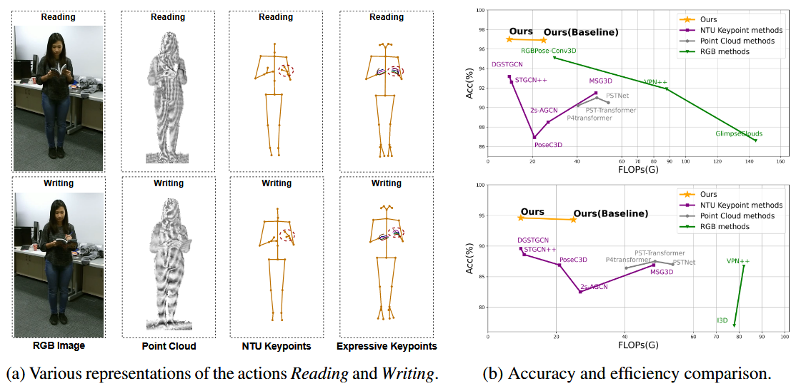
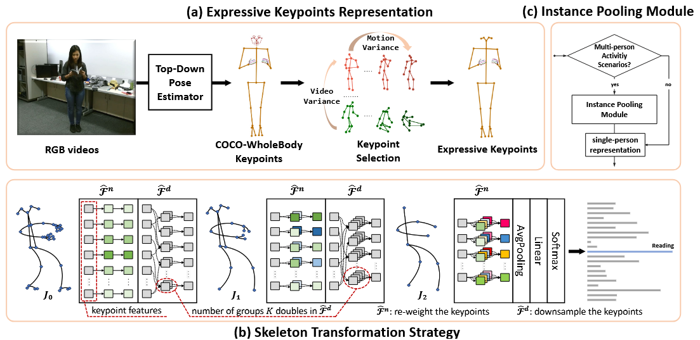
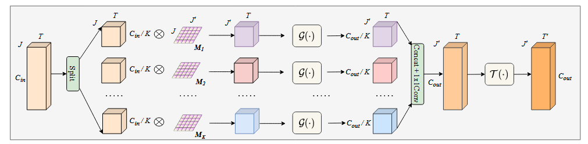

 #資料集/ntu60 #資料集/ntu120  #資料集/Kinetics400  #動作識別演算法/GCN  #運行框架/pyskl 

## 摘要

在基於骨架的動作識別領域，傳統依賴粗略身體關鍵點的方法難以捕捉到細微的人類動作。在本研究中，我們提出了**表達性關鍵點**，該方法結合了手和腳的細節，形成了一種細粒度的骨架表示，提升了現有模型在辨別複雜動作時的識別能力。為了有效地建模表達性關鍵點，我們提出了**骨架轉換策略**，逐步下採樣關鍵點並通過分配權重優先處理重要關節。此外，我們引入了一個**即插即用的實例池化模塊**，在不增加計算成本的情況下，將我們的方法擴展到多人的場景。基於七個數據集的大量實驗結果表明，我們的方法在骨架動作識別方面優於現有的最新技術。代碼可在 [https://github.com/YijieYang23/SkeleT-GCN](https://github.com/YijieYang23/SkeleT-GCN) 獲取。

## 1. 介紹

骨架動作識別已成為眾多視覺應用的基石，如視頻監控 [33, 47]、人機交互 [41] 和體育分析 [39]，這是因為骨架表示簡潔且對光照、比例和視角變化具有較強的魯棒性。傳統方法主要使用NTU [35, 42] 和COCO [32] 格式定義的簡單身體關鍵點，來提供人類運動的稀疏表示。儘管這些方法實用，但過於簡略的表示缺少捕捉手部和腳部動作等細微但關鍵的細節。因此，現有的粗糙骨架表示在有效區分複雜動作時存在局限性。

近來，一些方法 [16-18] 採用了點雲表示來捕捉人體表面的詳細空間結構，從而增強對複雜動作的識別能力。然而，這導致了極大的計算成本，削弱了點雲表示的效率。此外，若干研究 [22, 27, 51] 通過引入物體點來提高識別準確率，但在沒有互動物體的人類場景中，這些方法的泛化能力有限。

為了解決先前工作中的限制，我們在身體關鍵點中加入了更豐富的四肢關鍵點，提出了一種細粒度的表示方法，稱為**表達性關鍵點**。該方法強調手部互動和腳部動作等細微動作，這對區分細緻動作至關重要。如圖1a所示，我們展示了常用的數據表示。與RGB圖像、過多的點雲數據以及粗糙的身體關鍵點表示相比，表達性關鍵點表示因其對視角不敏感、數據量相對較小且能表示四肢細節的能力而顯得突出。實際上，表達性關鍵點可以根據COCO-Wholebody [25] 注釋從RGB圖像中輕鬆估算，而無需依賴來自多視角數據或實驗室控制的動作捕捉系統獲取深度信息。實驗結果表明，當將粗粒度關鍵點替換為表達性關鍵點時，所有三個基線方法 [8, 13, 14] 的準確性顯著提高（超過6%）。

圖 1：（a）相同操作的不同表示形式。（b）我們的方法與 NTU-60 [42]（上）和 NTU-120 [35]（下）的代表性方法的準確性和效率比較。

然而，直接使用表達性關鍵點作為輸入會顯著增加計算成本，因為需要處理的關節數量幾乎增加了三倍。為了提高計算效率，我們提出了**骨架轉換策略**（SkeleT），以多階段逐步下採樣表達性關鍵點的骨架表示。這種新穎的策略通過可學習的映射矩陣來重新加權並下採樣關鍵點，以優化骨架特徵。這些映射矩陣由人體拓撲的語義分區初始化，並在訓練期間逐步優化。通過進一步引入針對不同骨架規模的變量組設計，骨架特徵被均勻地拆分並獨立轉換，然後再進行拼接。SkeleT策略使關鍵點的有效下採樣和分組建模成為可能，並且可以輕鬆集成到現有的基於GCN（圖卷積網絡）的骨架動作識別方法中，形成我們的**SkeleT-GCN**，以有效處理表達性關鍵點。

在四個標準的骨架動作識別數據集上進行的實驗 [34, 35, 42, 50] 表明，SkeleT-GCN在計算量減少一半以上的情況下，達到了與基線GCN方法相當甚至更高的準確率。此外，我們還希望在多人的群體活動場景下對方法進行進一步評估，如一些常見的“野外”數據集 [26, 28, 46]。然而，我們發現傳統的GCN方法對每個輸入的個體進行獨立的特徵建模，並在後期進行特徵融合，因此隨著場景中人數的增加，計算複雜度呈指數級增長。受 [22] 啟發，我們在GCN模型之前實施了一個輕量級的**實例池化模塊**，其核心思想是將多個人的特徵聚合並在早期階段將其投影到單一的骨架表示上。通過利用即插即用的實例池化模塊，可以在不增加計算成本的情況下支持群體活動的分類。這為將基於GCN的骨架動作識別方法（包括我們的SkeleT-GCN）擴展到多人體場景提供了實用且可行的解決方案。

在七個數據集上的廣泛實驗評估 [26, 28, 34, 35, 42, 46, 50] 中，我們的管道在所有基準上都實現了最先進的性能，展現了其卓越的表現和強大的泛化能力。我們發現，戰略性地使用細粒度關鍵點可以在計算複雜度較低的情況下識別複雜的人類動作。

總結來說，我們的工作主要有三大貢獻：
- 我們引入了四肢細節作為**表達性關鍵點**表示，用於骨架動作識別，提高了識別細緻動作的性能。
- 我們提出了**骨架轉換策略**，通過動態下採樣關鍵點，使現有GCN方法在保留準確性的同時變得更高效。
- 我們實施了一個**即插即用的實例池化模塊**，以在不增加計算成本的情況下將GCN方法擴展到多人體群體活動場景。

## 2. 相關工作

### 2.1 基於點的動作識別

基於點的動作識別方法在應對光照和視角變化方面比基於RGB的方法更具魯棒性 [7, 19, 20, 45]。一些研究 [16–18, 38] 使用點雲數據作為輸入，這些數據由許多無序的3D點集組成。然而，點雲數據為學習動作模式引入了過多的冗餘信息，導致高昂的計算成本。一些研究利用2D/3D關鍵點 [32, 42] 來表示人體的骨架結構，這些方法通常也被稱為基於骨架的方法。在這些方法中，圖卷積網絡（GCN）模型 [8, 10, 13, 14, 29, 44, 52] 由於能夠有效表示圖結構 [40]，被廣泛採用。此外，一些模型 [5, 6, 15] 嘗試將人體關鍵點投影到多個2D偽圖像中以學習有用特徵，並且取得了顯著的性能。然而，現有的基於骨架的方法使用粗粒度的骨架表示作為輸入，難以識別複雜的動作，導致性能的局限。為了解決這一問題，我們提出將手部和腳部關鍵點納入身體部分，形成細粒度的骨架結構，以更好地區分複雜的動作。

### 2.2 基於GCN的骨架動作識別

STGCN [52] 首次使用圖卷積進行骨架動作識別，隨後基於GCN的方法迅速成為主流。近來的研究 [8, 13, 14, 44] 對此進行了不同的改進。MS-AAGCN [44] 提出自適應學習圖的拓撲結構，而不是手動設置。CTRGCN [8] 使用共享的拓撲矩陣作為網絡通道的通用先驗，以提高性能。PYSKL [14] 提供了一個開源工具箱，用於骨架動作識別，並以良好的實踐為基準測試了代表性的GCN方法。DGSTGCN [13] 則提出了一種輕量但強大的模型，無需預定義圖結構。

然而，傳統方法通常面臨兩個限制：（1）它們維持靜態的骨架結構，關鍵點數量固定，這限制了它們捕捉多尺度信息的能力；（2）隨著每增加一個人，計算成本呈線性增長，導致輸入最多只能包含兩個人。在本研究中，我們提出了**骨架轉換策略**，以動態修改骨架結構並下採樣關鍵點。此外，我們引入了**實例池化模塊**，以克服輸入人數的限制。

## 3. 提出的方法管道

我們提出的整體管道如圖2所示。在第3.1節中，我們將四肢的詳細關鍵點納入粗粒度的身體關鍵點，形成**表達性關鍵點**的表示。我們詳細介紹了這些關鍵點的收集和預處理過程，並強調了此方法的優勢。在第3.2節中，我們提出了**骨架轉換策略**，以有效處理更多的四肢關鍵點。我們發現，在網絡處理過程中，隱式聚合潛在空間中的關鍵點可以顯著降低計算複雜度，同時保持高準確率。在第3.3節中，我們發現傳統方法對每個實例進行個體建模並在後期融合特徵的方式，限制了其對輸入人數的可擴展性。因此，我們引入了一個**即插即用的實例池化模塊**，用於多實例輸入（見第3.3節），支持群體活動的識別而不增加計算成本。

### 3.1 表達性關鍵點表示

**數據收集**。我們得益於COCO-WholeBody [25] 提供的密集標記，該數據集包含133個關鍵點，其中包括17個身體關鍵點、68個面部關鍵點、42個手部關鍵點和6個腳部關鍵點，這為細粒度骨架表示提供了基礎。在實踐中，COCO-WholeBody可以通過自上而下的估計器提取。我們首先使用基於ResNet50的Faster-RCNN [21] 提取人體邊界框，隨後通過預訓練的姿態估計器 [48] 獲取邊界框內的COCO-WholeBody [25] 關鍵點。

圖 2：提出的 pipeline 概述。（a）我們使用自上而下的估計器從視頻中提取 COCOWholeBody 關鍵點，並根據統計指標進行關鍵點選擇，去除多餘的面部關鍵點，形成我們的 Expressive Keypoints 表示。(b) 我們提出了骨架轉換策略，該策略可以集成到大多數 GCN 方法中，以有效地處理表達關鍵點。它通過對關鍵點進行重新加權和逐漸下採樣，引導網路成組地更改骨骼特徵。（c）我們實現了一個 Instance Pooling 模組，在早期階段將多個實例融合在一起。我們將其用作輕量級擴展，用於在包含多人小組活動的一般野外場景中評估我們的方法。

**關鍵點選擇**。我們發現，直接使用COCO-WholeBody作為輸入不僅會導致顯著的計算成本，還會降低性能，因為大量冗餘的關鍵點會向模型引入大量噪音。為了減輕這一問題，我們從兩個角度選擇了133個輸入的關鍵點。首先，COCO-WholeBody不僅包括身體和詳細的手部關鍵點，還包括面部標記點，而面部標記點直觀上與人類動作無關。此外，我們分析了兩個統計指標：**視頻方差**和**動作方差**，基於NTU-120數據集計算每個人的關鍵點方差和各幀間每個關鍵點的運動頻率。更多詳細信息和結果可在附錄D中查閱。我們發現面部的關鍵點（第23至90號）具有較高的視頻方差和較低的運動頻率，這表明它們對動作識別的貢獻較小。這一觀察指導我們手動移除了這些關鍵點，形成最終的**表達性關鍵點**表示。

### 3.2 骨架轉換策略

表達性關鍵點的表示為骨架動作識別提供了豐富的運動線索。然而，直接將表達性關鍵點輸入現有的GCN方法會遇到幾個限制。(i) **低效率**：處理更多的四肢關節比粗粒度關節大幅增加了計算複雜度。(ii) **次優的準確性**：表達性關鍵點的拓撲圖更為複雜，並且存在多跳連接，這妨礙了網絡在遠距節點之間有效地交換信息。因此，它面臨著更加突出的長程依賴問題[29]。我們認為，關鍵問題在於傳統方法在前向傳播過程中保持了固定的骨架結構。

為此，我們提出了一種新穎的**骨架轉換策略**（SkeleT），以在處理階段逐步下採樣表達性關鍵點。SkeleT策略可以無縫集成到大多數GCN方法中，從而創建我們的SkeleT-GCN（例如，基線：DGSTGCN [13] → 我們的：SkeleT-DGSTGCN），而無需修改其圖卷積和時間卷積層的內部實現或高層次的架構設計。我們所做的工作是將基線圖卷積層封裝在提出的**分組映射框架**中，將輸入的關鍵點特徵劃分為多組，並在進入圖卷積層之前與映射矩陣相乘。

通過策略性地利用表達性關鍵點，我們的SkeleT-GCN在計算成本（GFLOPs）遠低於基線GCN方法的情況下，實現了相當或更高的準確性。

圖 3：分組映射框架 $\hat{F}$ 的架構。大多數基於 GCN 的方法都可以採用圖卷積層 $g$ 和時間捲積層 $T$。

### 3.2.1 GCN的基本介紹與符號表示

骨架序列 $\mathbf{X}\in\mathbb{R}^{J\times T\times C}$ 由 $J$ 個關節點構成，每個關節點在 $T$ 幀中具有 $C$ 個維度通道。對於大多數現有的基於GCN的方法，它們具有相同的架構設計，包括 $M$ 個時空塊，每個時空塊 $F$ 包含一個圖卷積層 $G$ 和一個時間卷積層 $T$，交替建模空間和時間信息。我們用 $B=\{1,2,..,M\}$ 表示時空塊的索引集合，並且該集合包含兩個子集 $B_n$ 和 $B_d$，其中 $B_d$ 包含下採樣塊 $F_d$ 的索引，這些塊負責對時間長度進行下採樣，而 $B_n$ 包含其他普通塊 $F_n$ 的索引。鄰接矩陣 $A\in \mathbb{R}^{J \times J}$ 定義了人體骨架的拓撲連接，當第 $i$ 個關節和第 $j$ 個關節物理上連接時，$A_{ij} = 1$，否則為0。$F$ 的計算可以總結如下：

\[
F(X, A) = T(G(X, \tilde{A})) + X, \tag{1}
\]
其中 \(\tilde{A} = A + I\) 是帶有自環的骨架拓撲圖。

### 3.2.2 分組映射框架

為了實現現有GCN方法的SkeleT策略，我們提出了**分組映射框架**，它封裝了任何GCN方法的原始圖卷積層 \(G\) 和時間卷積層 \(T\)，而不修改其內部設計。我們同樣繼承了高層架構 \(B = B_n \cup B_d\)。我們用 \(F^\wedge\) 表示分組映射框架，其詳細架構如圖3所示。具體來說，我們將骨架序列 \(X\) 的通道維度分為 \(K\) 組，從而將每個特徵組的通道寬度減少到 \(C/K\)。隨後，每個特徵組與相應的映射矩陣 \(M\) 相乘，自適應地改變骨架結構。接下來，我們並行化 \(K\) 個基線圖卷積層 \(\{G_1, ..., G_K\}\)，提取組特定的特徵，從而豐富各種結構中的運動特徵表示。最後，將 \(K\) 組特徵在通道維度上拼接，並由基線的時間卷積層 \(T\) 處理時間依賴性，生成精細的運動特徵。分組映射框架 \(F^\wedge\) 的完整處理過程可以表述為：

\[
F^\wedge(X, A, M) = T(\sigma(G_k(M_k X_k, \tilde{A})W)) + \text{res}(X), k \in \{1, ..., K\}, \tag{2}
\]

其中，\(X_k\) 是第 \(k\) 組特徵，\(W\) 是可學習的權重，\(\sigma(\cdot)\) 和 \(\text{res}(\cdot)\) 分別表示激活函數和殘差連接。我們隨後詳細說明映射矩陣 \(M\)。

### 映射矩陣

下採樣關鍵點的主要思想是通過與映射矩陣 \(M_d \in \mathbb{R}^{J_i \times J_{i+1}}\) 相乘來融合相關的關節。它將原始骨架 \(X\) 中的 \(J_i\) 關節映射到新的骨架 \(X'\)，該過程可表示如下：

\[
X' = M_d X, \tag{3}
\]

一旦骨架結構被下採樣，新的鄰接矩陣可以計算如下：

\[
A' = (M_d)^T A M_d. \tag{4}
\]

下採樣操作僅在 \(B_d\) 中的下採樣塊中進行。對於 \(B_n\) 中的其他普通塊，映射矩陣 \(M_n \in \mathbb{R}^{J_i \times J_i}\) 被定義為一個可學習的對角矩陣，不會對關鍵點進行下採樣。它用來重新加權骨架關節，使得網絡通過對角線上的權重分配來優先處理重要關節。考慮到 \(F^\wedge\) 的索引和映射矩陣的類型，公式(2)可以詳細表示為：

\[
F^\wedge(i)(X, A, M) =
\begin{cases}
T(\sigma(\{[G_k(M_n  X_k, \tilde{A})]\}_{k \in \{1, ..., K\}}W)) + X, & i \in B_n, \\
T(\sigma(\{[G_k(M_d  X_k, \tilde{A})]\}_{k \in \{1, ..., K\}}W)) + M_d X, & i \in B_d.
\end{cases} \tag{5}
\]

### 預定義的關鍵點劃分

如圖4所示，上述的下採樣映射矩陣 \(M_d\) 的權重為 \([J_i, J_{i+1}]\)，將 \(J_i\) 關鍵點映射到 \(J_{i+1}\) 關鍵點，並且需要一個良好的初始化來穩定訓練初期的過程。相鄰關鍵點通常具有相似的語義，在進行初始化時，我們利用預定義的語義知識對 \(M_d\) 進行初始化，具體來說，\(J_i\) 關節可以分為部分集合 \(\{P_{(i, i+1)}\}\)，其中 \(J_{i+1}^k\) 包含 \(P_{(i, i+1)}^k\) 的索引。一旦劃分確定，映射矩陣中 \(j\)-th 行和 \(k\)-th 列的初始化元素可以表示如下：

\[
M_d(j, k) =
\begin{cases}
\frac{1}{\text{len}(P_{(i, i+1)}^k)}, & j \in P_{(i, i+1)}^k, \\
0, & \text{otherwise}.
\end{cases} \tag{6}
\]

關鍵點的劃分由語義引導，類似於手指上的關節點在初始化時被分為同一部分。