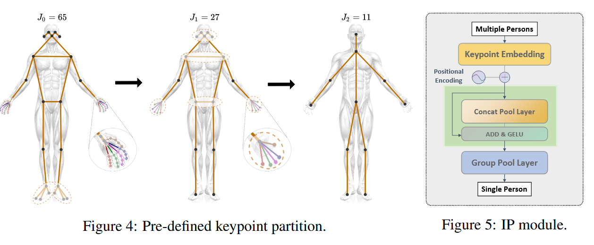
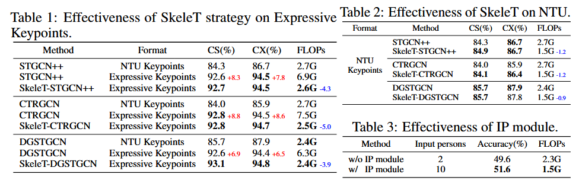
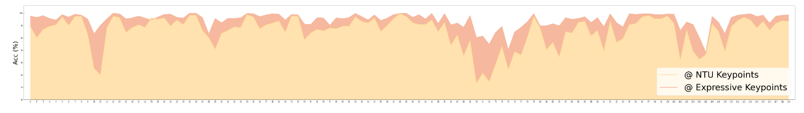
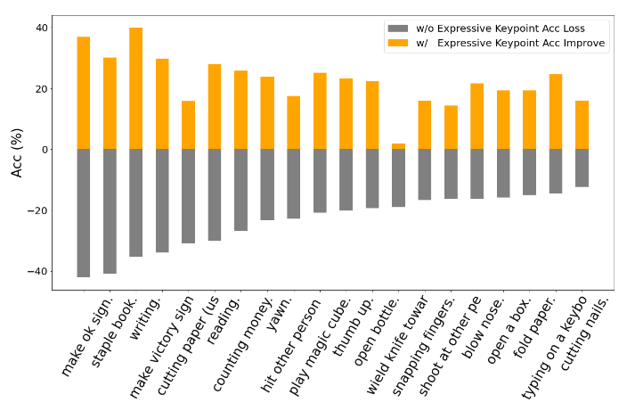
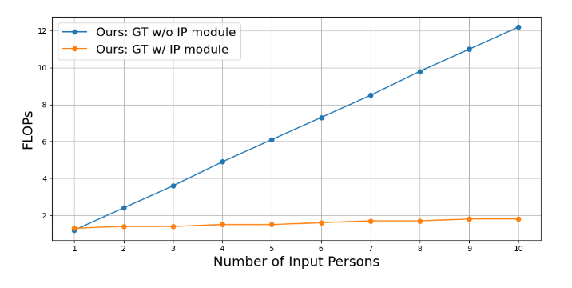
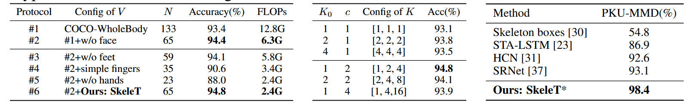
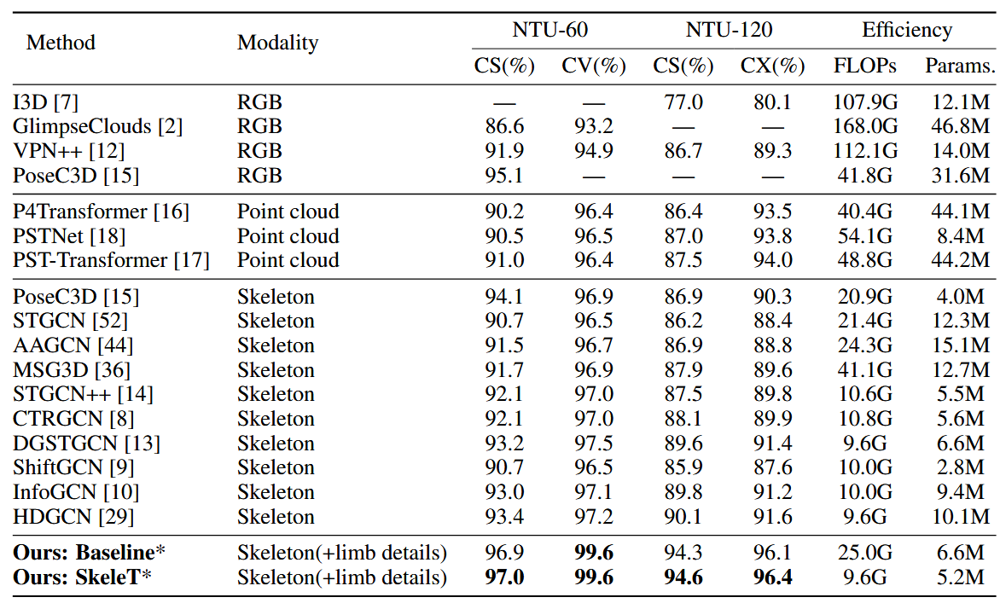
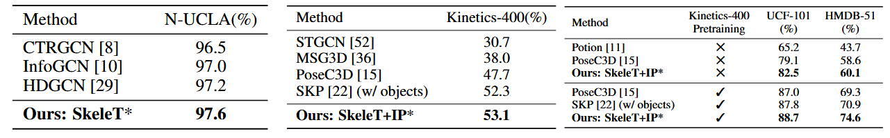

 #資料集/ntu60 #資料集/ntu120  #資料集/Kinetics400 #人體邊框偵測model/ResNet50  #骨架偵測model/HRNet   #動作識別演算法/GCN  #運行框架/pyskl  #消融實驗/分組映射框架的分組數量 #消融實驗/有無加入IP模組 #消融實驗/不同關鍵點選擇 

## 摘要

在基於骨架的動作識別領域，傳統依賴粗略身體關鍵點的方法難以捕捉到細微的人類動作。在本研究中，我們提出了**表達性關鍵點**，該==方法結合了手和腳的細節，形成了一種細粒度的骨架表示==，提升了現有模型在辨別複雜動作時的識別能力。為了有效地建模表達性關鍵點，我們==提出了**骨架轉換策略**，逐步下採樣關鍵點並通過分配權重優先處理重要關節。==此外，我們引入了一個==**即插即用的實例池化模塊**，在不增加計算成本的情況下，將我們的方法擴展到多人的場景。==基於七個數據集的大量實驗結果表明，我們的方法在骨架動作識別方面優於現有的最新技術。代碼可在 [https://github.com/YijieYang23/SkeleT-GCN](https://github.com/YijieYang23/SkeleT-GCN) 獲取。

## 1. 介紹

骨架動作識別已成為眾多視覺應用的基石，如視頻監控 [33, 47]、人機交互 [41] 和體育分析 [39]，這是因為骨架表示簡潔且對光照、比例和視角變化具有較強的魯棒性。傳統方法主要使用NTU [35, 42] 和COCO [32] 格式定義的簡單身體關鍵點，來提供人類運動的稀疏表示。儘管這些方法實用，但過於簡略的表示缺少捕捉手部和腳部動作等細微但關鍵的細節。因此，現有的粗糙骨架表示在有效區分複雜動作時存在局限性。

近來，一些方法 [16-18] 採用了點雲表示來捕捉人體表面的詳細空間結構，從而增強對複雜動作的識別能力。然而，這導致了極大的計算成本，削弱了點雲表示的效率。此外，若干研究 [22, 27, 51] 通過引入物體點來提高識別準確率，但在沒有互動物體的人類場景中，這些方法的泛化能力有限。

為了解決先前工作中的限制，我們在身體關鍵點中加入了更豐富的四肢關鍵點，提出了一種細粒度的表示方法，稱為**表達性關鍵點**。該==方法強調手部互動和腳部動作等細微動作，這對區分細緻動作至關重要。==如圖1a所示，我們展示了常用的數據表示。與RGB圖像、過多的點雲數據以及粗糙的身體關鍵點表示相比，表達性關鍵點表示因其對視角不敏感、數據量相對較小且能表示四肢細節的能力而顯得突出。實際上，表達性關鍵點可以根據COCO-Wholebody [25] 注釋從RGB圖像中輕鬆估算，而無需依賴來自多視角數據或實驗室控制的動作捕捉系統獲取深度信息。實驗結果表明，當將粗粒度關鍵點替換為表達性關鍵點時，所有三個基線方法 [8, 13, 14] 的準確性顯著提高（超過6%）。

圖 1：（a）相同操作的不同表示形式。（b）我們的方法與 NTU-60 [42]（上）和 NTU-120 [35]（下）的代表性方法的準確性和效率比較。

然而，直接使用表達性關鍵點作為輸入會顯著增加計算成本，因為需要處理的關節數量幾乎增加了三倍。為了提高計算效率，我們提出了**骨架轉換策略**（SkeleT），以多階段逐步下採樣表達性關鍵點的骨架表示。這種新穎的策略==通過可學習的映射矩陣來重新加權並下採樣關鍵點，以優化骨架特徵。==這些映射矩陣由人體拓撲的語義分區初始化，並在訓練期間逐步優化。通過進一步引入針對不同骨架規模的變量組設計，骨架特徵被均勻地拆分並獨立轉換，然後再進行拼接。SkeleT策略使關鍵點的有效下採樣和分組建模成為可能，並且可以輕鬆集成到現有的基於GCN（圖卷積網絡）的骨架動作識別方法中，形成我們的**SkeleT-GCN**，以有效處理表達性關鍵點。

在四個標準的骨架動作識別數據集上進行的實驗 [34, 35, 42, 50] 表明，SkeleT-GCN在計算量減少一半以上的情況下，達到了與基線GCN方法相當甚至更高的準確率。此外，我們還希望在多人的群體活動場景下對方法進行進一步評估，如一些常見的“野外”數據集 [26, 28, 46]。然而，我們發現傳統的GCN方法對每個輸入的個體進行獨立的特徵建模，並在後期進行特徵融合，因此隨著場景中人數的增加，計算複雜度呈指數級增長。受 [22] 啟發，我們==在GCN模型之前實施了一個輕量級的**實例池化模塊**，其核心思想是將多個人的特徵聚合並在早期階段將其投影到單一的骨架表示上。通過利用即插即用的實例池化模塊，可以在不增加計算成本的情況下支持群體活動的分類。==這為將基於GCN的骨架動作識別方法（包括我們的SkeleT-GCN）擴展到多人體場景提供了實用且可行的解決方案。

在七個數據集上的廣泛實驗評估 [26, 28, 34, 35, 42, 46, 50] 中，我們的管道在所有基準上都實現了最先進的性能，展現了其卓越的表現和強大的泛化能力。我們發現，==戰略性地使用細粒度關鍵點可以在計算複雜度較低的情況下識別複雜的人類動作。==

總結來說，我們的工作主要有三大貢獻：
- 我們引入了四肢細節作為**表達性關鍵點**表示，用於骨架動作識別，提高了識別細緻動作的性能。
- 我們提出了**骨架轉換策略**，通過動態下採樣關鍵點，使現有GCN方法在保留準確性的同時變得更高效。
- 我們實施了一個**即插即用的實例池化模塊**，以在不增加計算成本的情況下將GCN方法擴展到多人體群體活動場景。

## 2. 相關工作

### 2.1 基於點的動作識別

基於點的動作識別方法在應對光照和視角變化方面比基於RGB的方法更具魯棒性 [7, 19, 20, 45]。一些研究 [16–18, 38] 使用點雲數據作為輸入，這些數據由許多無序的3D點集組成。==然而，點雲數據為學習動作模式引入了過多的冗餘信息，導致高昂的計算成本。==一些研究利用2D/3D關鍵點 [32, 42] 來表示人體的骨架結構，這些方法通常也被稱為基於骨架的方法。在這些方法中，圖卷積網絡（GCN）模型 [8, 10, 13, 14, 29, 44, 52] 由於能夠有效表示圖結構 [40]，被廣泛採用。此外，一些模型 [5, 6, 15] 嘗試將人體關鍵點投影到多個2D偽圖像中以學習有用特徵，並且取得了顯著的性能。然而，現有的基於骨架的方法使用粗粒度的骨架表示作為輸入，難以識別複雜的動作，導致性能的局限。為了解決這一問題，我們提出將手部和腳部關鍵點納入身體部分，形成細粒度的骨架結構，以更好地區分複雜的動作。

### 2.2 基於GCN的骨架動作識別

STGCN [52] 首次使用圖卷積進行骨架動作識別，隨後基於GCN的方法迅速成為主流。近來的研究 [8, 13, 14, 44] 對此進行了不同的改進。MS-AAGCN [44] 提出自適應學習圖的拓撲結構，而不是手動設置。CTRGCN [8] 使用共享的拓撲矩陣作為網絡通道的通用先驗，以提高性能。PYSKL [14] 提供了一個開源工具箱，用於骨架動作識別，並以良好的實踐為基準測試了代表性的GCN方法。DGSTGCN [13] 則提出了一種輕量但強大的模型，無需預定義圖結構。

==然而，傳統方法通常面臨兩個限制：（1）它們維持靜態的骨架結構，關鍵點數量固定，這限制了它們捕捉多尺度信息的能力；（2）隨著每增加一個人，計算成本呈線性增長，導致輸入最多只能包含兩個人。在本研究中，我們提出了**骨架轉換策略**，以動態修改骨架結構並下採樣關鍵點。此外，我們引入了**實例池化模塊**，以克服輸入人數的限制。==

## 3. 提出的方法管道

我們提出的整體管道如圖2所示。在第3.1節中，我們將四肢的詳細關鍵點納入粗粒度的身體關鍵點，形成**表達性關鍵點**的表示。我們詳細介紹了這些關鍵點的收集和預處理過程，並強調了此方法的優勢。在第3.2節中，我們提出了**骨架轉換策略**，以有效處理更多的四肢關鍵點。我們發現，在網絡處理過程中，隱式聚合潛在空間中的關鍵點可以顯著降低計算複雜度，同時保持高準確率。在第3.3節中，我們發現傳統方法對每個實例進行個體建模並在後期融合特徵的方式，限制了其對輸入人數的可擴展性。因此，我們引入了一個**即插即用的實例池化模塊**，用於多實例輸入（見第3.3節），支持群體活動的識別而不增加計算成本。

### 3.1 表達性關鍵點表示

**數據收集**。我們==得益於COCO-WholeBody [25] 提供的密集標記，==該數據集包含133個關鍵點，其中包括17個身體關鍵點、68個面部關鍵點、42個手部關鍵點和6個腳部關鍵點，這為細粒度骨架表示提供了基礎。在實踐中，COCO-WholeBody可以通過自上而下的估計器提取。我們首==先使用基於ResNet50的Faster-RCNN [21] 提取人體邊界框，隨後通過預訓練的姿態估計器 [48] 獲取邊界框內的COCO-WholeBody [25] 關鍵點。==

圖 2：提出的 pipeline 概述。（a）我們使用自上而下的估計器從視頻中提取 COCOWholeBody 關鍵點，並根據統計指標進行關鍵點選擇，去除多餘的面部關鍵點，形成我們的 Expressive Keypoints 表示。(b) 我們提出了骨架轉換策略，該策略可以集成到大多數 GCN 方法中，以有效地處理表達關鍵點。它通過對關鍵點進行重新加權和逐漸下採樣，引導網路成組地更改骨骼特徵。（c）我們實現了一個 Instance Pooling 模組，在早期階段將多個實例融合在一起。我們將其用作輕量級擴展，用於在包含多人小組活動的一般野外場景中評估我們的方法。

**關鍵點選擇**。我們發現，直接使用COCO-WholeBody作為輸入不僅會導致顯著的計算成本，還會降低性能，因為大量冗餘的關鍵點會向模型引入大量噪音。為了減輕這一問題，我們從兩個角度選擇了133個輸入的關鍵點。首先，COCO-WholeBody不僅包括身體和詳細的手部關鍵點，還包括面部標記點，而面部標記點直觀上與人類動作無關。此外，我們分析了兩個統計指標：**視頻方差**和**動作方差**，基於NTU-120數據集計算每個人的關鍵點方差和各幀間每個關鍵點的運動頻率。更多詳細信息和結果可在附錄D中查閱。我們發現==面部的關鍵點（第23至90號）具有較高的視頻方差和較低的運動頻率，這表明它們對動作識別的貢獻較小。這一觀察指導我們手動移除了這些關鍵點，形成最終的**表達性關鍵點**表示。==

### 3.2 骨架轉換策略

表達性關鍵點的表示為骨架動作識別提供了豐富的運動線索。然而，直接將表達性關鍵點輸入現有的GCN方法會遇到幾個限制。(i) **低效率**：處理更多的四肢關節比粗粒度關節大幅增加了計算複雜度。(ii) **次優的準確性**：表達性關鍵點的拓撲圖更為複雜，並且存在多跳連接，這妨礙了網絡在遠距節點之間有效地交換信息。因此，它面臨著更加突出的長程依賴問題[29]。我們認為，關鍵問題在於傳統方法在前向傳播過程中保持了固定的骨架結構。

為此，==我們提出了一種新穎的**骨架轉換策略**（SkeleT），以在處理階段逐步下採樣表達性關鍵點。SkeleT策略可以無縫集成到大多數GCN方法中，從而創建我們的SkeleT-GCN（例如，基線：DGSTGCN [13] → 我們的：SkeleT-DGSTGCN），而無需修改其圖卷積和時間卷積層的內部實現或高層次的架構設計。我們所做的工作是將基線圖卷積層封裝在提出的**分組映射框架**中，將輸入的關鍵點特徵劃分為多組，並在進入圖卷積層之前與映射矩陣相乘。==

通過策略性地利用表達性關鍵點，我們的SkeleT-GCN在計算成本（GFLOPs）遠低於基線GCN方法的情況下，實現了相當或更高的準確性。

圖 3：分組映射框架 $\hat{F}$ 的架構。大多數基於 GCN 的方法都可以採用圖卷積層 $g$ 和時間捲積層 $T$。

### 3.2.1 GCN的基本介紹與符號表示

骨架序列 $\mathbf{X}\in\mathbb{R}^{J\times T\times C}$ 由在 $T$ 幀中每個關節具有 $C$ 個維度通道的關節點 $J$ 構成。對於大多數現有的基於GCN的方法，它們具有相同的架構設計，包括 $M$ 個時空塊，每個時空塊 $\mathcal{F}$ 包含一個圖卷積層 $\mathcal{G}$ 和一個時間卷積層 $\mathcal{T}$，交替建模空間和時間信息。我們用 $\mathbb{B}=\{1,2,..,M\}$ 表示時空塊的索引集合，並且該集合包含兩個子集 $\mathbb{B}_n$ 和 $\mathbb{B}_d$，其中 $\mathbb{B}_d$ 包含下採樣塊 $\mathcal{F}_d$ 的索引，這些塊負責對時間長度進行下採樣，而 $\mathbb{B}_n$ 包含其他普通塊 $\mathcal{F}_n$ 的索引。鄰接矩陣 $A\in \mathbb{R}^{J \times J}$ 定義了人體骨架的拓撲連接，當第 $i$ 個關節和第 $j$ 個關節物理上連接時，$A_{ij} = 1$，否則為0。$F$ 的計算可以總結如下：

$$
\mathcal{F}(\mathbf{X},\mathbf{A})=\mathcal{T}(\mathcal{G}(\mathbf{X},\widetilde{\mathbf{A}}))+\mathbf{X}, \tag{1}
$$

其中 $\tilde{A} = A + I$ 是帶有自環的骨架拓撲圖。

### 3.2.2 分組映射框架

為了實現現有GCN方法的SkeleT策略，我們==提出了**分組映射框架**，它封裝了任何GCN方法的原始圖卷積層 $G$ 和時間卷積層 $T$，而不修改其內部設計。==我們同樣繼承了高層架構 $\mathbb{B} = \mathbb{B}_n \cup \mathbb{B}_d$。我們用  $\hat{F}$ 表示分組映射框架，其詳細架構如圖3所示。==具體來說，我們將骨架序列 $X$ 的通道維度分為 $K$ 組，從而將每個特徵組的通道寬度減少到 $C/K$。隨後，每個特徵組與相應的映射矩陣 $M$ 相乘，自適應地改變骨架結構。接下來，我們並行化 $K$ 個基線圖卷積層 $\{\mathcal{G}_1, ..., \mathcal{G}_K\}$，提取組特定的特徵，從而豐富各種結構中的運動特徵表示。最後，將 $K$ 組特徵在通道維度上拼接，並由基線的時間卷積層 $T$ 處理時間依賴性，生成精細的運動特徵。==分組映射框架 $\hat{F}$ 的完整處理過程可以表述為：

$$
\hat{\mathcal{F}}(\mathbf{X},\mathbf{A},\mathbf{M})=\mathcal{T}(\sigma(\mathcal{G}_k(\mathbf{M}_k\mathbf{X}_k,\widetilde{\mathbf{A}})\mathbf{W}))+res(\mathbf{X}),k\in\{1,...,K\}, \tag{2}
$$

其中，$X_k$ 是第 $k$ 組特徵，$W$ 是可學習的權重，$\sigma(\cdot)$ 和 $\text{res}(\cdot)$ 分別表示激活函數和殘差連接。我們隨後詳細說明映射矩陣 $M$。

**映射矩陣** 下採樣關鍵點的主要思想是通過與映射矩陣 $\mathrm{M}^d\in\mathbb{R}^{J_i\times J_{i+1}}$ 相乘來融合相關的關節。它將原始骨架 $X$ 中的 $J_i$ 關節映射到新的骨架 $X'$，該過程可表示如下：

$$
X' = M^d X, \tag{3}
$$

一旦骨架結構被下採樣，新的鄰接矩陣可以計算如下：

$$
A' = (M^d)^T A M_d. \tag{4}
$$

下採樣操作僅在 $\mathbb{B}^d$ 中的下採樣塊中進行。對於 $\mathbb{B}^n$ 中的其他普通塊，映射矩陣 $M^n \in \mathbb{R}^{J_i \times J_i}$ 被定義為一個可學習的對角矩陣，不會對關鍵點進行下採樣。它用來重新加權骨架關節，使得網絡通過對角線上的權重分配來優先處理重要關節。考慮到 $\hat{F}$ 的索引和映射矩陣的類型，公式(2)可以詳細表示為：

$$
\left.\hat{\mathcal{F}}_{(i)}(\mathbf{X},\mathbf{A},\mathbf{M})=\left\{\begin{array}{ll}\mathcal{T}(\sigma(\{[\mathcal{G}_k(\mathcal{M}_k^n\mathbf{X}_k,\widetilde{\mathbf{A}})]\}_{k\in\{1,...,K\}}\mathbf{W})+\mathbf{X}&,i\in\mathbb{B}^n,\\\mathcal{T}(\sigma(\{[\mathcal{G}_k(\mathcal{M}_k^d\mathbf{X}_k,\widetilde{\mathbf{A}})]\}_{k\in\{1,...,K\}}\mathbf{W})+\mathbf{M}^d\mathbf{X}&,i\in\mathbb{B}^d.\end{array}\right.\right. \tag{5}
$$

**預定義的關鍵點劃分**如圖4所示，上述的下採樣映射矩陣 $M^d$ 的權重為 $[J_i, J_{i+1}]$，將 $J_i$ 關鍵點映射到 $J_{i+1}$ 關鍵點，並且需要一個良好的初始化來穩定訓練初期的過程。相鄰的關鍵點在人體動作中通常具有相似的語義，因此我們使用預定義的語義知識來初始化 $M_d[i,i+1]$。具體來說，$J_i$ 關節可以分為部分集合 $\{P_{(i, i+1)}\}$，其中 $J_{i+1}^k$ （第 $J_{i+1}$ 個關節點中的第 $k$ 個關節）包含來自 $J_i$​ 的索引 $P_{(i, i+1)}^k$ 。一旦劃分確定，映射矩陣中 $\mathbf{M}^d\left(j\in J_i,k\in J_{i+1}\right)$ 第 $j$ 行和第 $k$ 列的初始化元素 可以表示如下：

$$
\mathbf{M}_{(j,k)}^d=\{\begin{array}{cc}\frac1{len(P_{(i,i+1)}^k)}&,j\in P_{i,i+1}^k,\\0&,\text{ otherwise.}\end{array} \tag{6}
$$

關鍵點的劃分由語義引導，類似於手指上的關節點在初始化時被分為同一部分。

### 3.3 實例池化模塊

以往基於GCN的方法的計算隨著視頻中人物數量的增加而線性增長，這使得它們在群體活動識別中效率較低。其主要==問題在於傳統方法是獨立建模每個人的骨架序列，然後在後期進行特徵融合。==

==為了解決這個問題，我們實施了一個即插即用的**實例池化（Instance Pooling, IP）模塊**，該模塊在將多個輸入骨架序列輸入GCN之前，對它們進行早期特徵融合。如圖5所示，我們首先利用全連接層和來自多人骨架序列的關鍵點位置編碼來獲取關鍵點嵌入。隨後，採用由[22]提出的**拼接池化層**（Concat Pool Layer, $P_c(\cdot)$）和**分組池化層**（Group Pool Layer, $P_g(\cdot)$）來聚合 $I$ 個實例級特徵向量。==這一過程可以公式化為：

$$
\mathbf{Y}^{\prime}=\mathcal{P}_g(\sigma(\mathcal{P}_c(\mathbf{Y})+\mathbf{Y})), \tag{7}
$$

其中，$\mathbf{Y}=\textit{ emb}(\{\mathbf{X}_1,\mathbf{X}_2,...,\mathbf{X}_I\})\in\mathbb{R}^{I\times J\times T\times C}$ 是多人骨架嵌入的特徵表示，$Y' \in \mathbb{R}^{J \times T \times C}$ 是聚合後的單人表示，其中實例維度 $I$ 已被消除。

==通過在輕量級的IP模塊中進行早期融合，隨後的GCN將僅需對這些聚合後的數據進行一次空間-時間建模，而不受輸入實例數量的影響。==該IP模塊是一個靈活且輕量的擴展，可用於任何基於GCN的方法（包括我們的SkeleT-GCN）。它為基於GCN的骨架動作識別方法擴展到多人體群體活動場景提供了一個實用且高效的解決方案，而不會大幅增加計算成本。

### 4 實驗

我們進行了綜合實驗來評估我們提出的管道，在七個數據集上進行測試，包括 NTU-60 [42]、NTU-120 [35]、PKU-MMD [34]、N-UCLA [50]、Kinetics-400 [26]、UCF101 [46] 和 HMDB-51 [28]。數據集概述（見附錄A）和實現細節（見附錄E）在附錄中提供。我們報告了Top-1準確率來評估模型的識別性能，並報告了浮點運算次數（FLOPs）和參數數量（Params.）來評估模型在計算成本和模型規模方面的效率。

### 4.1 提出組件的有效性

我們對提出的管道中每個組件的有效性進行了評估，這些組件包括表達性關鍵點表示、SkeleT策略和IP模塊。

**表達性關鍵點表示**。在NTU-120數據集上，我們將表達性關鍵點直接輸入到三個代表性GCN方法中，分別是STGCN++ [14]、CTRGCN [8] 和 DGSTGCN [13]。如表1所示，表達性關鍵點表示顯著提升了三個基線網絡的動作識別性能（分別提升了+7.8%、+8.6%、+6.5%）。此外，我們進一步評估了在替換粗粒度的NTU關鍵點為細粒度的表達性關鍵點時，對120個動作類別的準確率提升（見圖6）以及對最難的前20個動作案例的準確率提升（見圖7）。可以看出，結合四肢的詳細關鍵點能夠穩定提升骨架動作識別性能，特別是在辨別具有細微肢體動作的難以識別的動作時。

圖 6：NTU 關鍵點和 Expressive 關鍵點之間 120 個操作的準確性比較。

圖 7：前 20 個困難案例的比較。灰色條表示與 NTU 關鍵點的平均值相比，準確性降低，橙色條表示使用 Expressive 關鍵點的準確性有所提高。

圖 8：IP 模組的消融研究，與輸入的人數相對。在沒有IP模組的情況下，FLOPs 隨人數的增加而線性增加。而 FLOPs 幾乎不會隨著 IP 模組的增加而增加。

表 4：輸入關鍵點選擇的消融研究。簡單手指意味著每個手指只保留一個關鍵點。
表 5：組配置的消融研究。
表 6：PKU-MMD 數據集的性能比較。

**SkeleT策略**。我們進一步將提出的SkeleT策略整合到基線GCN方法中，形成我們的SkeleT-GCN，包括SkeleT-STGCN++、SkeleT-CTRGCN和SkeleT-DGSTGCN。通過逐步下採樣表達性關鍵點，應用SkeleT策略的三個基線模型顯著減少了超過一半的計算成本（分別減少了-4.3G、-5.0G、-3.9G），同時達到了相當甚至更高的準確率，如表1所示。此外，我們還使用NTU關鍵點輸入評估了SkeleT策略的有效性。如表2所示，SkeleT策略也能大幅降低處理粗粒度骨架數據的計算成本（從2.4G∼2.7G降至1.5G），同時保持準確性。可以觀察到在六個設置中的一個情況下準確性略有下降，我們認為這是因為粗粒度的骨架表示已經非常簡潔，進一步下採樣可能導致特徵不足。

**IP模塊**。在包含多人群體活動場景的HMDB-51數據集上，我們使用SkeleT-DGSTGCN測試了使用和不使用IP模塊的計算成本和準確率。結果如表3所示，我們發現結合IP模塊後，識別準確率有所提高，同時大幅降低了FLOPs。此外，圖8展示了隨著輸入人數的增加，FLOPs的變化。沒有IP模塊時，隨著個體數量的增加，計算成本急劇增加，這是因為傳統GCN管道需要對每個個體進行大量特徵建模。然而，結合IP模塊後，FLOPs的增幅很小，因為多個個體的特徵在進入後續GCN模型之前已由輕量級的IP模塊聚合為一個表示。

### 4.2 配置探索

**輸入關鍵點選擇**我們廣泛探索了初始輸入關鍵點的選擇。如表4所示，實驗結果表明，從COCO-WholeBody關鍵點（protocol#1）中移除面部關鍵點，形成我們的表達性關鍵點（protocol#2），是合理的，並與統計分析結果一致。去除冗餘點減少了噪音的影響，從而在降低計算成本的同時提高了準確性。基於表達性關鍵點，我們嘗試進一步修剪一些關鍵點。值得注意的是，以明確的方式移除四肢關鍵點可以降低FLOPs，但也會導致準確性相應下降（protocol#3∼#5）。我們認為，對於大規模數據集中的各種動作，顯式選擇詳細的四肢關鍵點並不適用。這就是為什麼我們採用了基於學習的方法——SkeleT策略，從表達性關鍵點中進行隱式選擇（protocol#6），從而在保持高準確性的同時大幅節省FLOPs。

**分組設計**表5展示了關於初始分組數量 $K_0$ 和分組擴展因子 $c$ 的六種配置。值得注意的是，靜態分組設計($c = 1$）表現出次優的性能。對於擴展分組設計，[1, 2, 4] 的分組配置提供了最佳的準確性表現。我們認為過多的分組會在通道拆分後導致特徵數量過少，從而限制表示能力。

### 4.3 與最新技術的比較

在與最新技術（SOTA）的比較中，我們選擇使用表達性關鍵點輸入的DGSTGCN [13] 作為基線方法（標記為“Ours: Baseline”），並應用SkeleT策略形成我們的SkeleT-DGSTGCN（標記為“Ours: SkeleT”）。在實驗中，* 表示使用表達性關鍵點，我們採用了一種類似於先前工作 [8, 13, 14, 44] 的四流融合策略。

在NTU-60和NTU-120數據集上，如表7所示，表達性關鍵點大大提高了基於骨架的動作識別準確性，甚至超過了基於點雲 [17] 和RGB的最新方法 [15]。在應用SkeleT策略後，我們的方法顯著降低了計算成本（從25.0G降低到9.6G），並且達到相當或更高的準確性。

表 7 在相同資料集 NTU60 與 NTU120 與其他 SOTA 方法的準確性和效率比較

在PKU-MMD數據集上，如表6所示，我們的方法在Top-1準確率達到98.4%，顯著超越了所有先前的基於骨架的方法，達到了最先進的性能。

在N-UCLA數據集上，如表8所示，我們的方法實現了97.6%的Top-1準確率，同樣超過了之前的最佳方法[29]。值得注意的是，在標準骨架數據集中，N-UCLA具有最顯著的視角變化和嚴重的遮擋問題。儘管受限於無法利用深度信息和3D空間增強（如3D隨機旋轉）的2D估計表示，我們的方法仍然取得了非常有希望的性能。

我們進一步將SkeleT-DGSTGCN與IP模塊相結合（標記為“Ours: SkeleT+IP”），從而使我們的方法能夠在更通用的“野外”動作識別數據集[26, 28, 46]上進行評估。對於涵蓋許多人體-物體交互場景（如削蘋果、削馬鈴薯）的Kinetics-400數據集，純骨架方法的準確率遠低於其他數據集，因為這些方法無法捕捉物體信息。因此，SKP [22] 將物體輪廓納入，將基於關鍵點的基準準確率提高到52.3%。然而，如表9所示，通過策略性地利用表達性關鍵點，我們的方法即使在沒有物體信息的情況下，仍在Kinetics-400數據集上達到了最先進的性能（53.1%）。這是通過我們的表達性骨架表示和有效的轉換策略實現的，展示了我們的管道即使在這些挑戰性條件下仍然能夠發揮效力。

此外，我們在UCF-101和HMDB-51數據集上進行了公平的對比。如表10所示，我們的方法無論是否在Kinetics-400數據集上進行預訓練，始終超越了之前基於骨架的最新技術[15, 22]。

表 8：N-UCLA 的性能比較。
表 9：Kinetics-400 的性能比較。
表 10：UCF-101 和 HMDB-51 的性能比較。

### 5 結論

在這項工作中，我們提出了使用表達性關鍵點表示的骨架轉換策略，實現了高效識別細節動作的能力，同時保持了較高的效率。此外，我們實施了一個實例池化模塊，擴展了基於GCN的方法在多人體場景中的應用。通過在七個數據集上的綜合實驗，我們的方法展示了卓越的性能和強大的泛化能力。