#資料集/ntu60 #資料集/ntu120 #資料集/PKUMMD #骨架偵測/tools/Kinectv2  #動作識別/線性分類器 (全連接層) #動作識別/自監督學習/MAE #動作識別/自監督學習/ContrastiveLearn 

## 摘要  
自我監督學習已被證明對基於骨架的人類行為理解有效，這是一個重要但具有挑戰性的課題。先前的研究主要依賴對比學習或遮蔽運動建模來建模骨架關係。然而，這些方法無法有效且同時處理序列層級和關節層級的表徵學習，導致所學得的表徵無法泛化到不同的下游任務。此外，簡單地將這兩種範式結合，未能挖掘出它們之間的協同作用，並可能在訓練中引起干擾。為了解決這些問題，我們提出了名為「PCM3」（Prompted Contrast with Masked Motion Modeling）的通用3D行為表徵學習方法。我們的方法將對比學習與遮蔽預測任務以互惠的方式整合，大幅提升了對各種下游任務的泛化能力。具體來說，遮蔽預測為對比學習提供了新的訓練視角，而對比學習則用高層次的語義信息引導了遮蔽預測的訓練。此外，我們提出了雙重提示的多任務預訓練策略，透過減少學習這兩種不同預訓練任務時產生的干擾，進一步改善了模型的表徵。基於三個大規模數據集，我們在五個下游任務上進行了廣泛的實驗，展示了PCM3相較於最先進的研究作品在泛化能力上的優勢。我們的項目公開於：https://jhang2020.github.io/Projects/PCM3/PCM3.html。

## 1 引言

人類活動理解是一個多媒體處理中的關鍵問題，因其在現實生活應用中扮演著重要角色，例如人機互動 [18]、醫療保健 [25] 和自動駕駛 [2]。作為人類活動理解的一種高效表徵，3D 骨架通過人體關鍵關節的 3D 座標來表示人體形態。與其他表徵方式（如 RGB 視頻和深度數據）相比，骨架具有輕量化、緊湊性和隱私保護等優勢。由於這些競爭優勢，骨架已廣泛應用於人類行為分析中。

許多研究已經致力於基於監督學習的骨架行為學習 [6, 9, 35, 47]。然而，這些方法的性能嚴重依賴於大量的標註數據，而這些標註數據的收集既耗時又昂貴。這一全監督學習方法的內在缺陷限制了其在現實世界中的應用。因此，越來越多的研究開始關注自我監督的 3D 行為表徵學習，從無標註數據中學習有意義的特徵。

自我監督的 3D 行為表徵學習主要集中在兩種模式上：基於重建的方法和基於對比學習的方法。基於重建的方法利用編碼器-解碼器架構，通過預測遮蔽的骨架（即遮蔽建模）或重建原始數據來學習表徵。這些方法側重於關節層級的特徵建模，並捕捉時空關係。相比之下，基於對比學習的方法通過數據增強構建正負樣本對，並應用實例區分任務來學習序列層級的語義特徵。

然而，值得注意的是，最近的大多數表徵學習方法專注於單一範式來建模關節層級（通過遮蔽骨架建模）[45, 53] 或序列層級（通過對比學習）[8, 20, 26, 52] 的特徵。因此，這些方法難以在不同的下游任務中很好地泛化，例如識別任務和運動預測，因為它們無法同時有效地學習不同粒度的表徵。儘管一些研究 [21, 40, 43] 致力於結合上述兩種方法以學習更豐富的表徵，但僅取得了中等的改進。這是因為簡單地結合這兩種方法忽略了遮蔽預測與對比學習特徵建模機制之間的差異，未能充分利用其潛在的協同作用。這些問題限制了模型的泛化能力，使得通用的 3D 行為表徵學習成為一個具有挑戰性的且未被充分探索的領域。

為了解決這些問題，我們提出了帶有遮蔽運動建模的提示對比學習（PCM3），該方法探索了上述兩種範式之間的相互協作，以實現通用的 3D 行為表徵學習，如圖 1 所示。具體來說，首先提出了精心設計的內部和外部對比學習以及基於拓撲的遮蔽骨架預測作為基本流程。此外，我們將這兩個任務連接起來，探索它們之間的協同作用。遮蔽預測訓練中的視角被用作對比學習的新穎正樣本。反過來，遮蔽預測分支也通過來自對比學習分支的梯度更新，以獲得更高層次的語義指導。同時，為了減少不同預訓練任務和數據視角之間的學習干擾，我們提出了雙提示多任務預訓練策略。兩種類型的提示，即領域特定提示和任務特定提示，被應用來明確指導模型從不同的數據視角和任務中學習。

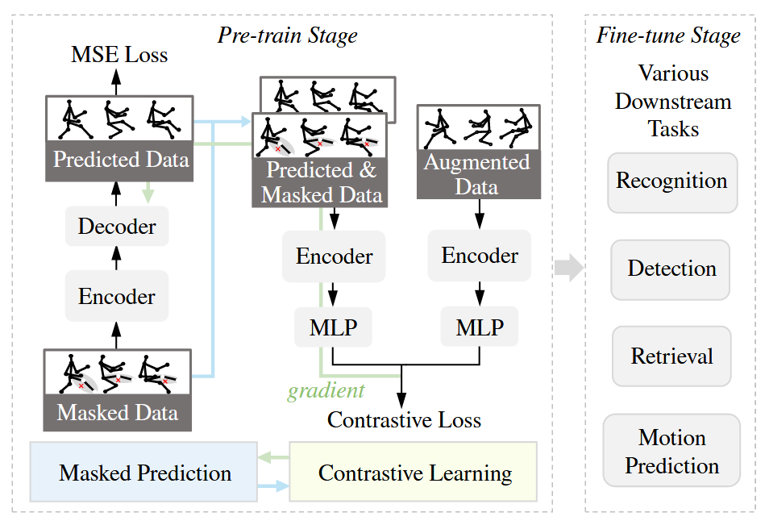
圖 1：提出的多功能動作表示學習方法的插圖。我們以互惠互利的方式整合了對比學習和掩蔽骨架建模範式。掩蔽預測為對比學習提供了新的視圖（藍色箭頭），生成的對比梯度（綠色箭頭）反過來作為掩蔽預測的高級語義指導，對關節級別和序列級別的特徵進行建模。

我們在五個下游任務上進行了廣泛的實驗，為該方法進行了全面評估。相比於最先進的方法，我們提出的方法展現了出色的泛化能力。我們的貢獻可以總結如下：

- 我們==提出了 PCM3 以實現多粒度的表徵，將遮蔽骨架預測和對比學習範式以互惠的方式結合。通過遮蔽預測網絡生成更多樣化的正運動視角來進行對比學習。同時，生成的梯度被傳播並用高層次的語義信息引導遮蔽預測學習。==
- 考慮到不同的數據視角和預訓練任務可能會引起相互干擾，我們==引入了領域特定提示和任務特定提示來進行多任務預訓練。這些可訓練的提示使模型能夠為不同的骨架生成更具區分性的表徵。==
- 我們進行了嚴格的定量實驗，評估了最先進的自我監督 3D 行為表徵學習技術在五個下游任務中的泛化效果，包括識別、檢索、檢測和運動預測，並涵蓋了未損壞和損壞的骨架數據。我們的研究為研究社群提供了一個全面的基準，我們相信這能為該領域的未來研究提供有價值的見解和幫助。

## 2 相關工作

### 2.1 基於骨架的動作識別

隨著深度學習的巨大進展，基於循環神經網絡（RNN）、卷積神經網絡（CNN）、圖卷積神經網絡（GCN）和 Transformer 的方法被廣泛應用於基於骨架的動作識別。RNN 已經被廣泛用來建模時間依賴性，並捕捉骨架動作識別中的運動特徵。研究 [9] 中使用 RNN 將骨架視為序列數據來處理。隨後，Song 等人 [37, 38] 提出了利用注意力機制和多模態信息來增強特徵表徵。其他一些研究 [15, 24] 將每個骨架序列轉換為類似圖像的表徵，並應用 CNN 模型來提取時空信息。近年來，基於 GCN 的方法由於人體的自然拓撲結構，吸引了更多的關注。許多研究 [6, 35, 47] 將 GCN 應用於空間和時間維度 [47]，並在監督學習的骨架動作識別中取得了顯著成果。同時，由於 transformer 模型 [29, 36] 能夠通過注意力機制學習長距離的時間依賴性，也展示了有前景的結果。

==然而，這些監督學習方法依賴於大量的標註數據來訓練模型。在本文中，我們探討的是自我監督的 3D 行為表徵學習。==

### 2.2 基於骨架的對比學習

==對比學習 Contrastive Learning [3, 4, 14] 已經被證明在骨架表徵學習中具有良好效果。==一個受歡迎的研究方向是骨架數據的增強方法，這對所學表徵的質量至關重要。Guo 等人 [12] 探討了在當前對比學習管道中使用極端增強方法。Zhang 等人 [52] 提出了層次一致性對比學習，利用了更強的增強技術。另一個研究角度是探索骨架中不同視角的知識。ISC [41] 採用了圖像、圖結構和序列表徵的跨對比學習方式。Li 等人 [20] 利用了不同骨架模態（如關節、骨骼、運動）挖掘潛在的正樣本，並根據相似度對訓練樣本進行重新加權。Mao 等人 [26] 在不同視角之間進行了互相蒸餾。==與上述工作不同的是，我們提出將遮蔽建模預訓任務與對比學習相結合，對關節層級和序列層級的特徵進行建模，以實現更通用的表徵學習。==

### 2.3 遮蔽影像/骨架建模

遮蔽建模最早在堆疊去噪自編碼器 [42] 中得到探索，將遮蔽操作視為對原始數據添加噪聲。最近，遮蔽建模在自我監督學習中取得了顯著的成功 [13, 46]，特別是在影像表徵學習領域。對於骨架數據，LongT GAN [53] 直接使用基於自編碼器的模型，並通過附加的對抗訓練策略來優化。一些研究 [21, 40] 應用運動預測預訓任務來學習骨架序列中的時間依賴性。受到遮蔽自編碼器 [13] 的啟發，Wu 等人 [45] 提出了遮蔽骨架自編碼器來學習時空關係。在本文中，我們探索了遮蔽建模與對比學習之間的協同作用，並提出了一種基於拓撲的遮蔽策略，以進一步提升表徵學習的效果。

## 3 提出的方法：PCM3

在本部分中，我們首先描述設計的對比學習流程（第 3.1 節）以及我們提出的基於拓撲的遮蔽建模方法（第 3.2 節）。接著，我們進一步在第 3.3 節中介紹了兩個預訓任務之間的協同探索。提示式預訓練策略和整體模型設計則在第 3.4 節中給出。

### 3.1 骨架對比學習

為了便於理解，根據先前的研究 [1, 3, 14]，對影像/骨架對比學習的典型設計進行了說明，通常包括以下組件：

- **數據增強模塊**：該模塊包含一系列手動的數據轉換，用來構建原始數據的不同視角，這些視角被視為共享相同語義的正樣本。
- **編碼器 $f(·)$**：作為從輸入空間映射到潛在特徵空間(latent feature space)的映射函數。
- **嵌入投影器 $h(·)$**：在編碼器 $f(·)$ 之後應用，將編碼後的特徵映射到嵌入空間，在這裡應用自我監督損失。
- **自我監督損失**：旨在最大化正樣本之間的相似度，通過進行特徵聚類操作來獲得區分性表徵空間(representation space)。

我們的==對比學習設計基於 MoCo v2 [4]。具體來說，我們引入了內部和外部骨架變換以及關係知識蒸餾，以幫助模型捕捉多樣的運動模式並提升表徵學習效果。==

**1) 骨架內轉換學習**  我們利用以下轉換方法：時間裁剪-重縮放(Temporal crop-resize)、剪切(Shear)、和關節抖動(Joint Jittering)，參考了之前的研究 [26, 41]。具體來說，給定一個骨架序列 $x$，正樣本對  $(s_{\text{intra}}, s')$  通過上述轉換構建。然後，我們通過查詢/鍵編碼器 $f_q(·)/f_k(·)$ 和嵌入投影器 $h_q(·)/h_k(·)$ 分別獲得相應的特徵表徵 $(z_{\text{intra}}, z')$。同時，維護一個記憶隊列 $M$ ，其中存儲了大量負樣本以進行對比學習。我們通過 InfoNCE 目標 [28] 來優化整個網絡：

$$
\mathcal{L}_{Info}^{Intra}=-\log\frac{\exp(z_{intra}\cdot z^{\prime}/\tau)}{\exp(z_{intra}\cdot z^{\prime}/\tau)+\sum_{i=1}\exp(z_{intra}\cdot m_{i}/\tau)},  \tag{1}
$$

其中，$m_i$ 是對應於第 $i$ 個負樣本在記憶隊列 $M$ 中的特徵，$\tau$  是溫度超參數。在每個訓練步驟後，批次中的樣本將按照先進先出策略被更新到記憶隊列中作為負樣本。鍵編碼器是查詢編碼器的動量更新版本，即：$\theta_k \leftarrow \alpha\theta_k + (1 - \alpha)\theta_q$，
其中 $\theta_q$ 和 $\theta_k$ 分別是查詢編碼器和鍵編碼器的參數， $\alpha \in [0, 1)$ 是動量係數。

**2) 骨架間轉換學習**  受混合增強技術在自我監督學習中的成功應用啟發 [17, 19, 34, 49]，我們將 $CutMix$ [48]、$ResizeMix$ [31] 和 $Mixup$ [50] 引入到骨架對比學習中。這些骨架間轉換使用兩個不同的樣本來生成混合增強視角。具體來說，給定兩個骨架序列 $s_1, s_2$，我們隨機選擇一種混合方法並獲得混合骨架數據 $s_{\text{inter}}$，具體如下：

- **Mixup [50]**：我們根據採樣的混合比例 $\lambda$ 插值兩個骨架序列，即：$s_{\text{inter}} = (1 - \lambda) s_1 + \lambda s_2$
- **CutMix [48]**：兩個骨架序列的隨機選定區域在時空維度上被剪切並粘貼，並且 $\lambda$ 定義為替換的關節數量與總關節數量的比率。
- **ResizeMix [31]**：這與 $CutMix$ 類似，但首先在時間維度上對 $s_2$ 進行降採樣，然後再進行混合。

隨後，我們可以通過 $z_{\text{inter}} = h_q \circ f_q (s_{\text{inter}})$ 獲得對應於混合數據的嵌入，並優化以下損失函數：

$$
\mathcal{L}_{Info}^{Inter}=-\log\frac{\exp(z_{inter}\cdot z_{inter}^{\prime}/\tau)}{\exp(z_{inter}\cdot z_{inter}^{\prime}/\tau)+\sum_{i=1}\exp(z_{inter}\cdot m_i/\tau)}, \tag{2}
$$

其中：$z'_{\text{inter}} = (1 - \lambda)(h_k \circ f_k (s_1)) + \lambda(h_k \circ f_k (s_2))$

**3) 關係知識蒸餾** 為了進一步在對比學習中提供細粒度的語義一致性監督，我們引入了關係知識自蒸餾損失，用於正樣本對。受到 [26, 44, 52] 的啟發，關係知識被建模為 $z'| z'_{\text{inter}}$ 與記憶隊列 $M$ 中特徵錨點之間的餘弦相似度。關係分佈（即與負錨點樣本的相似性）在每對正樣本之間被強制保持一致。以對應於前述骨架內轉換的嵌入對 $(z_{\text{intra}}, z')$為例，損失表達式為：

$$
L_{\text{Intra\_KL}} = - p(z', \tau_k) \log p(z_{\text{intra}}, \tau_q)
$$
$$
p_j(z, \tau) = \frac{\exp(z \cdot m_j /\tau)}{\sum_{i=1}^{I} \exp(z \cdot m_i /\tau)} \tag{3}
$$

其中 $m_i$ 是記憶隊列 $M$ 中存儲的第 $i$ 個特徵錨點，$\tau_k$ 和 $\tau_q$ 分別是溫度超參數，設置為 0.05 和 0.1。該蒸餾項引入更多錨點來挖掘細粒度且具語義感知的相似性關係 [44]，從而提升表徵的質量。

### 3.2 **遮蔽骨架預測**

==為了進一步豐富模型學習到的表徵，我們將遮蔽骨架建模整合到訓練過程中，並將關節層級的特徵學習融入其中。與僅使用實例級區分任務（即對比學習）相比，這進一步提升了模型的泛化能力，尤其是在密集預測下游任務中。==

首先，關於遮蔽策略，先前的研究 [45, 53] 使用隨機遮蔽來隨機選擇在時空維度上的遮蔽關節。然而，由於骨架序列具有冗餘性，遮蔽的關節很容易通過複製空間或時間維度中的相鄰關節來推斷，這不利於對骨架中有意義的關係進行建模。為此，我們==提出了基於拓撲的遮蔽策略，該策略在身體部位層級進行遮蔽，而非關節層級，即遮蔽軀幹、右手、左手、右腿和左腿。同時，我們將序列在時間維度上分為不同的片段，並在每個片段中遮蔽相同的部位==，如圖 3 所示。

基於上述遮蔽策略，我們對原始骨架 $x$ 進行遮蔽，然後將遮蔽後的骨架 $s_{\text{mask}}$ 輸入編碼器 $f_q(·)$，以獲得相應的特徵。為了預測被遮蔽的骨架區域，我們使用解碼器 $\text{dec}(·)$，該解碼器以編碼特徵為輸入，輸出重建的骨架。對於遮蔽區域，我們通過優化原始數據 $x$ 與預測數據 $s_{\text{predict}}$ 之間的均方誤差（MSE）損失：
$$
L_{\text{Mask}} = \frac{1}{N} \sum_{N} ||(x - \text{dec} \circ f_q (s_{\text{mask}})) \odot (1 - M)||_2 \tag{4}
$$
其中， $N$ 是所有被遮蔽關節的數量，$M$ 是二進制遮蔽矩陣，1 和 0 分別對應可見關節和被遮蔽關節。矩陣 $1$  是與 $M$ 形狀相同的全1 (all-one) 矩陣。

### 3.3 **對比學習與遮蔽建模之間的協作**

儘管我們提出了對比學習和遮蔽骨架預測的新流程，但我們發現，簡單地將這兩種範式整合只會帶來有限的性能提升，如表 7 所示。這是由於兩個任務的特徵建模範式之間的固有差異 [30]，模型無法直接利用它們之間的潛在協同作用。因此，在本部分中，我們探索這兩個任務的協作，並將它們以互惠的方式聯繫起來。

**1) 新穎的正樣本對作為連接**  
首先，我們在遮蔽預測訓練中利用特殊的數據視角，為對比學習提供更多樣化的正樣本。考慮到遮蔽骨架自然地模擬了骨架的遮擋，我們將遮蔽後的骨架 $s_{\text{mask}}$ 視為具有挑戰性的正樣本，來學習潛在的語義一致性並增強對遮擋的魯棒性。同時，我們還通過將解碼器 $\text{dec}(·)$ 輸出的預測骨架作為正樣本來促進對比學習。與遮蔽視角相比，預測視角包含了模型在連續訓練中帶來的內在噪聲、不確定性和多樣性，這有助於編碼更多樣的運動模式，從而提高泛化能力。

總而言之，我們利用遮蔽視角 $s_{\text{mask}}$ 和預測視角 $s_{\text{predict}}$ 作為正樣本，將遮蔽建模與對比學習聯繫起來。我們將所有正樣本對（嵌入對）呈現如下：

$$
\{(z_{\text{intra}}, z'), (z_{\text{inter}}, z'_{\text{inter}}), (z_{\text{mask}}, z'), (z_{\text{predict}}, z')\} \tag{5}
$$

這些正樣本對分別由查詢/鍵編碼器和投影器獲得。每個正樣本對都應用於計算公式（1）中的對比損失和公式（3）中的蒸餾損失。以 $(s_{\text{mask}}, s')$ 為例，它將 $z_{\text{intra}}$ 替換為 $z_{\text{mask}} = h_q \circ f_q (s_{\text{mask}})$ 進行優化。請注意，我們使用 $L_{\text{Con}}$ 和 $L_{\text{KL}}$ 分別表示總對比損失和蒸餾損失，它們包括所有四個正樣本對（如公式 5 定義）所計算的公式（1）和公式（3）中的組件損失。

**2) 高層次語義指導**

另一方面，預測骨架 $s_{\text{predict}}$ 的梯度從對比學習分支傳播到重建解碼器 $\text{dec}(·)$，如圖 2 所示。這為骨架預測提供了高層次的語義指導，與公式（4）中的均方誤差（MSE）損失一起作用，該損失作為關節層級的監督，從而改進了遮蔽預測學習，並提升了 $s_{\text{predict}}$ 作為正樣本的質量。

通過上述協同設計，遮蔽預測任務提供了作為對比學習有意義補充的新正樣本。同時，隨著對比學習的梯度傳播到遮蔽建模分支，遮蔽預測任務可以反向得到對比學習任務提供的高層次語義指導。這些設計將兩個任務聯繫起來，從而提高了表徵的質量。

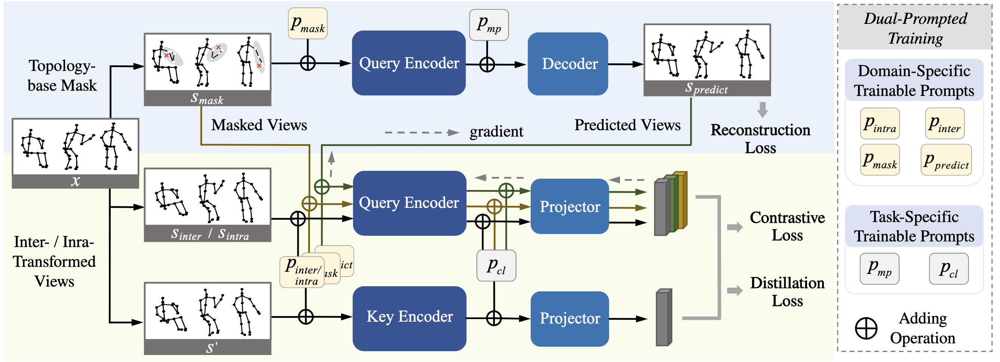
圖 2：所提出方法的概述。我們以互惠互利的方式整合了蒙版骨架預測（藍色部分）和對比學習（黃綠色部分）範式。為了簡潔起見，我們在圖中的單一分支中表示內部和相互轉換的視圖。屏蔽視圖和預測視圖用於揭示更多新穎的運動模式以進行對比學習。同時，對比學習的梯度（圖中的虛線箭頭）被傳播到屏蔽預測分支以更新解碼器。為了進一步促進不同視圖/任務的表示學習，我們提出了雙提示多任務預訓練策略，其中以輸入方式和特徵方式添加特定領域和特定任務的提示，作為訓練指導。

圖 3：基於拓樸的屏蔽策略的圖示。灰色區域是要遮蓋的身體部位。

### 3.4 **雙重提示多任務預訓練**

在自我監督的預訓練過程中，整個模型以多任務方式同時優化對比學習和遮蔽預測任務。然而，不同的預訓練任務（如對比學習和遮蔽預測）的輸入數據來自不同的分佈（領域），例如增強視角和遮蔽視角。之前的研究直接將這些數據輸入到編碼器中，以學習各自的表徵，這可能會導致特徵建模中出現模糊，從不同數據/任務中學習時也可能產生干擾。

為了解決這個問題，我們提出了一種新的雙提示多任務預訓練策略，明確指導模型從不同領域/任務中學習。具體來說，設計了兩種類型的提示，即領域特定提示和任務特定提示，它們被實現為可訓練向量，以提供訓練指導。

1) **領域特定提示**  
針對不同領域的輸入，我們為每個輸入視角（例如 $p_{\text{inter}}$、$p_{\text{intra}}$、$p_{\text{mask}}$ 和 $p_{\text{predict}}$）維護領域特定提示，這些提示的維度等於骨架的空間大小。然後，這些領域特定提示被加到對應的輸入數據中（$s^*$ 代表任何視角）：

$$
s^* = s^* + p^* \tag{6}
$$

這些裝飾過的骨架被輸入編碼器進行自我監督預訓練。這些可訓練的提示使模型能夠學習領域特定的知識，並實現更好的表徵。

2) **任務特定提示**  
對於任務特定提示，我們在編碼器之後應用深層特徵提示，而不是針對輸入進行提示，以鼓勵編碼器為不同的任務提取更多通用的特徵。當獲得表徵 $\text{feat}_* = f_q/f_k(s_*) \in \mathbb{R}^d$ 後，我們將任務特定提示 $p_{\text{cl}}$ 或 $p_{\text{mp}}$ 加到 $\text{feat}_*$ 上。具體來說，$p_{\text{cl}}$、$p_{\text{mp}} \in \mathbb{R}^r$（其中維度 $r < d$ 為了提升效率 [11]），被加到從原始特徵 $\text{feat}_*$ 中隨機選擇的 $r$ 維通道上。如果特徵要輸入到投影器 $h_q/h_k(·)$ 進行對比學習，則加上 $p_{\text{cl}}$，否則加上 $p_{\text{mp}}$ 進行遮蔽預測。這些提示能夠有效地學習任務特定知識，並減少不同預訓任務之間的干擾。

總體來說，整個模型應用以下目標進行優化，如圖 2 所示：

$$
L = L_{\text{Con}} + \lambda_m L_{\text{Mask}} + \lambda_{\text{kl}} L_{\text{KL}}, tag{7}
$$

其中，損失權重 $\lambda_m$ 和 $\lambda_{\text{kl}}$ 在實現中分別設置為 40.0 和 1.0。需要注意的是，這些提示僅在預訓練階段進行調整，因為它們針對的是自我監督的預訓練任務，而非下游任務。因此，我們在預訓練階段結束後會簡單地移除所有提示。

## 4 實驗結果

### 4.1 數據集

1) **NTU RGB+D 60 數據集 (NTU 60)** [33]  
該數據集包含 56,578 段視頻，每幀包含 25 個關節點，並定義了 60 種行為類別。我們採用了以下兩種評估協議：  
a) **跨主體 (xsub)**：訓練和測試數據來自 40 個不同的主體。  
b) **跨視角 (xview)**：訓練和測試數據來自三種不同的視角：正面視角、左側 45 度視角以及右側 45 度視角。

2) **NTU RGB+D 120 數據集 (NTU 120)** [22]  
NTU 120 是 NTU 60 數據集的擴展版本。該數據集包含 114,480 段視頻，涵蓋了 120 種行為類別。我們同樣採用了兩種推薦的評估協議：  
a) **跨主體 (xsub)**：訓練和測試數據來自 106 個不同的主體。  
b) **跨設置 (xset)**：訓練和測試數據來自 32 個不同設置，攝像機位置各異。

3) **PKU 多模態數據集 (PKUMMD)** [23]  
PKUMMD 是一個大規模數據集，專注於人類行為的多模態 3D 理解。特別是，PKUMMD 支持行為檢測的評估。該數據集將行為組織成 51 種行為類別，並包含近 20,000 個樣本。PKUMMD 被分為兩個子集：第一部分和第二部分。我們遵循先前的研究，採用跨主體協議進行實驗。

### 4.2 實現細節

我們遵循了近期工作 [26, 41] 的實驗設置。在數據預處理方面，所有的骨架序列被下採樣至 300 幀，然後裁剪並重縮放至 64 幀以輸入模型。我們採用了 3 層 Bi-GRU 作為編碼器的主幹網絡，隱藏層的維度設置為 $d = 1024$，這與之前的工作保持一致。任務提示的維度 $r$ 設置為 128。MLP 用作投影頭，將特徵映射到 128 維的嵌入空間。解碼器 $\text{dec}(·)$ 使用 512 維的 2 層 GRU。3s- 表示三個流的融合結果，即骨架的關節、骨骼和運動模態。

在自我監督預訓練過程中，模型總共訓練 450 個周期，批次大小為 128。初始學習率為 0.02，並在第 350 個周期時減少至 0.002。我們使用 SGD 優化器，動量設置為 0.9，權重衰減為 0.0001。記憶庫 $M$ 的大小設置為 16384，溫度參數 $\tau$ 設置為 0.07。

### 4.3 與最先進方法的比較

為了全面評估所提出方法 PCM3 的泛化能力，我們在三個廣泛使用的數據集上進行了五個下游任務的實驗。

**1) 基於骨架的動作識別**  
在自我監督任務中預訓練編碼器 $f(·)$ 後，我們利用學到的表徵來解決基於骨架的動作識別問題。具體來說，我們採用了兩種評估方法，即無監督學習方法和半監督學習方法。

- **無監督學習方法**  
  在編碼器之後應用一個全連接層，該層在訓練過程中保持固定。我們在表 1 中報告了 Top-1 準確率結果。在 NTU 數據集上，PCM3 在所有協議上顯著超越了其他最先進的方法。特別是在 NTU 120 數據集中，我們的方法相比於最新方法提升了 5% 以上的準確率。值得注意的是，我們的方法的單一流就能達到與最先進方法的三流系統相當的表現。同時，我們也給出了在 PKUMMD II 數據集上的結果，該數據集相對較小，但包含了更多來自現實生活中的噪聲數據。PCM3 在所有基準測試中都取得了最佳結果，表明其在跨數據集上的強大泛化能力和魯棒性。

- **半監督學習方法**  
  半監督學習方法共同訓練編碼器 $f(·)$ 和全連接層以完成識別任務，但僅使用部分有標註的訓練數據，即 1% 和 10% 的標註數據。這種方法反映了表徵的質量，因為優秀的表徵可以有效避免訓練過程中的過擬合問題。結果如表 2 所示。正如我們所看到的，PCM3 在不同比例的可用訓練數據下刷新了最先進的分數，顯示出其強大的泛化能力。

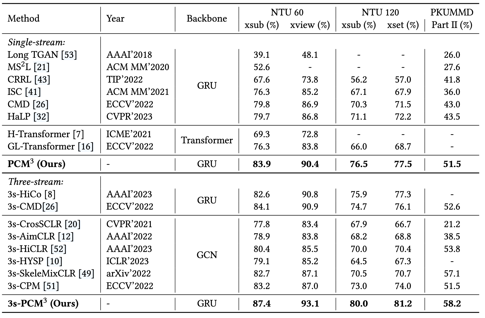
表 1：無監督動作辨識結果比較。

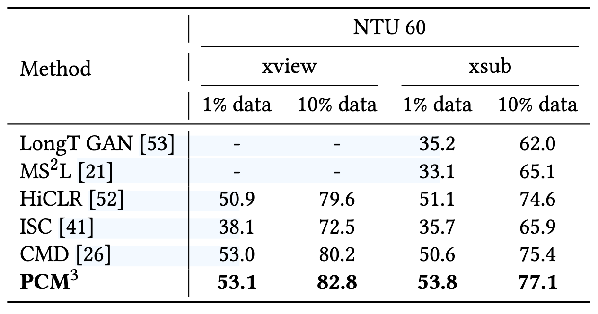
表 2：半監督評估協議下 NTU 60 的性能比較。

**2) 基於骨架的動作檢索**  
我們遵循之前工作 [40] 中介紹的設置。具體來說，我們使用 K 近鄰分類器 (KNN, k=1) 對學到的表徵進行分類，並為訓練集分配動作標籤。NTU 60 和 NTU 120 數據集的結果如表 3 所示。所提出的方法取得了最佳結果，顯著超越了其他最先進的方法，這表明通過我們的方法獲得了高度可區分的表徵空間。

**3) 帶有遮擋的動作識別**  
遮擋是現實世界中普遍存在的干擾，會嚴重影響動作識別的性能。我們將從乾淨數據集中學到的表徵轉移到帶有身體遮擋的動作識別任務中，並採用了線性評估協議。根據工作 [39]，我們使用了一個包含空間和時間遮擋的合成數據集。對於空間遮擋，我們隨機遮蔽了身體部位，如軀幹和右手。對於時間遮擋，我們將幾幀的區塊隨機遮蔽為零。所有遮蔽都是隨機生成的，遮蔽比例從 [0.3, 0.7] 中隨機取樣。實驗在與對比方法相同的設置下進行，結果如表 4 所示。由於我們提出的基於拓撲的遮蔽對比學習預訓練，該方法能夠在扭曲的數據中捕捉到區分性結構，並能很好地處理空間遮擋。同時，這種能力也很好地延伸到了時間遮擋上。正如我們所見，我們的方法在兩種遮擋情況下都顯示出顯著改進，並且相比於乾淨數據下的性能下降最小。

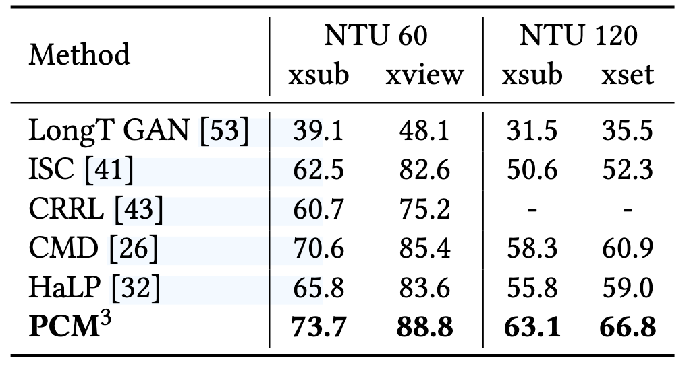
表 3：聯合流的動作檢索結果。

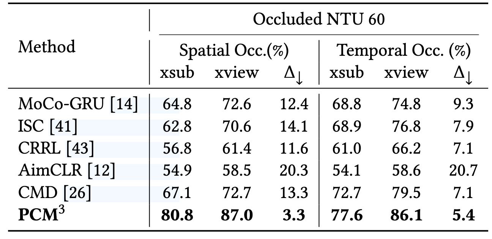
表 4：有遮蔽結果的動作辨識。 Δ↓表示與沒有遮蔽的情況相比的平均性能下降。

**4) 基於骨架的動作檢測**  
根據 [5, 23] 的設置，我們在 PKUMMD I 數據集上評估檢測性能，以展示其在短期幀級區分任務中的有效性。我們將線性分類器（全連接層）附加到編碼器上，並微調整個模型來預測每幀的標籤。編碼器首先在 NTU 60 xsub 數據集上進行預訓練，然後轉移到 PKUMMD Part I xsub 數據集。我們採用了不同動作的平均精度（mAPa）和不同視頻的平均精度（mAPv），重疊比例為 0.5 作為評估指標。結果如表 5 所示。首先，我們可以看到，與隨機初始化的模型相比，現有的對比學習方法能夠大幅提升檢測性能，這表明學習到的序列層級表徵對幀級任務在一定程度上是有益的。此外，我們的方法進一步提升了最先進的分數，這歸功於對關節層級和序列層級特徵的協同建模。

**5) 運動預測**  
根據之前的研究 [5]，我們給出了運動預測任務的結果，這是一個密集預測的下游任務。在 $f(·)$ 之後，我們使用了 [27] 中的解碼器，並遵循短期運動預測協議 [27]。如表 6 所示，我們的方法在 MPJPE 指標上取得了最佳結果。儘管基於對比學習的先前方法在高層次識別任務中顯示了良好的性能，但它們中的大多數相比隨機初始化的方法在運動預測中卻顯示出負面影響。這是因為它們只關注高層次信息，忽略了關節層級特徵建模。相比之下，我們的方法提取了關節層級和序列層級的語義特徵，從而有效提升了密集預測下游任務的性能。

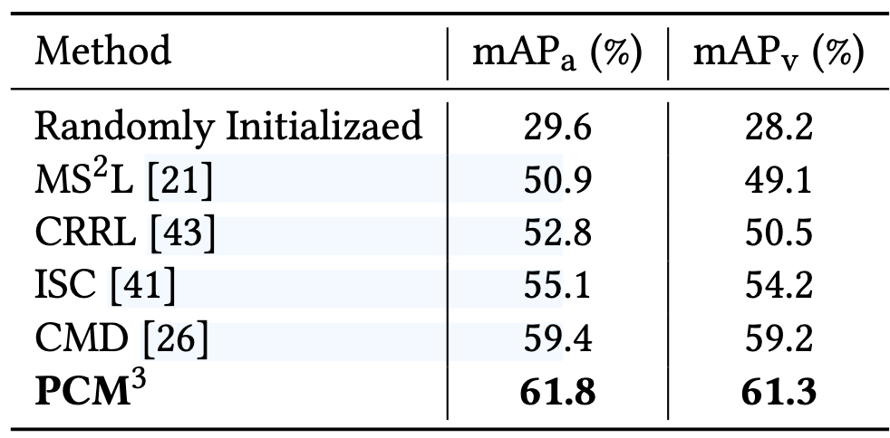
表 5：重疊率為 0.5 的 PKUMMD 第 I 部分 xsub 基準的動作偵測結果。

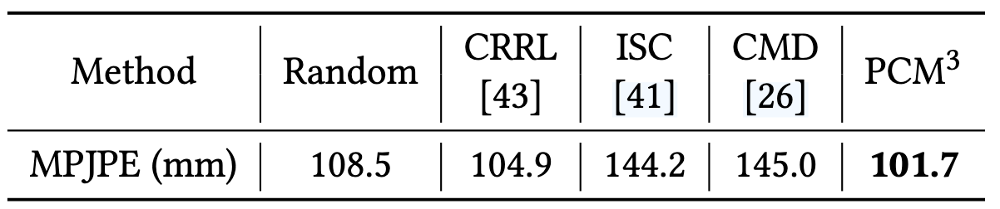
表 6：運動預測任務的結果。

### 4.4 **消融研究**

在本部分中，我們對所提出的方法進行更詳細的分析。結果基於動作識別任務的線性評估報告，默認使用 NTU 60 數據集的 xview 協議。

**1) 遮蔽策略的效果**  
我們在框架中使用了基於拓撲的遮蔽策略，以構建更具挑戰性的損壞數據視角。在表 10 中，我們報告了動作識別任務的線性評估結果，因為這在其他表徵學習方法的評估中被廣泛使用。與隨機遮蔽策略相比，模型顯示了更好的結果，表明其獲得了更可區分的特徵空間。同時，這種遮蔽策略模擬了更真實的遮擋數據，這些數據在時空維度上通常是連續的。我們將遮蔽比例設置為 0.6。

**2) 兩個任務之間協同設計的分析**  
我們首先分析了在不同下游任務中採用單一範式（即遮蔽預測或對比學習）或它們的組合時的性能，結果如表 7 所示。僅採用遮蔽預測任務無法生成高度可區分的特徵空間，導致線性識別任務中的表現較差。同時，對比學習主要建模高層次特徵，學到的先驗表徵對運動預測並無幫助。因此，為了結合兩個範式的優點，我們可以直接執行多任務學習。由於精心設計的對比學習和遮蔽預測流程，簡單的多任務方法可以取得不錯的表現。然而，它忽略了兩個任務之間的聯繫，僅在識別任務上取得了中等的改進。相比之下，我們的設計利用了兩個任務之間的協同作用，進一步提升了性能和泛化能力，證明了所提出方法的有效性。

接下來，我們詳細分析了我們協同設計的單獨效果。正如表 8 所示，所提出的內部和外部骨架轉換可以很好地提升對比學習的性能。同時，在遮蔽預測訓練中，遮蔽視角和預測視角作為正樣本對，分別帶來了 1.1% 和 1.5% 的提升。關係蒸餾損失被證明是有效的，進一步提升了表徵質量。

最後，我們展示了將對比分支的梯度傳播到遮蔽預測中的效果，當梯度傳播時，模型達到 80.5 分，而不傳播梯度時為 80.0 分，即將兩個分支的梯度隔離。對比分支的梯度信息可以作為高層次的語義指導，促進遮蔽預測訓練並產生更具信息性的正樣本。

**3) 雙提示預訓練策略的效果**  
我們在表 9 中展示了不同提示類型的效果。正如我們所見，所提出的領域特定提示和任務特定提示對表徵學習是有效的，這些提示可以學習領域和任務的特定知識，並在訓練中提供明確的指導。這有助於模型區分領域和任務身份，減少模型在從多視角數據和多任務中學習時的干擾和模糊性。當這兩種類型的提示都被使用時，模型取得了最佳結果。

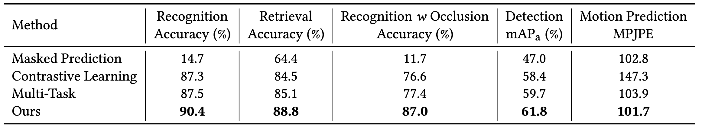
表 7：對比學習和屏蔽骨架預測在不同下游任務上的協同作用的消融研究。多任務代表以多任務方式簡單地組合兩個任務。

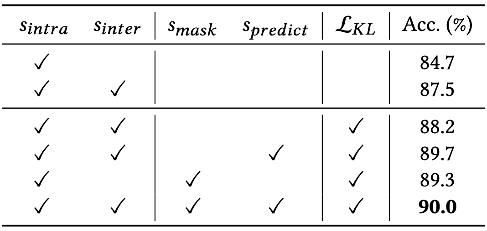
表8：不同陽性樣本的消融研究和蒸餾損失（沒有任何提示）。

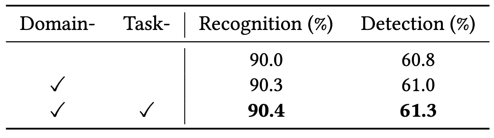
表 9：不同類型提示的消融研究。

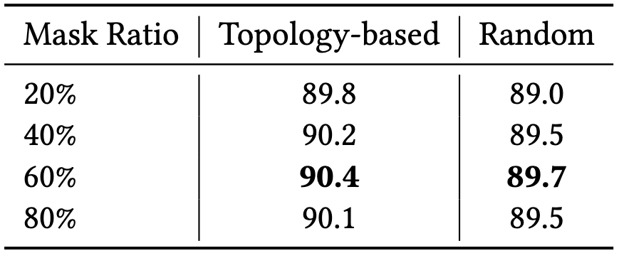
表 10：掩蔽策略的消融研究。

## 5 **結論**

我們提出了一種名為帶提示對比與遮蔽運動建模（PCM3）的新框架，該框架通過探索對比學習和遮蔽預測任務之間的相互協作，有效學習有意義的表徵。具體來說，遮蔽預測訓練中的新穎視角被用作對比學習的正樣本。同時，對比學習通過將梯度傳播到預測解碼器，為遮蔽預測提供語義指導。此外，我們引入了雙提示多任務預訓練策略，提供明確的訓練指導。進行了廣泛的實驗，展示了我們方法的優越性能和出色的泛化能力。