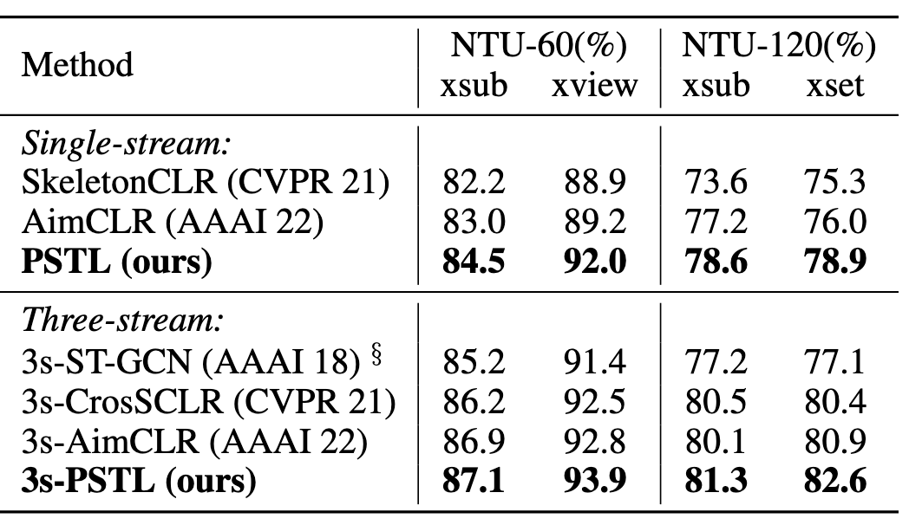

#資料集/ntu60 #資料集/ntu120 #資料集/PKUMMD #骨架偵測/tools/Kinectv2 #動作識別/自監督學習/BarlowTwins #動作識別/自監督學習/Masking  #動作識別/演算法/STGCN #動作識別/線性分類器 #運行框架/MS2L
## 摘要
自我監督學習已在基於骨架的動作識別中的表徵學習方面展現出顯著的能力。現有方法主要集中在應用全局數據增強來生成骨架序列的不同視角，以進行對比學習。然而，由於骨架序列中包含豐富的動作線索，現有方法可能僅從全局的角度學習區分不同的骨架，而未能充分利用骨架關節和影片幀之間的局部關係，這在實際應用中至關重要。在本研究中，我們提出了一個局部時空學習（Partial Spatio-Temporal Learning，PSTL）框架，以通過獨特的時空遮罩策略從局部骨架序列中挖掘局部關係。具體而言，我們構建了一個無負樣本的三路流結構，該結構由不含任何遮罩的基準流、帶有中央空間遮罩（Central Spatial Masking, CSM）的空間遮罩流，以及帶有動作注意時序遮罩（Motion Attention Temporal Masking, MATM）的時間遮罩流組成。分別計算基準流與另外兩個遮罩流之間的特徵交叉相關矩陣。（1）中央空間遮罩從特徵計算過程中移除選定的關節，其中具有較高中心度的關節被選中的可能性較高。（2）動作注意時序遮罩利用動作的運動，移除移動較快的幀，其被選中的可能性較高。我們的方法在NTURGB+D 60、NTURGB+D 120和PKU-MMD的各種下游任務中達到最先進的表現。此外，為了模擬真實場景，我們進行了一項實際評估，其中在下游任務中一些骨架關節會遺失。與之前方法在此挑戰性設置下性能大幅下降相比，我們的PSTL仍能實現顯著的結果，驗證了我們方法的穩健性。我們的代碼可在 https://github.com/YujieOuO/PSTL.git 上獲取。

## 引言

近年來，人體動作識別在現實世界中的多種應用（如安全、人體與機器人互動、虛擬現實）方面得到了廣泛的研究。隨著感測技術（Zhang 2012；Shotton等, 2011）和人體姿勢估計方法（Cao等, 2017；Hua等, 2022）的發展，獲取骨架數據變得更加容易。

由於骨架數據對外觀和背景變化的魯棒性，許多研究者開始探索使用全監督方法進行動作識別，例如在骨架數據上應用卷積神經網路（CNN）（Ke等, 2017）、循環神經網路（RNN）（Du、Wang 和 Wang, 2015）或圖卷積網路（GCN）（Yan、Xiong 和 Lin, 2018；Shi等, 2019）。

然而，全監督學習依賴於大量的手動標註數據，這既耗時又昂貴。因此，自我監督框架（例如MoCo（He等, 2020）、SimCLR（Chen等, 2020）、Barlow Twins（Zbontar等, 2021）和MAE（He等, 2022））受到了廣泛關注。在骨架數據上的自我監督學習中，早期的方法也應用了預設任務（Lin等, 2020；Su、Liu 和 Shlizerman, 2020；Zheng等, 2018）。然而，目前大多數研究者專注於對比學習，並將MoCo結構應用於骨架序列（Thoker、Doughty 和 Snoek, 2021；Li等, 2021；Rao等, 2021；Guo等, 2022）。

目前基於對比學習方法的關鍵在於找到有效的全局數據增強方法，並謹慎地使用它們來創建骨架的各種視角。然而，由於骨架序列中儲存了豐富的動作線索，這種範式容易從全局視角區分不同的視角，卻未能徹底利用不同骨架關節和視頻幀之間的局部關係。因此，這限制了模型在現實場景中的表現和穩健性。此外，對比學習需要大量批量大小或記憶庫，這對於少量骨架數據來說並不適合。為了評估現有方法在現實場景（如視頻監控）中的魯棒性，我們制定了一個新的評估設置，其中僅有部分骨架可用於下游任務，以模擬相機捕獲的骨架數據被遮擋的情況。在這個具有挑戰性的設置下，以往的工作會出現嚴重的性能下降。我們推測，如果能夠探索並捕捉局部的空間和時間關係，將有助於提升模型在下游任務中的表徵能力和魯棒性。

因此，我們提出了一個局部時空學習（Partial Spatio-Temporal Learning, PSTL）框架，通過獨特的時空遮罩策略來挖掘局部骨架序列中的局部關係。具體來說，我們構建了一個無負樣本的三路流結構，由基準流、帶有中央空間遮罩（Central Spatial Masking, CSM）的空間遮罩流和帶有動作注意時序遮罩（Motion Attention Temporal Masking, MATM）的時間遮罩流組成。

在每個流中，首先應用常規增強來提高輸入樣本的多樣性。（1）在空間遮罩流中，中央空間遮罩從特徵計算過程中移除選定的關節。值得注意的是，這並不是簡單地將選定的關節位置設為零，因為這對於骨架數據是不合理的。考慮到人體骨架的拓撲結構是預定義的圖形，具有更高中心度的關節擁有更強的連接性。通過以更高的概率過濾掉這些關節，編碼器可以更加關注那些較少被探索的骨架。（2）在時間遮罩流中，考慮到變化較快的幀通常包含更多關於動作的語義信息，我們提出了一種動作注意時序遮罩策略，即移動較快的幀更有可能被遮罩。（3）在基準流中，未引入遮罩策略，以保持原始的語義信息。共享編碼器同時提取三路流的特徵。

受Barlow Twins損失函數（Zbontar等, 2021）的啟發，我們採用交叉相關矩陣來分別捕捉基準流與其他兩個遮罩流之間的相關性。作為一種無負樣本的自我監督方法，PSTL鼓勵學習到的表徵之間的經驗交叉相關矩陣接近單位矩陣，並最小化表徵向量內的冗餘，以減輕特徵崩塌的問題。通過這種方式，空間和時間關係可以被有效捕捉，並且關節的魯棒性在下游任務中得以提升。我們在三個大型基準數據集上的廣泛實驗結果證明了我們提出的遮罩策略的有效性。我們的貢獻如下：
- 我們提出了局部時空骨架表徵學習（PSTL），這是一種無負樣本的自我監督框架，用於基於骨架的動作表徵學習。
- 我們首次將遮罩策略引入到基於骨架的自我監督學習中，並在預訓練期間使用中央空間遮罩（Central Spatial Masking, CSM）策略，以提高學習表徵在下游任務中的關節穩健性。
- 提出了一個獨特的動作注意時序遮罩策略（Motion Attention Temporal Masking, MATM），該策略使用骨架數據的運動信息來引導時間遮罩模塊，找到並遮罩序列中的關鍵幀。
- 在NTU-60、NTU-120和PKU-MMD數據集上進行的廣泛實驗結果表明，所提出的PSTL在多樣的下游任務（如線性評估、微調評估和半監督評估協議）中達到了最先進的性能。

## 相關研究

基於骨架的動作識別：針對基於骨架的動作識別，早期方法主要集中在手工設計特徵（Vemulapalli、Arrate 和 Chellappa 2014；Xia、Chen 和 Aggarwal 2012）。隨著深度神經網路的發展，骨架數據被作為偽影像，通過卷積神經網路（CNN）進行處理（Ke等, 2017；Kim 和 Reiter, 2017）。其他方法則將其結構化為長期序列，並輸入到循環神經網路（RNN）中（Du、Wang 和 Wang 2015；Zhang等, 2017）。隨後，ST-GCN（Yan、Xiong 和 Lin 2018）將骨架數據結構化為預定義的空間圖，並利用圖卷積網路（GCN）整合骨架關節信息。之後，許多基於GCN的方法被提出，這些方法包含更多的數據流或加入注意力機制（Shi等, 2019；Song等, 2020；Chen等, 2021）。在本文中，我們同樣使用廣泛應用的ST-GCN作為主幹網路。
**自我監督表徵學習** 自我監督學習旨在從大量未標記樣本中獲取高階表徵。早期方法依賴於預設任務來生成監督信號，如拼圖（Noroozi 和 Favaro 2016；Wei等, 2019）、圖像上色（Larsson、Maire 和 Shakhnarovich 2016；Zhang、Isola 和 Efros 2016）或旋轉預測（Gidaris、Singh 和 Komodakis 2018）。隨後，像MoCo（He等, 2020）和SimCLR（Chen等, 2020）這樣的區分性方法取得了顯著的性能，與監督學習相當。通過區分正樣本對和負樣本對，主幹網路能夠獲取具有豐富區別信息的表徵。然而，這類方法需要大量的批次大小或記憶庫來存儲負樣本。為了解決這個問題，引入了無負樣本的方法，如BYOL（Grill等, 2020）、SimSiam（Chen 和 He, 2021）和Barlow Twins（Zbontar等, 2021）。這些方法不需要顯式構建負樣本對，但大多數方法利用非對稱網路來避免特徵崩塌。特別是，Barlow Twins避免了對對稱破壞網路的依賴，而是通過最小化表徵向量內的冗餘來減輕崩塌問題。最近，遮罩自編碼器（He等, 2022）被引入，用於從局部互補信息中學習有效的視覺表徵。

**基於自我監督的骨架動作識別** 為了將自我監督學習應用於骨架數據，LongT GAN（Zheng等, 2018）使用遞迴編碼器-解碼器GAN來重建輸入序列。基於此，Predict&Cluster（Su、Liu 和 Shlizerman 2020）提出了一個解碼器來提升編碼器的表徵能力。MS2L（Lin等, 2020）則提出了一個多任務自我監督學習框架，包括動作預測和拼圖遊戲。AS-CAL（Rao等, 2021）使用動量LSTM來正則化特徵空間，並結合了多種骨架增強策略。ISC（Thoker、Doughty 和 Snoek 2021）提出了結合基於序列和基於圖的表徵的跨骨架對比方法。CrossCLR（Li等, 2021）引入了SkeletonCLR，使用記憶庫來存儲負樣本，並使用跨視角知識挖掘策略以捕捉更全面的表徵。AimCLR（Guo等, 2022）旨在利用大量的增強策略來引入動作模式，迫使編碼器學習更具普遍性的表徵。然而，這些基於對比學習的方法過度依賴於強大的數據增強策略，但在空間關節和時間幀中的冗餘性尚未得到考慮，這些冗餘性可以提高3D視覺表徵的魯棒性，對下游任務至關重要。因此，我們引入PSTL，並提出了一個時空遮罩策略來找到更具普遍性的表徵。

## 方法

如圖2所示，局部時空骨架表徵學習（Partial Spatio-Temporal skeleton representation Learning, PSTL）採用三路流架構，該架構基於我們的Skeleton Barlow Twins（SkeletonBT），並在其空間遮罩流中應用了中央空間遮罩（Central Spatial Masking, CSM），在時間遮罩流中應用了動作注意時序遮罩（Motion Attention Temporal Masking, MATM），同時加入一個基準流來保留原始的語義信息。具體而言：

1) SkeletonBT 是一個基本的無負樣本雙路流網絡，配有普通的增強策略，用於骨架自我監督學習。
2) CSM 首先調整GCN主幹的計算模式，確保被遮罩的關節信息不參與特徵計算。隨後，具有較高中心度的關節被賦予更高的遮罩概率。
3) MATM 計算每個動作幀的對應運動值，該值作為注意力權重來選擇需要遮罩的幀。

### Skeleton Barlow Twins

受到最近無負樣本自我監督方法進展的啟發（Zbontar等, 2021），這些方法避免了使用負樣本，並且不需要大型批量或記憶庫，我們開發了Skeleton Barlow Twins（SkeletonBT）來學習基於骨架的動作表徵。這是一個對稱網路，使用共享編碼器來生成特徵。具體來說，一個3D人體骨架序列可以表示為 $s \in \mathbb{R}^{C \times T \times V}$，其中 $T$ 是幀數，$V$ 是關節數，$C$ 是表示3D位置的通道維度。如圖1所示，輸入的骨架序列 $s$ 首先應用常規增強 $T$ 來獲取多樣的視角 $x$ 和 $x'$。編碼器 $f$ 用於提取特徵：$h = f(x; \theta)$ 和 $h' = f(x'; \theta)$，其中 $h, h' \in \mathbb{R}^{ch}$。接著，投射器 $g$ 將每個特徵映射到更高維度的空間，獲得嵌入表示：$z = g(h)$ 和 $z' = g(h')$，其中 $z, z' \in \mathbb{R}^{c_z}$。最後，通過使扭曲變化後的嵌入之間的經驗交叉相關矩陣趨近單位矩陣，編碼器可以捕捉兩個流之間的關係。損失函數可表示為：

$$
\mathcal{L}=\sum_i\left(1-\mathcal{C}_{ii}\right)^2+\lambda\sum_i\sum_{j\neq i}\mathcal{C}_{ij}^2. \tag{1}
$$

其中，$C$ 是嵌入 $z$ 和 $z'$ 沿著批量維度 $b$ 計算的交叉相關矩陣：

$$
\mathcal{C}_{ij}=\frac{\sum_bz_{b,i}z_{b,j}^{^{\prime}}}{\sqrt{\sum_b\left(z_{b,i}\right)^2}\sqrt{\sum_b\left(z_{b,j}^{^{\prime}}\right)^2}}, \tag{2}
$$

其中，$i$ 和 $j$ 代表嵌入的維度。具體而言，在方程 (1) 中，第一項促使交叉相關矩陣 $C$ 的對角元素接近 1，這使得嵌入表示對應用的多樣化增強保持不變。第二項則將 $C$ 的非對角元素趨近 0，這有助於將不同的嵌入表示組件相互解耦，從而最小化表徵中的冗餘性。參數 $\lambda$ 作為權衡參數，用於平衡這兩個項的影響。

### 中央空間遮罩（Central Spatial Masking, CSM）

為了增強學習到的表徵的關節魯棒性，我們提出了中央空間遮罩（CSM）模組，旨在使部分骨架數據能夠生成與完整骨架數據相似的特徵。編碼器可以捕捉被遮罩和未遮罩關節之間的關係，這對於處理困難的下游任務至關重要。

如前所述，為編碼器構建部分骨架數據是至關重要的。早期方法（Rao等, 2021）試圖直接將遮罩關節的值設為零，但對於骨架數據來說這是不合理的，因為關節的語義信息是其3D位置，這些位置會發生變化。

針對CSM，我們首先調整了主幹網路ST-GCN（Yan、Xiong和Lin, 2018）的計算模式。具體而言，對於骨架序列 $s$，被遮罩的關節將被捨棄，並且從鄰接矩陣中刪除相應的行和列，迫使被遮罩的關節不參與計算過程，生成的特徵僅由未被遮罩的關節產生。

接下來，我們利用人體骨架圖拓撲中的度中心性，發現具有更多連接度的關節可以獲取更豐富的鄰域信息。因此，我們賦予這些連接度更高的關節更高的遮罩概率，這有助於編碼器捕捉更廣泛的關節關係。如圖2中的綠色框所示，人體骨架關節記作 $V_i$，$i \in (1, 2, ..., n)$，其中 $n$ 為關節總數。值得注意的是，關節分為四種類型。位於圖邊緣的淺灰色關節的度數為1。深灰色關節的度數為2，它們更具連接性，並且在整個圖中數量占多數。藍色和紅色關節的度數分別為3和4，分別位於身體的上半部和下半部的中心位置。遮罩這些中心關節有助於編碼器捕捉更大範圍的關節信息關係。為此，我們的CSM策略首先計算每個關節 $V_i$ 的度數 $d_i$，並設置其遮罩概率：

$$
p_i = \frac{d_i}{\sum_{j=1}^{n} d_j} \tag{3}
$$

### 動作注意時序遮罩（Motion Attention Temporal Masking, MATM）

相比於空間關節，時間信息中存在更多冗餘，而動作的語義則更加集中。一些關鍵幀在動作語義表徵中扮演著關鍵角色。為了利用這一特性，我們的MATM旨在找到這些關鍵幀，並對其進行遮罩，以在我們提出的PSTL中生成基準流與時間遮罩流的困難樣本對。通過促使兩個流的嵌入之間的經驗交叉相關矩陣趨於單位矩陣，編碼器能夠有效地捕捉冗餘幀與關鍵幀之間的關係。

具體來說，序列 $s$ 的運動 $m \in \mathbb{R}^{C \times T \times V}$ 由幀之間的時間位移計算得出： $m_{:,t,:} = x_{:,t+1,:} - x_{:,t,:}$。然後，我們計算每一幀的整體運動率，該運動率作為注意力權重：
$$
a_t = \frac{m_t^2}{\sum_{i=1}^{T} m_i^2} \tag{4}
$$
接著，我們選擇注意力權重最大的前K個 $a_{t1}, ..., a_{tK}$，並將序列 $x_{t1}, ..., x_{tK}$ 作為包含更多動作語義信息的關鍵幀。如圖2的藍色框所示，底部展示的是一個「戴眼鏡」的骨架序列，頂部顯示的是運動密度。我們可以發現序列中一些中間幀的運動值較高，這些幀是該動作的關鍵幀。因此，我們遮罩這些關鍵幀，並促使遮罩序列的特徵接近基準流的特徵，因為基準流包含了完整的語義信息。

### 損失函數

回顧圖2所示的三路流PSTL流程。給定骨架序列 $s$，首先應用普通增強來獲得不同的視角 $x$、$x'$ 和 $\hat{x}$。對於序列 $x'$，採用中央空間遮罩策略生成部分骨架數據 $x'_c$。根據骨架圖的度中心性，連接度較高的關節在此模組中被賦予更高的遮罩概率。對於序列 $\hat{x}$，使用動作注意時序遮罩策略。我們首先計算每個幀的運動值，該值代表骨架動作中的關鍵片段。然後選擇運動值最大的前K個幀進行遮罩，並隨機從剩餘序列中遮罩K個幀，以進一步增加多樣性，生成 $\hat{x}_m$。基準流中的序列 $x$ 不引入任何遮罩策略，以保持原始語義信息。

隨後，使用共享編碼器 $f$ 同時提取特徵。$h = f(x; \theta)$、$h'_c = f(x'; \theta)$、$\hat{h}_m = f(\hat{x}_m; \theta)$，其中 $\theta$ 是編碼器學習到的參數，並在下游任務中使用。接著，應用投射器 $g$ 將特徵投射到高維空間中的嵌入表示 $z, z'_c, \hat{z}_m$，即 $z = g(h)$、$z'_c = g(h'_c)$、$\hat{z}_m = g(\hat{h}_m)$。為了捕捉被遮罩關節和未遮罩關節之間的關係，我們計算嵌入 $z$ 和 $z'_c$ 之間的交叉相關矩陣 $C'$。計算過程參照方程 (2)，然後應用 $L1$：

$$
\mathcal{L}1 = \sum_i (1 - C'_{ii})^2 + \lambda \sum_i \sum_{j \neq i} C'^2_{ij} \tag{5}
$$

其中，第一項促使 $C'$ 的對角元素接近1，強制部分數據的表徵與完整數據的表徵相似。第二項設計為促使不同的嵌入組件相互解耦，這有助於最小化表徵中的冗餘性，避免表徵成為常數。

類似地，嵌入 $z$ 和 $\hat{z}_m$ 之間的交叉相關矩陣 $\hat{C}$ 用於計算 $\mathcal{L}2$：

$$
\mathcal{L}2 = \sum_i (1 - \hat{C}_{ii})^2 + \lambda \sum_i \sum_{j \neq i} \hat{C}^2_{ij} \tag{6}
$$

該項用於捕捉遮罩幀和未遮罩幀之間的關係。需要注意的是，權衡參數 $\lambda$ 用於平衡第一項和第二項之間的維度差異，因此在方程 (5) 和方程 (6) 中保持相同。最終，PSTL的總損失 $\mathcal{L}_p$ 可以表示為：

$$
\mathcal{L}_p=\mathcal{L}_1+\mathcal{L}_2. \tag{7}
$$

## 實驗

### 數據集

1. **NTU-RGB+D 60**：NTU-60數據集（Shahroudy等, 2016）由Microsoft Kinect感測器收集，包含60個動作類別的56,578個骨架序列，由40名志願者執行。每個受試者的骨架由25個關節表示，每個影片最多包含兩名受試者。數據集有兩個官方劃分方式：
   1) **Cross-Subject (xsub)**：一半的受試者屬於訓練集，其餘屬於測試集。
   2) **Cross-View (xview)**：訓練集和測試集由不同視角的相機拍攝。

7. **NTU-RGB+D 120**：NTU-120數據集（Liu等, 2019）是NTU-60的擴展版本，包含120個動作類別的113,945個骨架序列，由106名志願者執行。數據集同樣有兩個官方劃分方式：
   1) **Cross-Subject (xsub)**：訓練集由53名志願者執行，測試集由其餘志願者執行。
   2) **Cross-Setup (xset)**：訓練集和測試集由不同配置的相機拍攝。

8. **PKU-MMD**：PKU-MMD數據集（Liu等, 2020）由Kinect v2感測器從多個視角拍攝，包含66名受試者執行的約20,000個動作實例，涵蓋51個類別。數據集分為兩部分：
   1) **第一部分**包含21,539個序列。
   2) **第二部分**包含6,904個序列，因視角變化大和骨架噪聲多，挑戰性更高。

### 實施細節

為了與其他方法進行公平比較，我們遵循CrossCLR（Li等, 2021）和AimCLR（Guo等, 2022）相同的預處理方法，將骨架序列調整為50幀。同樣，我們使用帶有16個隱藏通道的STGCN（Yan、Xiong 和 Lin, 2018）作為主幹網路。所有實驗（包括表徵學習和下游任務）均採用Adam優化器和餘弦退火調度器，進行150個周期的訓練。迷你批次大小設為128。

**數據增強** 在應用我們提出的關節和時間遮罩策略之前，首先使用一些普通的增強來生成輸入骨架序列的不同視角。這些普通增強包括3個空間增強和1個時間增強。

1. **剪切（Shear）**：這是一種對骨架3D坐標進行線性變換的方式。剪切矩陣為：
$$
\mathbf{S}=\left[\begin{array}{ccc}1&s_{12}&s_{13}\\s_{21}&1&s_{23}\\s_{31}&s_{32}&1\end{array}\right],
$$
   
   其中，$s_{12}, s_{13}, s_{21}, s_{23}, s_{31}, s_{32}$ 是剪切因子，隨機從範圍 [−β, β] 中取樣，這裡設置 $β = 1$。通過將剪切矩陣直接與3D坐標相乘，可以使人體姿勢在隨機角度傾斜。

2. **裁剪（Crop）**：作為一種時間增強，裁剪通過首先將部分幀填充到原始序列，然後隨機裁剪回原長度來提高數據多樣性。填充長度為 $γT$，其中 $T$ 是原始序列長度，$γ$ 是填充比例（我們設置 $γ = 1/6$）。

3. **旋轉（Rotate）**：這是一種高效的空間增強，有助於表徵適應空間視角的變化。具體來說，它首先隨機選擇一個軸 $M \in \{X, Y, Z\}$ 作為主要軸，然後在 [0, π/6] 範圍內隨機選擇一個角度進行旋轉。接著，另外兩個軸的角度隨機選擇在 [0, π/180] 的範圍內。

4. **空間翻轉（Spatial Flip）**：這是另一種空間增強，將骨架數據的左右側以概率 $p = 0.5$ 進行交換。

### 實驗設置

**自我監督預訓練**  我們使用ST-GCN（Yan、Xiong 和 Lin 2018）作為編碼器，從骨架序列中提取256維的特徵，然後將其投射到6144維的嵌入表示。每個流的損失函數中的 $\lambda$ 設置為 2e-4。為了穩定訓練過程，我們使用10個周期的熱身階段。權重衰減設置為1e-5。需要注意的是，對於所有數據集和評估設置，中央空間遮罩（CSM）中的遮罩關節數為9，而動作注意時序遮罩（MATM）中的 $K = 10$。為了與最先進的方法進行比較，我們使用了多種骨架模態，包括關節（J）、骨骼（B）和運動（M）。我們使用不同的評估協議來評估學到的表徵。

 **線性評估**  我們在凍結的預訓練編碼器上添加線性分類器，然後在目標骨架動作識別數據集上訓練識別器，初始學習率設置為0.01。

**部分身體評估**  為了讓學到的表徵適應現實場景中的骨架遮擋或部分身體信息缺失，我們引入了部分身體評估協議。基本上，我們遵循線性評估的設置。然而，為了模擬骨架提取過程中關節或身體部分的缺失，我們考慮兩種設置：1) **關節遮擋**：在評估過程中隨機遮罩一些關節；2) **身體部分遮擋**：我們將骨架分為5個主要部分，並在評估過程中隨機移除部分。

**微調**  我們在編碼器頂部附加一個線性分類器，然後在目標骨架動作識別數據集上微調整個網路，初始學習率設置為0.005。

**半監督學習**  這個協議與“微調”設置相同，但僅使用隨機選取的1%或10%的標註數據進行訓練。

### PSTL的消融研究
我們在基線模型SkeletonBT上分別進行消融實驗，以展示我們提出的CSM和MATM策略的有效性。線性評估結果如表2所示，SkeletonBT在xsub和xview上分別達到68.5%和71.6%的準確率。我們發現CSM模組在xsub和xview上分別提高了約3.3%和3.8%的Top-1準確率，而MATM模組則分別帶來了5.2%和6.4%的性能提升。通過結合這兩個模組，我們的PSTL實現了8.8%和9.4%的增長。這些結果表明，我們提出的CSM和MATM策略可以促使編碼器獲取更強的特徵，這些特徵更適合於下游任務。

**與SkeletonBT的比較**  為了進一步驗證我們提出的方法的有效性，我們在三個數據集上進行實驗，詳細比較PSTL與基線方法SkeletonBT。如表1所示，PSTL在所有三個不同的流上均優於SkeletonBT。融合結果顯示，3s-PSTL顯著提高了SkeletonBT的性能，特別是在NTU-120數據集上。

**與隨機遮罩策略的比較**  為了證明我們遮罩策略的有效性，我們將CSM和MATM模組與隨機空間遮罩（RSM）策略和隨機時間遮罩（RTM）策略進行比較，這些隨機策略會隨機選擇遮罩位置。線性評估結果如表3所示，通過我們的三路流網路，隨機遮罩可以捕捉關節和幀之間的關係，並在下游任務中取得不錯的結果。接著，我們的CSM和MATM策略進一步加強了這種能力，從而獲得更好的準確率。

表 1：與 SkeletonBT 在 NTU-60、PKU-MMD 和 NTU-120 資料集上的線性評估結果比較。 「Δ」表示與使用相同串流資料的 SkeletonBT 相比的增益。 J、M、B表示關節流、運動流、骨流。

表 2：NTU-60 資料集上 PSTL 的消融研究。

表 3：與 NTU60 資料集上的隨機遮蔽策略進行比較。 RSM 表示隨機空間掩蔽，RTM 表示隨機時間掩蔽。

### 與最先進方法的比較

**部分身體評估**  為了驗證提取特徵的關節魯棒性，我們在NTU-60 xsub數據集上進行了部分身體評估。評估協議的第一層是關節遮擋，這會對關節隨機遮罩，以模擬現實場景中關節被遮擋的情況。如表4所示，基線模型SkeletonBT在沒有CSM和MATM的情況下性能大幅下降。當遮罩關節數增加到10個時，最先進的AimCLR方法（Guo等, 2022）和其基線方法SkeletonCLR（Li等, 2021）也分別遭遇了約20.0%和17.6%的性能下降。值得注意的是，我們的PSTL提取的特徵具有較強的關節魯棒性，當遮罩10個關節時，僅下降了3.5%的性能。

評估協議的第二層是身體部分遮擋，如表5所示，這一評估更加困難，因為我們遮罩了整個身體部分。但即便如此，我們的PSTL仍然取得了優於其他方法的結果。總結來說，隨著更多骨架序列信息的丟失，我們的方法優勢變得更加明顯。這些結果表明，通過關節和幀之間的局部關係，我們的CSM和MATM策略能夠提高學習特徵的魯棒性，這對下游任務至關重要。

**線性評估**  如表6所示，對於單一流，PSTL在NTU60和NTU120上均相對於其他方法取得了顯著的提升。與當前的最先進方法AimCLR相比，我們的PSTL分別在Xsub和Xview上提升了3.0%和2.1%。結果表明，關節和幀之間的局部關係有助於提取適合下游任務的特徵。

在三流的性能方面，PSTL仍然達到了與當前方法相當的結果。我們的方法在NTU-120數據集上同樣取得了最佳結果。對於單一流，PSTL分別在Xsub和Xset上超過了當前的最先進方法AimCLR 2.8%和4.3%。同時，融合結果也分別達到1.0%和1.5%的增長。

值得注意的是，PKU-MMD數據集的數據量約為NTU-60的一半，如表7所示，我們的方法在小數據集上的優勢更加明顯。值得一提的是，我們的基線方法SkeletonBT在單流上能夠超越AimCLR的表現，這表明我們的無負樣本方法在無需記憶庫的情況下，對於小數據集更為高效。同樣，我們的PSTL在PKU-MMD數據集上取得了顯著的結果。對於單流來說，PSTL在第一部分和第二部分分別超過AimCLR 5.0%和12.5%。在三流融合中，我們的3s-PSTL在這兩個部分分別超過3s-AimCLR 1.4%和13.8%。

**微調評估** 我們將PSTL與其他自我監督方法和使用相同結構和參數的監督方法ST-GCN進行比較。如表8所示，對於單流來說，所有方法均使用骨骼流，因為其結果比關節流更好。我們的PSTL在NTU-60和NTU-120數據集上表現優於其他方法。值得注意的是，僅單流PSTL就能超越監督的3s-ST-GCN在NTU-120數據集上的表現，這表明我們的方法具有很高的有效性。同樣，3sPSTL在兩個數據集上的融合結果也超越了3s-CrossCLR和3s-AimCLR。

**半監督評估** 為了展示我們方法的優越性，我們在半監督設置下對所有方法進行測試，此時僅使用1%或10%的標註數據，這使得模型更容易過擬合。如表9所示，我們的PSTL在PKU-MMD數據集上遠超當前最先進的方法AimCLR。對於融合結果來說，3s-PSTL在第二部分上比3s-AimCLR高出8.6%。這表明對比學習方法在缺少足夠樣本的情況下，依賴大型記憶庫的性能損失嚴重，但我們的無負樣本PSTL能很好地減輕這個問題，並取得更好的結果。

表 4：NTU60 xsub 資料集上陰影關節的線性評估結果。

表 5：NTU-60 xsub 資料集上陰影的身體部位的線性評估結果。

表 6：NTU-60 和 NTU-120 資料集的線性評估結果。

表 7：PKU-MMD 資料集上的線性評估結果。

表 8：NTU-60 和 NTU120 資料集上的 Finetune 評估結果。 「§」表示模型以完全監督的方式進行訓練。

表 9：PKU-MMD 資料集的半監督評估結果。

## 結論

在本文中，我們介紹了一個三路流網路，名為部分時空骨架序列學習框架（Partial Spatio-Temporal skeleton sequences Learning, PSTL），用於自我監督的基於骨架的動作識別。首先，所有流應用普通增強來生成多樣的骨架視角。其次，一個流引入了中央空間遮罩策略，強制選定的關節從GCN主幹計算中移除。第三個流使用動作注意時序遮罩模組，找到關鍵幀並對其進行遮罩。最後，我們測量特徵交叉相關矩陣，獲取每個流之間的相關性。實驗表明，這種遮罩策略可以提升骨架關節表徵的魯棒性，這對下游任務至關重要。我們的PSTL在三個大型骨架數據集上，在各種評估設置下均取得了顯著的表現。