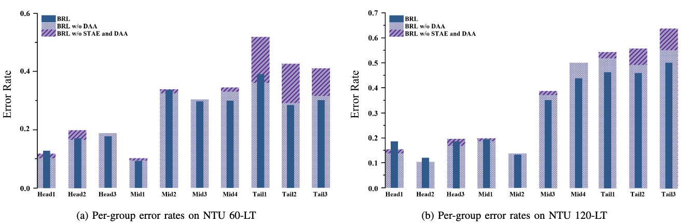
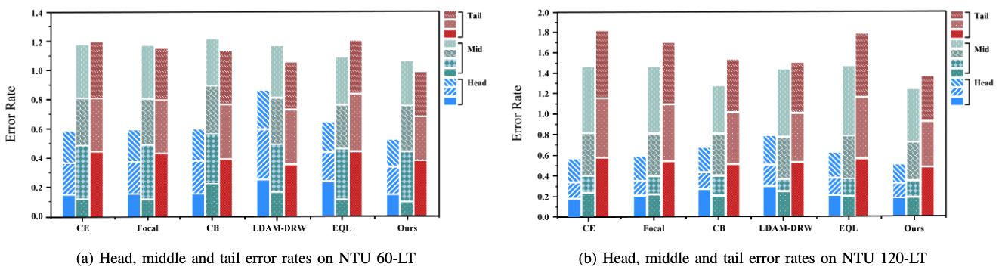

#資料集/ntu60 #資料集/ntu120 #資料集/Kinetics400 #資料集/NW-UCLA #骨架偵測/tools/Kinectv2 #骨架偵測/骨架資料處理/RebalancedPartialMixup #骨架偵測/骨架資料處理/TemporalReversePerception #動作識別/演算法/STGCN＋＋ #消融實驗/ntu60  #消融實驗/ntu120  #運行框架/pyskl 

## 摘要
基於骨架的動作識別最近取得了顯著進展。然而，數據不平衡在現實場景中仍然是一項巨大挑戰。當訓練數據存在嚴重的類別不平衡時，當前動作識別算法的性能會急劇下降。不平衡數據實際上會削弱這些方法學習到的表徵，成為動作識別的瓶頸。如何從不平衡的動作數據中學習無偏表徵是長尾動作識別的關鍵。在本文中，我們提出了一種新穎的平衡表徵學習方法來解決動作識別中的長尾問題。首先，我們提出了一種==時空動作探索策略，有效擴展樣本空間，以重新平衡的方式生成更有價值的樣本。==其次，我們設計了一個獨立的動作感知學習計劃，以進一步減少表徵空間中的偏差。該計劃將尾類別的表徵學習與訓練分離，並提出了一種動作感知損失，以施加更有效的約束。此外，我們提出了一種跳過模態表徵，以提供互補的結構信息。我們的方法在四個骨架數據集（NTU RGB+D 60、NTU RGB+D 120、NW-UCLA和Kinetics）上進行了驗證。與當前的最新方法（SOTA）相比，它不僅取得了持續的大幅度提升，還通過大量實驗展示了卓越的泛化能力。我們的代碼已開源於 https://github.com/firework8/BRL。

## I. 引言

人類動作識別在近年來取得了許多進展，在許多應用中具有重要意義，例如影片分析和行為理解 [1][3]。多種模態，如視頻、深度圖像、光流 [4] 和人體骨架，已被應用於動作識別。特別是基於骨架的人類動作識別，由於其包含緊湊的與動作相關的結構信息且背景噪音少，已引起了廣泛關注 [5]。

通常，骨架數據可以通過深度感測器 [6] 以及先進的人體姿勢估計算法 [7] 高效獲取。研究人員通過收集和處理骨架數據構建了一些大型且具代表性的數據集 [1], [2], [5], [8]。這些數據集通常會被重新抽樣並在動作類別之間保持相對平衡，以便於研究。然而，這些學術數據集並未考慮真實世界的情況，即現實中的動作數據是不平衡的。隨著現實世界中的動作類別變得更加多樣且細緻，會出現長尾情況：常見的動作類別擁有大量樣本，而罕見的動作類別僅有少數樣本。因此，當前的識別方法 [9]–[12] 無法很好地應對長尾不平衡的情況並不令人驚訝。我們在實驗中觀察到，當在長尾模擬動作數據集上進行測試時，不同方法的性能顯著下降，且其下降的幅度接近。這表明，不改變其他因素的情況下，這些方法所學習的表徵因頭類別和尾類別之間的數據不平衡而普遍退化。

從表徵學習的角度來看，不平衡數據帶來了兩個問題。首先，不平衡數據直接導致了樣本空間的偏斜，當前的識別方法難以適應。偏斜的樣本空間會使得識別模型偏向於主導類別，從而在尾類別上表現不佳。由於骨架數據與影像數據之間存在固有的差異，當前關注長尾分類的研究方法 [13]–[15] 不太適合應用於長尾動作識別。對於動作識別而言，骨架數據的空間和時間特徵是至關重要的。然而，現有方法並未充分考慮此類結構信息，最終導致樣本質量下降。使用這些方法重複增加樣本數量可能導致信息重疊，數據對模型的邊際效益逐漸減少 [16], [17]。這一現象表明，如何針對動作識別生成更有價值的骨架樣本以補充偏斜的樣本空間至關重要。

其次，不平衡數據會導致表徵偏差。由於分佈不平衡，識別模型傾向於編碼更多主導類別的判別因素，這會扭曲尾類別的表徵空間。表徵偏差會混淆分類器，導致錯誤分類。許多當前的方法 [18]–[21] 通過調整不同類別的權重來減少偏差。然而，這些重新加權的方法以犧牲主導類別的性能為代價來提高尾類別的性能，陷入了性能跷跷板。此外，這些方法並未考慮不同動作類別之間的通用知識來補償不平衡偏差。對於長尾動作識別來說，主導類別和尾類別中的共識知識都非常重要，這需要在表徵學習目標上達到平衡。因此，如何學習平衡的表徵以減少長尾動作識別中的表徵偏差需要認真考慮。

面對上述兩個難題，本文針對長尾骨架動作識別提出了一種平衡表徵學習方法。為了生成更有價值的樣本，我們提出了一種新穎的時空動作探索策略。該==策略包含兩個模組，即重新平衡的部分混合（rebalanced partial mixup）和時間逆向感知（temporal reverse perception）。==一方面，重新平衡的部分混合旨在強化骨架動作數據的空間結構信息。此模組以重新平衡的方式混合不同身體的骨架部分來生成新樣本。重新平衡的方式意味著在樣本空間和標籤空間中使用不同的混合因子。通過設計的自適應標籤因子來重新平衡標籤空間，該方法可以為少數類別分配更高的權重，從而減輕不平衡動作數據的影響。另一方面，時間逆向感知旨在增強時間信息。此模組將原始序列均勻地分割成相等長度的片段，並隨機為尾類別抽取更多樣本，這推動了採樣器對尾類別進行過度增強。此外，該方法採用了關節的跳過模態表徵來進行多模態融合。通過挖掘不同模態流，模型能夠為尾類別引入額外的結構信息。結合這些組件，時空動作探索策略在空間和時間域中協同生成更有價值的樣本，從而補充偏斜的樣本空間。

為了減輕表徵偏差，我們提出了一個獨立的動作感知學習計劃。識別模型最初通過標準的交叉熵損失學習骨架序列的一般知識。隨後，動作感知損失被引入，以驅動模型專注於尾類別的特定模式。在計算樣本有效性和類別相對頻率後，我們在損失函數中添加了一個動作感知平衡項，該項目以模型無關的方式對不同類別施加更有效的約束。通過這種方式，我們將尾類別的特定模式從一般知識的學習中分離出來，並有效地強化它們。圖1展示了我們的方法，廣泛的實驗結果證明該計劃減輕了表徵空間中的偏差，並顯著提升了性能。

本文的主要貢獻可總結如下：
- 探討了長尾骨架動作識別的瓶頸，研究發現生成有價值的樣本和減輕表徵偏差是決定識別模型性能的關鍵因素。基於此觀察，提出了一種平衡表徵學習方法。
- 提出了一種時空動作探索策略，該策略生成了更有價值的骨架樣本。此外，還提出了一個獨立的動作感知學習計劃，以減輕從不平衡數據中學到的表徵偏差。
- 大量實驗和消融研究證明了所提出方法的有效性。總體而言，該方法可以輕鬆集成到各種動作識別框架中，僅需極少的計算開銷。

本文的結構如下：第二節簡要回顧了相關工作的文獻。第三節詳細描述了所提出的方法。第四節展示了廣泛實驗的配置和結果。最後，本文的結論總結於第五節。

![[PaperWithCode/7-BRL/Figure1.png]]
圖 1. 架構概述。 (a) 長尾行動資料。長尾動作資料集（本範例中為 NTU RGB+D-LT）的頭類和尾類具有截然不同的樣本數。 (b) 擬議架構概述。 (c) 時空動作探索策略，以產生更有價值的骨骼資料。 (d) 採用 ST-GCN++ 作為骨幹。 (e) 提出分離的動作感知學習來減輕長尾動作辨識中的表示偏差。

## II. 相關工作

A. 基於骨架的動作識別  
在早期階段，傳統的基於骨架的動作識別方法主要集中於設計手工特徵 [22]。這些手工特徵直觀且簡單易懂，但在表示人體部位的語義連接信息方面較弱。隨著深度學習的發展，卷積神經網絡（CNN）和遞歸神經網絡（RNN）開始應用於動作識別 [23]–[25]。隨後，長短期記憶（LSTM）和注意力機制的應用進一步利用了空間和時間動態信息 [26]–[29]。然而，這些方法在關節結構拓撲的利用上仍然有限。考慮到骨架點序列的內在圖結構，基於圖的方式自然地被用來處理骨架圖 [30]–[34]。通過構建時空圖，一系列基於圖的方式取得了出色的成績，這表明圖神經網絡成功捕捉了各種動作中最具信息性的特徵。

此後，許多巧妙的圖神經網絡相繼被提出。Yan等人 [9] 首次將基於圖的神經網絡應用於骨架動作識別，並提出了ST-GCN，它結合了空間圖卷積和時間動態卷積進行時空建模。在此基礎上，2s-AGCN [10] 提出了一種自適應圖卷積網絡，能夠自適應地建模兩個關節之間的關聯，並使用骨架骨流的雙流集成來提升識別性能。隨後，Cheng等人 [35] 提出了移位圖操作和輕量級點卷積，以提高模型效率。同時，Liu等人 [11] 提出了一種多尺度聚合方案，直接建模空間-時間依賴性。對應地，CTR-GCN [36] 探索了拓撲非共享的圖卷積，並提出了基於通道的拓撲優化圖卷積。InfoGCN [37] 也模型了上下文依賴的內在拓撲，並進一步利用信息論目標和多模態來更好地表示潛在信息。最近，FR Head [38] 提出了一種區分特徵細化模塊，以提升模糊動作的識別性能。儘管這些方法在基於骨架的動作識別上取得了令人鼓舞的成果，如何設計網絡來解決骨架動作識別問題仍然是一個未充分探索的重要問題。與此同時，還有許多改進空間，特別是在多模態融合的方面。如何融合來自不同模態的特徵 [10], [37] 需要仔細研究。此外，一些最新工作 [39], [40] 關注於自監督動作識別及其他有趣的領域。

然而，據我們所知，有關長尾骨架動作識別的研究仍然是空白的。我們相信，我們的工作能夠揭示動作識別在面對長尾數據分佈時的弱點，並激發後續工作進一步探索動作識別的內在本質。

B. 長尾學習  
由於現實應用中普遍存在數據不平衡問題，長尾困境引起了越來越多的關注 [17], [41]。針對長尾不平衡數據的方法可簡單分為兩大類：重採樣和成本敏感學習。重採樣方法 [15] 主要集中於對頭類別進行欠採樣和對尾類別進行過採樣，目的是修改訓練分佈以降低不平衡程度。成本敏感學習可以追溯到統計學中的重要性抽樣，該方法為樣本分配權重以匹配給定的數據分佈 [42]。通過成本敏感損失函數，重新加權方法引導網絡更加關注尾類別樣本，而非頭類別樣本。最近的研究 [18] 在以下三個方向上取得了進展：信息增強、類別重新平衡和模塊改進。具體來說，數據增強 [14], [15], [43]，遷移學習 [44]，對數調整 [45]–[47]，解耦訓練 [48]，集成學習 [49] 和半監督學習 [50] 進一步與經典的長尾學習方法相結合。

C. 長尾骨架動作識別  
當前的長尾學習工作主要集中於影像分類 [44], [51]，檢測 [20]，實例分割 [18]，多標籤分類 [19] 和視頻分類 [52]。儘管針對上述長尾任務已經進行了大量研究，針對長尾動作識別的研究仍較少。與影像或視頻幀相比，骨架序列更加概括和簡潔。骨架中關節點的拓撲連接包含了豐富的時空結構信息。由於骨架數據的特性，當前的算法並不適合用於基於骨架的動作識別。儘管一些現有的工作 [53]–[55] 嘗試採用結構信息，但它們未能考慮動作數據的不平衡問題。額外的重新加權方法提出了類別預測難度 [56] 和有效數量 [17] 等成本敏感因子來施加約束。但是，對骨架圖網絡來說，對頭類別進行全程的約束會影響區分性動作表徵的學習，並導致優化困難。與現有文獻相比，本文提出了一種平衡表徵學習方法，專門解決長尾骨架動作識別問題。結合長尾學習的理念，該方法提供了一種新的視角來理解長尾動作數據，特別是通過增強樣本空間和減輕表徵偏差。

### III. 方法論

本節將詳細說明所提出的平衡表徵學習方法，並在圖2中視覺化展示我們的方法。

![[PaperWithCode/7-BRL/Figure2.png]]
圖 2.所提出方法的圖示。 （彩色效果最佳。）首先，提出時空動作探索策略，以有效擴展相應的樣本空間。此外，由於資料分佈不均勻，原始決策邊界受到損害。獨立的行動感知學習計畫可以巧妙地調整決策邊界，以進一步減輕表徵偏差。透過統一過程，所提出的方法可以從長尾動作資料中學習平衡表示。

A. **數據預處理**  
對於骨架數據的預處理，一些現有的方法通常採用文獻 [31] 提供的增強解決方案。動作樣本的有效增強可以幫助網絡學習。對於長尾數據的表徵學習，數據增強的選擇更加關鍵。我們在吸收以往預處理方法的基礎上，設計了一種更高效的增強方案，專門針對長尾動作數據。常規的骨架增強基本包括六種空間增強技術，即翻轉、旋轉、剪切、縮放、遮罩、部件刪除，以及四種時間增強技術，即時間裁剪、時間翻轉、時間偏移和抽樣。濾波器如高斯噪聲和高斯模糊也可以用於空間和時間增強。此外，骨架序列的增強與普通圖像和視頻不同，應更關注空間和時間的獨特信息。因此，在增強長尾骨架數據時，應充分利用並進一步強化這類結構信息。由於增強的組合較為複雜，我們優先選擇那些可以引入更多新穎動作信息的增強組合。通過大量實驗測試了不同策略的效果，實驗結果證實，空間增強中的翻轉、旋轉和縮放以及時間增強中的抽樣對長尾動作數據更具效果。我們將這四種增強策略與當前的預處理方法集成，最終獲得多樣化的骨架序列。

B. **時空動作探索**  
本節將詳細介紹重新平衡的部分混合和時間逆向感知。

1) 重新平衡的部分混合：  
Mixup [53] 是一種為提高訓練數據泛化能力而提出的正則化技術。該方法通過線性插值特徵向量構建虛擬訓練樣本，擴展訓練分佈。其通過線性混合兩個圖像及其標籤來實現，公式如下：

$$
\widetilde{x}=\lambda x_i+(1-\lambda)x_j \tag{1}
$$
$$
\widetilde{y} = \lambda y_i + (1 - \lambda)y_j \tag{2}
$$

其中，$(x_i, y_i)$ 和 $(x_j, y_j)$ 是從訓練數據中隨機抽取的兩個樣本，$λ ∈ [0, 1]$。

對於基於骨架的動作識別，空間結構信息對理解動作至關重要。此外，相同的骨架部分在不同動作中具有獨特的意義。因此，為了生成有意義的樣本以減少樣本空間的偏斜，所提出的重新平衡的部分混合考慮以重新平衡的方式混合不同身體的骨架部分。重新平衡的方式意味著在樣本空間和標籤空間中使用兩個不同的混合因子。這是因為之前的單一混合因子僅僅擴展了訓練樣本空間，卻未能進一步解決動作數據的不平衡問題。因此，我們提出的策略轉向解耦樣本空間和標籤空間的混合過程。設計了一個自適應標籤因子，專注於尾類別提供有效的正則化。通過重新平衡標籤空間，該策略可以為少數類別分配更高的權重，從而減輕不平衡動作數據的影響。重新平衡的部分混合的公式定義如下：

$$
\widetilde{x}\quad=\quad Concat(\lambda_xx_i,(1-\lambda_x)x_j) \tag{3}
$$
$$
\widetilde{y}= \lambda_yy_i + (1 - λ_y) yj \tag{4}
$$

其中，$x_i$, $x_j$ 為身體的關節索引。$λ_x$ 表示整個身體中所選擇關節的比例。$λ_y$ 的具體形式根據以下公式定義：

$$
\left.\lambda_y=\left\{\begin{array}{ll}0,&\quad\frac{n_i}{n_j}>k\\1,&\quad\frac{n_i}{n_j}\leq\frac1k\\\lambda_x,&\quad otherwise\end{array}\right.\right. \tag{5}
$$

在公式中，$n_i$ 和 $n_j$ 表示樣本 $i$ 和樣本 $j$ 所屬的動作類別中的樣本數量。k 是一個超參數，表示兩個類別之間的不平衡程度。具體而言，如果 $n_i$ 比 $n_j$ 大 $k$ 倍，則 $λ_y$ 設為 0，當 $n_i$ 小於 $n_j$ 的 $1/k$ 時，$λ_y$ 設為 1，否則 $λ_y$ 等於 $λ_x$。隨機選擇身體的不同部位來生成新樣本，並根據對應的比例進行調整。隨機選擇樣本的比例設置為 1/16，即每 16 個樣本選擇一個樣本。我們將上半身和下半身直接結合，如圖3所示，並應用重新平衡的標籤設計。事實上，該方法的關鍵是以重新平衡的方式生成有意義的樣本。重新平衡的部分混合能夠有效聚合長尾動作樣本的空間結構信息，擴展骨架樣本的空間。通過重新平衡的標籤設計，標籤空間得到重新平衡，並減輕了數據不平衡的影響。通過這種有效的正則化技術，性能得到了進一步提升。通過這種方式，該策略生成了更有意義的樣本。

![[PaperWithCode/7-BRL/Figure3.png]]
圖 3. 重新平衡的部分混合結合了身體骨骼的各個部分，以重新平衡的方式產生更有價值的骨骼數據。透過重新平衡的標籤設計，此策略可以減輕不平衡資料的影響，從而使動作資料分佈更加平衡。

2) **時間逆向感知**：  
時間區別信息對於長尾動作數據同樣重要。針對不平衡的骨架數據進行過度採樣時，使用雙線性插值的子字符串抽樣未能充分利用骨架序列中的時間信息。因此，我們提出了時間逆向感知，幫助模型更好地理解骨架數據中的時間信息。首先，將原始輸入序列均勻地分割為幾個等長的片段，然後從每個片段中隨機選擇一幀。通過這種方法，採樣器能夠生成具有相似時間屬性的更具區別性的骨架序列。在多次隨機抽樣後，骨架序列的時間完整性得到了很好的保留。此外，經過測試的骨架序列長度範圍為 {300, 100, 64, 50, 32, 16}，實驗結果證實長度64最適合長尾骨架數據。均勻採樣器能夠有效保持樣本的多樣性，尤其是在與重新平衡的部分混合方法結合使用時。  

此外，由於尾類別樣本數量有限，過度採樣可能導致信息冗餘。這種時間信息的冗餘會降低生成更多數據的效益，從而影響表徵學習。所提出的時間逆向感知能夠推動採樣器對尾類別進行特殊增強。具體來說，逆向採樣器會根據實際動作數據分佈自適應地選擇採樣頻率，進一步減少無效的重疊，並保持有意義的時間信息。  

簡言之，時間逆向感知由均勻採樣器和逆向採樣器組成。該方法從原始序列中均勻抽取幀，並隨機對尾類別進行更多次抽樣。結合重新平衡的部分混合和時間逆向感知，所提出的時空動作探索策略能夠為網絡提供更多有價值的數據，從而學習更好的表徵。

C. **獨立動作感知學習計劃**  
為了減輕表徵偏差，本文提出了獨立動作感知學習計劃，其中包含獨立訓練策略和動作感知損失。類別重加權方法通常提供了一種為樣本分配適當權重的方式。然而，在長尾動作識別中，這並不容易，因為如果在整個訓練過程中使用重加權損失，性能將會逐漸惡化，尤其是對頭類別。這表明在整個訓練過程中對頭類別施加約束實際上會影響通用知識的學習。因此，我們提出了一種獨立的訓練策略。該策略將尾類別的特定模式與通用知識的學習分離，使模型能夠首先從主導類別中學習通用的動作表徵，之後再轉向感知尾類別的特定模式。具體來說，模型首先通過普通的交叉熵（CE）損失學習動作識別的通用知識。在經過幾個epoch後，從CE損失過渡到動作感知損失，促使模型從尾數據中學習特殊的動作模式，並實現更全面的表徵空間。該策略避免了在早期訓練過程中忽視尾類別，或在後期重加權策略中過度抑制頭類別，在訓練過程中對不同類別施加了更有效的約束。

對於標籤為 $y \in \{1, ..., C\}$ 的輸入動作樣本 $x$，假設模型對所有類別的預測輸出為 $z = [z1, ..., zC]⊤$，其中 $C$ 是類別總數。給定一個標籤為 $y$ 的樣本，該樣本的Softmax損失函數表示為：

$$
\mathcal{L}(\mathrm{z},y)=-\log p_y,\mathrm{with~}p_y=\frac{\exp(z_y)}{\sum_{j=1}^C\exp(z_j)}. \tag{6}
$$

此處，$z_y$ 表示目標logit，$z_j$ 表示第 $j$ 類別的預測logit。因此，$p_y$ 表示估計的類別概率。為了自適應地反映不同動作樣本的有效性，我們進一步提出了動作感知項，其定義如下：

$$
β_y = \lambda \times \frac{n_y - n_{\min}}{n_{\max} - n_{\min}} + υ \tag{7}
$$

其中，$n_y$ 為類別 $y$ 的樣本數，$n_{\max}$ 和 $n_{\min}$ 分別表示相應數據集中所有類別的最大和最小樣本數。λ 和 υ 是範圍縮放的超參數，根據動作數據的不平衡比例設置。通過如上計算類別相對頻率，$β_y$ 將被限制在固定範圍 [υ, λ + υ] 內。通過縮放限制，該項可以使動作類別的權重更加區別化。權重因子 $γ$ 的公式為：

$$
\gamma=\frac1{\sum_{i=1}^n\beta^{i-1}}=\frac{\beta-1}{\sum_{i=1}^n\beta^{i-1}\times(\beta-1)}=\frac{\beta-1}{\beta^n-1} \tag{8}
$$

其中，$\beta$ 是動作感知項。考慮這樣一種情況，模型已經對前 \(n-1\) 個樣本進行了採樣，現在需要對第 \(n\) 個樣本進行採樣。$\sum_{i=1}^{n} \beta_{i-1}$ 表示第 \(i\) 個樣本對有效樣本數 $\sum_{i=1}^{n} \beta_{i-1}$ 的貢獻。動作感知項 $\beta$ 是通過相對概率因子和縮放超參數來計算的，而不是通過樣本數 $N$ 來計算。由於 $\beta \in (0, 1)$，為了直觀計算並與之前的公式保持一致，權重因子 $\gamma$ 被計算為：

$$
\gamma = \frac{1 - \beta}{1 - \beta^n} \tag{9}
$$

假設類別 $y$ 有 $n_y$ 個訓練樣本，動作感知損失可表達如下：

$$
\mathcal{L}_{action-aware}(\mathrm{z},y)=-\frac{1-\beta_y}{1-\beta_y^{n_y}}\log\frac{\exp(z_y)}{\sum_{j=1}^C\exp(z_j)} \tag{10}
$$

通過所提出的動作感知損失，模型將更加關注尾類別，避免對尾類別進行過度訓練。此外，分類器能夠更好地區分那些容易混淆的尾類別動作樣本。
將獨立訓練策略與動作感知損失結合後，該方法能夠使所有樣本更高效地參與訓練，從而快速收斂。在學習尾部表徵時，該方法能夠更好地理解特定的長尾模式，同時保持頭部類別的性能。總體而言，所提出的獨立動作感知學習計劃有效地減輕了表徵偏差。整個訓練過程總結於算法1。

D. **多模態表徵的集成**  
與平衡數據設定下的普通動作識別相比，多模態融合對於長尾數據更具幫助。我們進一步分析了這一現象的原因，不同的模態為長尾數據提供了自然的數據增強。因此，我們擴展了空間結構，並定義了一種名為「跳過模態表徵」的新模態表徵。原始關節模態對應於骨架關節點在空間中的坐標信息。後續的骨骼模態則表示從源關節指向目標關節的向量。所提出的跳過模態表徵是在骨骼模態的基礎上跳過一個關節點，這樣可以在保持方向信息的同時，獲取更精簡的空間關係信息。此表徵能夠探索關節之間更深層的連接，從而分析動作。對於跳過更多關節步驟的其他模態，我們也進行了研究，但它們的性能不如跳過一個關節步驟的效果好。因此，我們主要採用跳過一個關節步驟的表徵作為選定的跳過模態表徵。  
在使用每個模態表徵訓練模型後，將不同模態的結果在推理階段進行集成。多模態融合實際上為獲取更具區別性的表徵提供了補充信息，使模型能夠更全面地理解長尾動作數據。

IV. **實驗**  
在本節中，我們將評估所提出方法在四個基於骨架的動作識別數據集上的性能。此外，還將進行消融研究，以驗證模型中每個組件的有效性。最後，實驗結果的分析和可視化將進一步展示所提出方法的效果。

A. **數據集**  
1) **NTU RGB+D 60**：這是一個室內捕獲的數據集 [1]，是一個大規模的人體動作識別數據集，包含60個動作類別的56,880個骨架動作序列。該數據集推薦了兩個基準：(1) **跨主體 (X-sub)**：訓練數據來自20個受試者，測試數據來自另外20個受試者。(2) **跨視角 (X-view)**：訓練數據來自攝像機視角2和3，測試數據來自攝像機視角1。

2) **NTU RGB+D 120**：這是目前最大的室內動作識別數據集 [2]，是NTU RGB+D的擴展版本，增加了60個動作類別。該數據集包含114,480個視頻，並由120個類別組成。類似地，建議採用兩種設定：(1) **跨主體 (X-sub)**：訓練數據來自53個受試者，測試數據來自另外53個受試者。(2) **跨設置 (X-set)**：訓練數據來自16個偶數設置ID，測試數據來自16個奇數設置ID。
3) **Northwestern-UCLA**：Northwestern-UCLA [5] 資料集使用三台 Kinect 攝像機捕獲，包含 1494 個樣本，涵蓋 10 個動作類別，每個動作類別由 10 名受試者執行。我們採用了與文獻 [5] 相同的評估協議：訓練數據來自前兩台攝像機，測試數據來自另一台攝像機。

4) **Kinetics Skeleton 400**：該數據集 [8] 是從 Kinetics 400 視頻數據集中使用 OpenPose 工具箱轉換成的 2D 關鍵點模式。該數據集包含 240,436 個訓練骨架片段和 19,796 個評估骨架片段，涵蓋 400 個類別，每個骨架圖包含 18 個身體關節。在每個時間步長，根據平均關節置信度，從多人物片段中選擇兩個人進行標記。在使用 2D 估計的骨架進行實驗時，我們使用公開可用的 PoseConv3D [34] 提供的 HRNet 骨架數據進行公平比較。通常，Top-1 分類準確率被用作評估標準。

5) **長尾數據集**：為了驗證我們的方法對於長尾骨架數據的有效性，我們基於 NTU 60、NTU 120 和 Northwestern-UCLA 構建了長尾數據集。如前所述，Kinetics 400 由許多獨特的短視頻組成。樣本與類別的統計數據表明，該數據集本身實際上呈現出長尾數據分佈。因此，我們還選擇 Kinetics Skeleton 400 作為實驗對象。

為了構建上述數據集的長尾版本，我們遵循長尾學習的通用設置，即從平衡版本中使用帕累托分佈截取子集 [16]。具體而言，為了創建不平衡版本，會減少每個類別中的訓練樣本數，而驗證集保持不變 [45]。不平衡比率 $\beta$ 用來表示最頻繁類別與最不頻繁類別的樣本數比例，即 $\beta = \frac{\max_i{n_i}}{\min_i{n_i}}$。整體長尾不平衡在不同類別的樣本數中遵循指數衰減。對於 NTU 60，在跨主體和跨視角設置下，每個類別的最大樣本數設置為 600，不平衡比率固定為 100。對於 NTU 120，我們將每個類別的最大樣本數調整為跨主體設置下的 600 和跨視角設置下的 400，考慮到類別和樣本數的變化。此外，我們將不平衡比率保持在 100。至於 Northwestern-UCLA，由於每個類別的訓練樣本數有限，若不平衡比率設定為 100，尾端類別僅有一個樣本，因此我們將不平衡比率設定為 10。圖 4 顯示了不同數據集中每個類別的訓練樣本數。

![[PaperWithCode/7-BRL/Figure4.png]]
圖 4. 建構的長尾動作資料集中每個類別的訓練樣本數量

B. **實驗設置**

1) **網絡架構**：  
本文提出的時空動作探索策略和獨立動作感知學習計劃是針對長尾骨架動作識別設計的，並且可以與任何動作識別的主幹網絡結合。同時，正如前文所述，各種圖模型對表徵學習質量的影響不大。因此，我們選擇 ST-GCN++ [12] 作為實驗中的主幹網絡。這是一個使用 GCN 技術的最近代表性方法。

2) **實現細節**：  
在實驗中，初始學習率設置為 0.1，並使用餘弦學習率調度器進行衰減。此外，我們使用帶有 Nesterov 動量 (0.9) 的隨機梯度下降（SGD）優化器，並將權重衰減設置為 5 × 10⁻⁴ 來調整參數。考慮到數據集大小的差異，我們將 NTU 60、NTU 120、Northwestern-UCLA 和 Kinetics Skeleton 400 數據集的批量大小分別設置為 128、128、16 和 32。模型使用 PyTorch 深度學習框架實現，最大訓練 epoch 數設置為 120。我們通過網格搜索將 k 設置為 3。當採用獨立動作感知學習計劃時，最後 20 個 epoch 被設置為獨立階段。我們設置 $\beta_y \in [0.99, 0.9999]$，即 $υ = 0.99$ 和 $λ = 0.0099$。關於數據預處理方法和超參數設置，我們遵循之前的策略 [12]。比較方法使用與本文提出的方法相同的訓練和測試集，這些方法均使用官方開源代碼實現。為了進行公平性能比較，使用相同的數據增強技術。

C. **實驗結果**

1) **NTU RGB+D 60 數據集結果**：  
我們將所提出的方法與 NTU 60 數據集的 X-sub 和 X-view 基準上的多個最先進（SOTA）方法進行比較。在表 I 中顯示了標準和長尾設置下的比較結果。以下是幾個重要觀察。在長尾設置下，以前的方法性能普遍下降，這證實了當前在平衡數據集上訓練的動作識別方法無法很好地適應長尾數據。相比之下，所提出的方法在長尾設置下顯著提高了性能，即 X-sub 基準為 81.8%，X-view 基準為 85.4%。該方法分別比 FR Head [38] 高出 4.5% 和 4.9%，比基線方法 ST-GCN++ 在兩個基準上分別高出 6.8% 和 5.4%。在標準設置下，所提出的方法也達到了與其他最先進方法相當的性能。這一優勢來源於平衡表徵學習，它生成了更多有價值的骨架樣本，並減輕了表徵偏差。

![[PaperWithCode/7-BRL/Table1.png]]
表 I：在 NTU 60 資料集上與 SOTA 方法在分類準確度（%）的比較。 † 表示 STGCN++ 為基線。

請注意，許多動作識別方法採用多流融合框架來提高性能。為了進行公平比較，我們遵循這些方法的規則，融合四種模態的結果。這四流融合包括關節、骨骼、關節運動和骨骼運動，稱為 4 ensemble。此處，運動模態表示相鄰兩個時間幀之間的關節運動。此外，我們增加了跳過模態和跳過運動模態表徵，將我們的方法稱為 6 ensemble。表 I 中詳細報告了 4 ensemble 和 6 ensemble 的結果，而在其他表格中，默認僅報告 6 ensemble 的結果。  
ST-GCN [9] 是當前骨架動作識別中最受歡迎的主幹模型。我們的主幹網絡 ST-GCN++ [12] 是對 ST-GCN 的升級版本，在標準設置下性能更好。然而，在長尾設置下，這兩個模型的性能相對接近。數據不平衡導致樣本空間偏斜，進而引發表徵偏差，最終影響以往方法學習的表徵質量。結合我們提出的方法後，ST-GCN++ 在長尾設置下的性能趕上了原始 ST-GCN 在標準設置下的準確率。該方法通過生成更多有價值的樣本來重塑樣本空間，減輕表徵空間中的偏差，有效解決樣本空間偏斜和表徵偏差的問題。結果表明，我們提出的方法能夠從不平衡數據中學習無偏見的平衡表徵，並能很好地處理不平衡骨架數據。

2) **NTU RGB+D 120 數據集的結果**：  
在 NTU 120 數據集上，如表 II 所示，我們的方法與其他方法相比，顯著提升了性能。在長尾設置下，我們的方法在 X-sub 基準上達到了 69.7% 的準確率，在 X-set 基準上達到了 71.3%。此外，我們的方法在 X-sub 基準上比 FR Head 高出 4.1%，在 X-set 基準上高出 3.1%，這也是一個顯著的提升。與 NTU 60 數據集的結果相似，這些結果證明了我們方法的有效性。

![[PaperWithCode/7-BRL/Table2.png]]
表 II：在 NTU 120 資料集上與 SOTA 方法在分類準確度（%）的比較。 † 表示 STGCN++ 為基線。

3) **Northwestern-UCLA 和 Kinetics 數據集的結果**：  
從表 IV 和表 V 中可以看出，我們的方法在 Northwestern-UCLA 和 Kinetics 數據集上取得了顯著的性能提升。具體來說，在長尾設置下，我們的方法在 Northwestern-UCLA 數據集上達到了 89.2% 的準確率，比 InfoGCN [37] 提升了 17.2%。這一提升可以歸因於 Northwestern-UCLA 的樣本量相對較小。我們的方法能夠在數據較少時生成更具區別性的樣本，進一步增強數據的多樣性，從而更有效地提高模型性能。如表 V 所示，我們的方法在 Kinetics Skeleton 400 數據集上以 Top-1 準確率超越其他最新技術方法 0.9%，這證明了我們的方法在現實長尾數據集上的表現非常優異。

4) **與長尾數據分佈算法的比較**：  
為了展示我們的方法相較於當前長尾數據分佈算法的優勢，我們進行了廣泛的實驗，與以下競爭算法進行了比較：(1) 交叉熵（CE）損失；(2) Focal 損失 [56]，這是一種針對不平衡類別樣本的常見重加權損失函數；(3) 加權 softmax 損失 [41]，直接使用訓練樣本的標籤頻率進行損失重加權；(4) 隨機過度採樣（ROS）[59]，對少數樣本進行過度採樣以平衡訓練數據中的類別分佈；(5) Mixup [53]，通過混合兩個樣本及其標籤生成新的訓練數據；(6) Remix [43]，在使用 Mixup 時通過為少數標籤分配更高權重來對少數類別進行過度採樣；(7) CB 損失 [17]，引入有效樣本數以近似不同類別的期望樣本數；(8) 延遲重加權的標籤分佈感知邊際損失（LDAM-DRW）[45]，通過最小化基於邊際的泛化界來正則化少數類別；(9) Equalization 損失 [20]，忽略稀有類別的梯度；(10) Balanced Softmax [46]，這是一種無偏的 Softmax 擴展；(11) GumbelCE [47]，通過 Gumbel 優化策略進行損失計算；(12) KPS 損失 [42]，引入關鍵點敏感損失以提高分類模型的泛化性能。

為了公平比較，實驗中對所有比較算法應用了相同的數據增強技術。以交叉熵損失（CE）訓練作為基線方法。如果某一算法使用不同的損失函數，則將 CE 損失替換為相應的損失。我們在 NTU 60 和 NTU 120 的長尾設置下進行了實驗，並使用關節數據測量分類準確率。根據文獻 [44]，我們還報告了三個不重疊子集的準確率：Many-shot 類別（訓練樣本超過 100 的類別）、Medium-shot 類別（樣本數在 20 到 100 之間的類別）和 Few-shot 類別（樣本數少於 20 的類別）。

性能比較見表 III。可以觀察到，與使用 CE 損失的普通訓練相比，我們的方法保持了 Many-shot 類別的性能，並顯著提高了 Medium-shot 和 Few-shot 類別的識別準確率。同時，與其他長尾方法相比，我們的方法取得了顯著的性能優勢。對於 Many-shot 類別，不同長尾算法的性能提升相對接近，但對於 Medium-shot 和 Few-shot 類別，我們的方法表現出色。這一優勢通過對頭部和尾部類別的共識知識和平衡學習具體模式得以實現，使得對不同類別施加了更有效的約束。平衡表徵學習幫助模型無論在頭類別還是尾類別上都能有效理解動作數據，從而提高整體識別性能。

![[PaperWithCode/7-BRL/Table3.png]]
表 III：在 NTU 60（左）和 NTU 120（右）的 X-sub 基準上與 SOTA 長尾法的比較。使用相同的主幹架構透過分類準確率 (%) 測量的結果。

![[PaperWithCode/7-BRL/Table4.png]]
表 IV：在 Northwestern-UCLA 資料集上與 SOTA 方法在分類準確率 (%) 的比較。

![[PaperWithCode/7-BRL/Table5.png]]
表 V：在 Kinetics Skeleton 400 資料集上與 SOTA 方法在分類準確率 (%) 的比較。

D. **消融研究**  
在本小節中，我們進行消融實驗，並對所提出的方法進行四個方面的進一步調查：(1) 不同組件的影響是什麼？(2) 所提出的方法能否有效集成到其他動作識別算法中？(3) 所學習的表徵是否確實優於原始方法學習的表徵？(4) 該方法在頭部、中部和尾部類別中的表現如何？實驗在 NTU 60 數據集的長尾設置下進行。

1) **每個組件的影響**：  
為了進一步分析所提出方法的有效性，我們進行了額外的實驗來驗證時空動作探索策略（STAE）和獨立動作感知學習計劃（DAA）的影響。性能通過使用關節數據在 NTU 60 上的分類準確率來衡量。首先，我們分析了時空動作探索（STAE），並在表 VI 中比較了重新平衡的部分混合（RPM）和時間逆向感知（TRP）的準確率提升。STAE 策略帶來了顯著的改進，在 X-sub 基準上提高了 3.4%，在 X-view 基準上提高了 2.9%。結果證明 RPM 和 TRP 都對動作識別模型有所貢獻。STAE 策略努力聚合空間結構信息，並充分利用時間區別信息。實驗結果表明，所提出的策略生成了更多有意義的骨架樣本，這些有價值的數據進一步幫助模型理解長尾動作。
其次，為了驗證所提出的獨立動作感知學習計劃的效力，我們構建了不同的消融實驗，並在表 VI 中報告了它們的性能。可以看出，直接在整個訓練過程中使用重加權損失會導致一定程度的性能下降。儘管 Focal Loss 的性能相對穩定，但重加權損失與交叉熵（CE）損失之間的差距仍然明顯。此外，在 X-sub 基準上，動作感知損失的準確率也下降了 0.1%。隨後，我們採用了獨立學習計劃，結果顯示不同損失的性能普遍提高。同時，獨立動作感知損失更加穩定，與原始的 CE 損失相比帶來了性能提升。
最後，我們詳細檢查了每個組件的貢獻。結果列在表 VII 中。CSTAE 和 CDAA 分別指時空動作探索策略和獨立動作感知學習計劃，CMS 代表多流集成。因此，報告了絕對準確率和 ∆ 值。∆ 表示使用不同組件組合相對於基線 ST-GCN++ [12] 的準確率提升。如表 VII 所示，我們可以觀察到模型的性能隨著不同組件的使用而提高。通過比較 $\mathcal{M}_{1},\mathcal{M}_{2},\mathcal{M}_{3},\mathrm{~and~}\mathcal{M}_{4}$ 變體的性能，CSTAE、CDAA 和 CMS 分別帶來了 3.4%、2.6% 和 0.8% 的提升。通過挖掘多流，模型能夠獲取更多對動作識別有價值的信息。在組合所有組件後，該方法在 NTU-60 X-sub 設置下的 ∆ = 6.8% 的準確率提升。結果表明，所提出方法的各個組件都有助於理解長尾動作數據。

![[PaperWithCode/7-BRL/Table6.png]]
表 VI：基於（頂部）從 STAE 策略中刪除 RPM 或 TRP 和（底部）不同學習計劃的分類準確率 (%) 的比較。

![[PaperWithCode/7-BRL/Table7.png]]
表 VII：Xsub 基準上不同組件的分類準確率比較（%）。 Δ 代表相對於基線 ST-GCN++ [12] 的相對精度改進。

2) **與其他算法的整合**：  
所提出的平衡表徵學習方法（BRL）具有良好的互操作能力，易於集成到其他方法中。在本小節中，我們評估了所提出方法在 NTU 60 數據集上與多種骨架動作識別主幹網絡結合的可擴展性。我們將所提出的 BRL 應用於一些常見的識別方法中，如 ST-GCN++ [12]、MS-G3D [11] 和 CTR-GCN [36]。不同識別主幹網絡的結果列於表 VIII 中。對於 ST-GCN++，該方法在 X-sub 基準上帶來了 6.8% 的增益，在 X-view 基準上帶來了 5.4% 的增益。結合所提出的方法，其他算法的性能也有所提升。例如，對於 MS-G3D，該方法在 X-sub 基準上帶來了高達 7.6% 的增益，在 X-view 基準上帶來了 4.8% 的增益。而對於 CTR-GCN，該方法在 X-sub 基準上帶來了 7.7% 的增益，在 X-view 基準上帶來了 4.6% 的增益。結果表明，我們的方法能夠穩定提升不同動作識別主幹網絡的性能。這表明，所提出的方法能夠輕鬆集成到多種動作識別算法中。

![[PaperWithCode/7-BRL/Table8.png]]
表 VIII：在 NTU 60 資料集上與各種主幹網在分類準確度（%）的比較。

3) **學習表徵的可視化**：  
為了進一步驗證所提出方法的有效性，我們在圖 5 中可視化了五個頭部類別和五個尾部類別的學習表徵。該圖展示了不同方法中潛在表徵的 t-SNE 嵌入。尾類別的樣本點被灰色區域覆蓋，以顯示不同組件帶來的改進。可以觀察到，所提出的方法能夠為尾部類別獲取更準確的分類邊界。通過更有價值的數據和更有效的權重約束，所提出的方法確實能夠為長尾骨架動作數據集學習平衡的表徵。

![[PaperWithCode/7-BRL/Figure5.png]]
圖5. 透過以下方式學習到的特徵的t-SNE 視覺化：(a) 基線、(b) 增強基線、(c) 僅採用STAE 策略的所提出的方法，以及(d) 所提出的平衡表示學習方法。不同的顏色表示不同的類別。請注意，五個頭類和五個尾類的學習表示是可視化的。尾部類別的樣本點由灰色區域覆蓋，以顯示不同組件帶來的改進。

4) **頭部、中部和尾部類別的改進**：  
為了分析所提出方法在不同動作類別上的表現，我們構建了以下實驗。一方面，基於表 VII，我們進一步分析了不同組件對不同類別性能的影響。如圖 6 所示，在 NTU 60-LT 和 NTU 120-LT 的 X-sub 基準上測試了三種方案，分別是 BRL、BRL 無 DAA 以及 BRL 無 STAE 和 DAA。為了方便可視化，我們根據標籤頻率將類別分為 10 組。具體來說，對於 NTU 60 數據集，該數據集包含 60 個類別，每組包括 6 個類別。最常見的 3 組被命名為 Head1 到 Head3。4 組中等頻率的類別被命名為 Mid1 到 Mid4，其餘 3 組最少頻率的類別被命名為 Tail1 到 Tail3。NTU 60-LT 和 NTU 120-LT 數據集上每個類別的錯誤率被繪製出來。結果證明，所提出的組件有效地提高了尾部類別的準確率，同時該方法也能很好地保持頭部類別的性能。

另一方面，我們將所提出的方法與其他相關方法進行了比較，如 Focal loss [56]、CB loss [17]、LDAM-DRW [45] 和 Equalization loss [20]。實驗在 NTU 60-LT 和 NTU 120-LT 的 X-sub 基準上進行。我們還根據標籤頻率將類別分為 10 組，並將結果進一步整合為頭部、中部和尾部部分以便比較。圖 7 所呈現的實驗結果揭示了一個共同趨勢，即不同方法在頭部類別上表現更好，而在中部和尾部類別上表現較差。這可以歸因於頭部類別通常有更多可用樣本，從而導致更一致的識別性能。此外，與基線 CE loss 相比，其他方法如 Focal loss、CB loss 和 LDAM-DRW 在減少中部和尾部類別的錯誤率方面表現出改進，而 EQL 的效果相對較弱。最後，與其他長尾方法相比，所提出的方法能夠更有效地學習尾部類別的平衡表徵，從而顯著減少尾部類別的錯誤率。同時，該方法能夠保持頭部類別的性能。

圖 6. NTU 60-LT/NTU 120-LT 資料集上不同組件組合所獲得的錯誤率。對於 NTU 60-LT/NTU 120-LT，類別聚合為 10 組。頭班的指數較低。相反，尾部類別的指數較高。錯誤率越低表示效能越好。

圖 7. NTU 60-LT/NTU 120-LT 資料集上不同長尾演算法所獲得的錯誤率。為了便於比較，將結果進一步整合到頭、中、尾部分。錯誤率越低表示效能越好。

---

## V. **結論**  
在這項工作中，我們針對基於骨架的動作識別中長尾問題做出了兩個主要貢獻：時空動作探索策略，用於生成更有價值的樣本；以及獨立動作感知學習計劃，用於減輕表徵偏差。此外，我們還引入了人體骨架的跳過模態表徵，用於模型集成。通過這些組件的結合，提出了平衡表徵學習方法。我們在多個長尾模擬和現實數據集上進行了大量實驗。數據不平衡實際上會削弱當前方法學習的表徵質量。實驗結果表明，所提出的方法能夠從不平衡動作數據中學習無偏見的平衡表徵，並超越最新的技術方法。我們相信我們的方法能夠促進基於骨架的動作識別的發展，並為理解長尾動作數據提供新的視角。